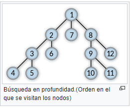
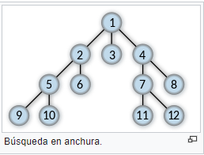

# Algoritmos Básicos

[TOC]

## DFS - Depth First Search

Se recorren los vertices del grafo G, visitando todas las adyacencias posibles hasta un vertice donde no haya adyacencias, entonces se vuelve hacia atras y se siguen visitando de igual forma.



````pseudocode
function DFS(graph G)
	for each vertex v from vertices de G do
		status[v] <- NOT_VISITED
		padre[v] <- NULL
    end for
    time <- 0
	for each vertex v from vertices de G
		if status[v] == NOT_VISITED then VISIT_DFS(v, time)
    end for
end

function VISIT_DFS(vertex v, int time)
	status[v] <- VISITED
	time <- time + 1
	dist[v] <- time
	for each vv from neighbors[v] do
		if status[vv] == NOT_VISITED then
			padre[vv] <- v
			VISIT_DFS(vv, time)
end
````

El coste es para Adjacent Matrix $O(|V|^2)$, Adjacent list $O(|V|+|E|)$

## BFS - Breadth First Search

Se recorre desde una raiz, todos los vertices se recorren sobre cada vecino y una vez visitados todos los vecinos de un vertice se sigue con los vecinos del siguiente vertice. 



 ````pseudocode
 function BFS(graph G, init_v v)
 	for each vertex v from vertices de G do
 		status[v] <- NOT_VISITED
 		dist[v] <- INF
 		padre[v] <- NULL
     end for
     status[v] <- VISITED
     dist[v] <- 0
     padre[v] <- NULL
     new_queueu(Q)
     Q.add(v)
     while not empty(Q) do
     	u = first(Q)
     	for v in neighbors[u] do
     		if status[v] == NOT_VISITED then
     			status[v] = VISITED
     			dist[v] = dist[u] + 1
     			padre[v] = u
     			Q.add(v)
     end 
 end
 ````

El coste es para Adjacent Matrix $O(|V|^2)$, Adjacent list $O(|V|+|E|)$

## Kosharaju - Sharir : Strongly connected components

Uses BFS (twice)

## Tarjan's : Strongly connected components

Uses DFS. Easier to implelent than K-S

## Dijkstra - minimum path