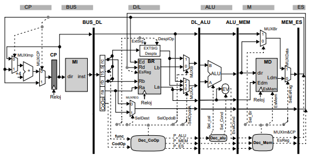
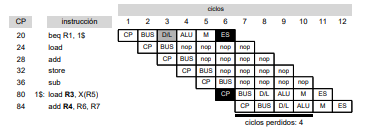
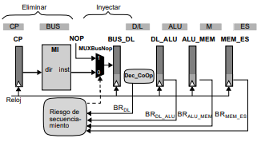
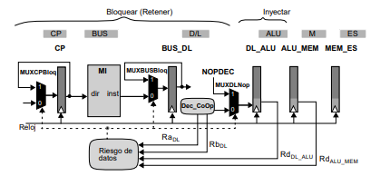

# TEMA 3. PROCESADOR SEGMENTADO LINEAL

[TOC]

### Camino de datos Segmentado

Tenemos instrucciones del tipo RR, RI, LOAD, STORE, BR.

El tiempo de ciclo deberá ser el suficiente, contando los bucles HW por secuenciamiento (ES y CP + BUS y CP) y por la actualización del BR (ES y D/L).

Los ciclos desde que se leen los datos hasta que están disponibles/calculados son la latencia efectiva segmentación. 

Necesariamente debemos controlar mediante mecanismos que no se produzcan riesgos de datos o secuenciamiento, darían lugar a resultados erróneos.

#### Descripción de las etapas

##### CP : Contador de programa

Almacena en el REG. CP el * a MI de la instrucción a ejecutar. El control de los MUX es función de la etapa ES (instr BR) y puede ser: CP + 4, CP(BR) + 4 o CP(BR). 

En el caso de BR incondicionales, MUXCP = 1. En el caso de BR condicionales y no cumplirse la condición de salto, la etapa ES devuelve la @ de la instrucción de BR misma, entonces MUXImp = 1.

##### BUS : Búsqueda

Con el REG. CP se accede a la MI y la instrucción pasa a BUS_DL.

##### D/L : Decodificación y Lectura

Se decodifican los campos de la instrucción, se leen del BR los operandos necesarios, se formatean los Imm y se generan las señales de control necesarias (P_ALU, P_MEM, P_ES). El BR permite escribir y leer (en este orden) en un mismo ciclo. 

El REG. BUS_DL contendrá a) operandos , b) información control, c)@ instrucción.

##### ALU : Cálculos

Se efectúa el cálculo y se evalúa la condición de salto con los datos de control de la etapa D/L.

##### M : Memoria de datos

Se accede a la memoria de datos, si es necesario, para guardar o escribir datos en ella.  Se genera un retardo si no es una instrucción de tipo MEM. 

El REG MEM_ES podrá ser: a) instr BR -> @BRANCH  b) datos para guardar en el BR + señales de control propias de cada caso.

##### ES : Escritura en el Banco de Registros

Se escribirá en el BR los datos necesarios y en el registro CP si es necesario.

### Control de los riesgos de secuenciamiento

La etapa MEM_ES alimenta al registro de CP en una instrucción de secuenciamiento. Al detectar (etapa D/L) la instrucción BRANCH, el procesador deberá <u>descartar</u> las dos instrucciones (etapa BUS y CP) y <u>suspenderá</u> los posibles cambios de estado CPU hasta el final de la instrucción de BRANCH de posibles instrucciones que estén en curso(NOP desde BUS).

  

| CP   | INST          | 1      | 2    | 3       | 4    | 5    | 6      | 7    | 8    | 9    | 10   | 11   | 12   |
| ---- | ------------- | ------ | ---- | ------- | ---- | ---- | ------ | ---- | ---- | ---- | ---- | ---- | ---- |
| X    | BEQ $1        | **CP** | BUS  | **D/L** | ALU  | M    | **ES** |      |      |      |      |      |      |
| $1   | LD R3, X(R5)  |        |      |         |      |      | **CP** | BUS  | D/L  | ALU  | M    | ES   |      |
| +4   | ADD R4, R6,R7 |        |      |         |      |      |        | CP   | BUS  | D/L  | ALU  | M    | ES   |
|      | *perdidas*    |        |      |         |      |      |        | *S1* | *S1* | *S1* | *S1* |      |      |

Los ciclos perdidos serán la latencia en actualizar el registro CP - 1, desde CP hasta ES (6-1 = 5).

EL control de R.S. debe actuar si entre la etapa D/L a ES hay una instrucción de BR.

	

### Riesgos de datos

Existe dependencia entre dos instrucciones que acceden a la misma posición de memoria (registro o @MEM) si alguna de las dos escribe.

* El rango (R) de una instrucción es el conjunto de posiciones que escribe una instrucción. 

* El dominio (D) de una instrucción es el conjunto de posiciones que lee una instrucción.

| EJEMPLO                                  | NOMBRE                | SIGLAS | U != 0       |
| ---------------------------------------- | --------------------- | ------ | ------------ |
| <u>r1</u> = r2 + r3, r7 = r4 + <u>r1</u> | dependencia verdadera | RaW    | R(i), D(i+k) |
| r1 = <u>r2</u> + r3, <u>r2</u> = r4 + r7 | antidependencia       | WaR    | D(i), R(i+k) |
| r1 = r2 + r3, r1 = r4 + r7               | dependencia de salida | WaW    | R(i), R(i+k) |

Se utiliza un grafo de dependencias, con nodos las instrucciones y arcos las dependencias.

#### Riesgos debidos a Registros

La segmentación del camino de datos puede modificar el orden de las lecturas/escrituras sobre registros.

La etapa D/L es la que conoce las @destino y @origen y puede activar las señales de riesgo de datos.

##### Tipo Read after Write

El bucle HW entre ES y D/L con latencia de 3 etapas (ALU, M, ES).

Al detectar RD en la etapa D/L se debe <u>bloquear etapa D/L y posteriores</u> y <u>enviar señales de control</u> a ALU, M y ES ya que no hay información válida.

El número de ciclos perdidos será la latencia efectiva de la segmentación menos el # ciclos que ya hayan pasado desde el inicio del cálculo.

| INST                     |  1   |  2   | 3    | 4    | 5    | 6          | 7    | 8          | 9          | 10   | 11   | 12   |
| ------------------------ | :--: | :--: | ---- | ---- | ---- | ---------- | ---- | ---------- | ---------- | ---- | ---- | ---- |
| LD **r1**, r2            |  CP  | BUS  | D/L  | ALU  | M    | **ES**     |      |            |            |      |      |      |
| LD **r9**, r5            |      |  CP  | BUS  | D/L  | ALU  | M          | ES   |            |            |      |      |      |
| ADD <u>r4</u>, **r1**,r3 |      |      | CP   | BUS  | D/L  | **D/L**    | ALU  | M          | **ES**     |      |      |      |
| ST <u>r4</u>, r6         |      |      |      | CP   | BUS  | <u>BUS</u> | D/L  | D/L        | **D/L**    | ALU  | M    | ES   |
| SUB r7, **r9**, r0       |      |      |      |      | CP   | <u>CP</u>  | BUS  | <u>BUS</u> | <u>BUS</u> | D/L  | ALU  | M    |
| *C perd*                 |      |      |      |      |      |            |      | *1D*       |            | *1D* | *1D* |      |

##### Tipo Write after Read y Write after Write

El diseño de procesador hace que este tipo de instrucciones. 

* Una instrucción siempre lee antes de que la instrucción posterior escriba
* Una instrucción siempre escribe antes de que escriba una instrucción posterior.

#### Riesgos debidos a Memoria

El diseño del procesador hace que los accesos a memoria no exista riesgos de datos.

* Una instrucción store siempre escribe antes de que lea una instrucción load posterior.
* Una instrucción load siempre lee antes de que escriba una instrucción store posterior.
* Una instrucción store siempre escribe antes de que escriba una store posterior.

### Control de riesgos de datos

	

Se añade circuitería para controlar los riesgos de datos:

1. MUXDLNop inyecta una NOP si hay riesgo de datos.
2. MUXCPBloq y MUXBUSBloq bloquean el registro de desacoplo.

La lógica de control de riesgos de datos recoge los id Registros destino de las instrucciones de las etapas ALU y M y los operandos fuente de la etapa D/L, siempre que los identificadores sean válidos.

### Lógica interbloqueo de la segmentación

Circuitería de control para garantizar que no hay riesgos de datos / secuenciamiento y además que no se inicia una instrucción fuera del orden que el programador ha indicado.

Los riesgos vienen dados por los bucles HW entre las etapa ES y CP + D/L y se deben solucionar en dos módulos (RD y RS).

En el caso de RS y RD,  prevalece la resolución del riesgo de datos antes de solucionar el RS.

| CP   | INST                   | 1    | 2    | 3    | 4    | 5    | 6       | 7    | 8    | 9         | 10   | 11   | 12   | 13   | 14     | 15   |
| ---- | ---------------------- | ---- | ---- | ---- | ---- | ---- | ------- | ---- | ---- | --------- | ---- | ---- | ---- | ---- | ------ | ---- |
| 16   | SUB **R1**, R2, R3     | CP   | BUS  | D/L  | ALU  | M    | **ES**  |      |      |           |      |      |      |      |        |      |
| 20   | <u>BEQ</u>  **R1**, $1 |      | CP   | BUS  | D/L  | D/L  | **D/L** | ALU  | M    | <u>ES</u> |      |      |      |      |        |      |
| 24   | SUB                    |      |      | CP   | BUS  | BUS  | BUS     | nop  | nop  |           |      |      |      |      |        |      |
| 28   | LD                     |      |      |      |      |      |         |      |      |           |      |      |      |      |        |      |
| 32   | ST                     |      |      |      |      |      |         |      |      |           |      |      |      |      |        |      |
| 36   | ADD                    |      |      |      |      |      |         |      |      |           |      |      |      |      |        |      |
| $1   | LD **R6**, R7          |      |      |      |      |      |         |      |      | CP        | BUS  | D/L  | ALU  | M    | **ES** |      |
| +4   | ADD R5, R9, **R6**     |      |      |      |      |      |         |      |      |           | CP   | BUS  | D/L  | D/L  | D/L    | ALU  |
|      | PERD->                 |      |      |      |      |      |         | D1   | D1   |           | S1   | S1   | S1   | S1   |        | D1   |

