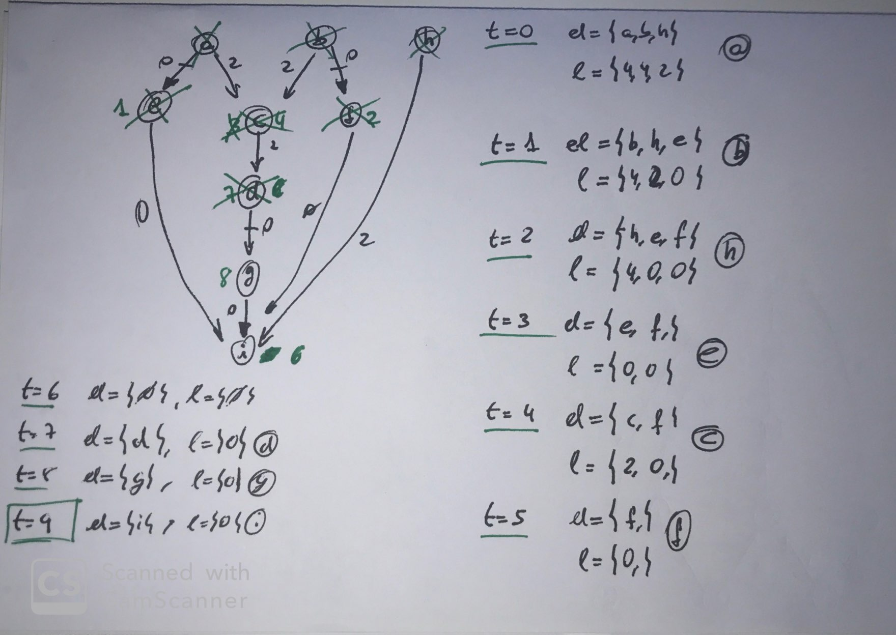
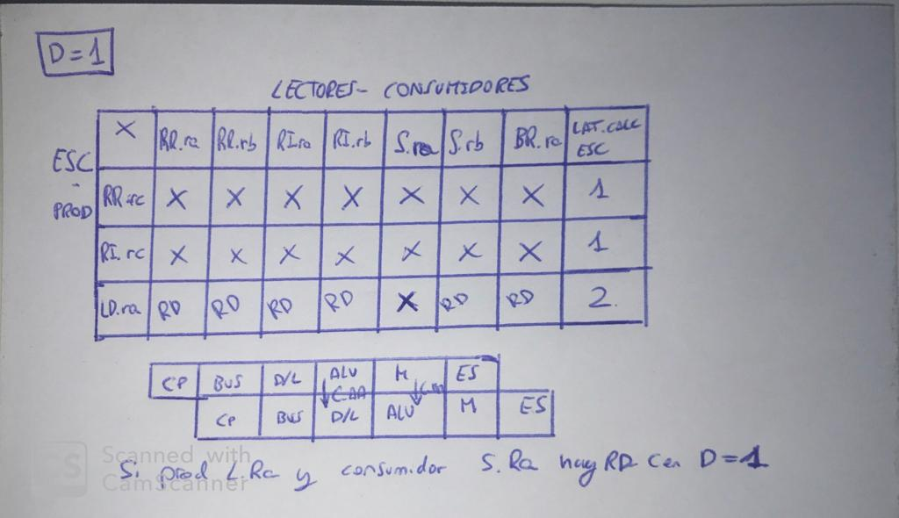
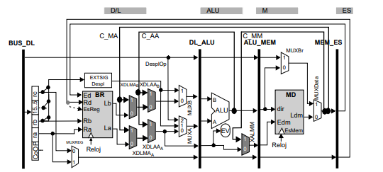

#  TEMA 4. REDUCIR LATENCIA EFECTIVA SEGMENTACION

Para reducir la latencia tenemos varias opciones: podemos reordenar las instrucciones, utilizar un resultado antes de que se escriba en el banco de registros,  predecir que sentido tomara una instrucción de salto.

Para todo ello necesitaremos hardware de control o un compilador que entienda este tipo de procesos.

[TOC]

## REDUCCIÓN CON PLANIFICACIÓN DE INSTRUCCIONES

Existen maneras de mantener la semántica de las instrucciones pero reordenar las instrucciones para evitar ciclos perdidos.

Deberemos fijar bloques de instrucciones estáticas (BB) para poder reordenarlo y aplicar un algoritmo de planificación sobre estos BB. En los BB, si se ejecuta la primera instrucción, se deben efectuar todas las del BB <u>siempre</u>; entonces el orden de ellas (salvo por las dependencias de datos) pueden variar de orden. Las instrucciones de secuenciamiento deben interpretarse siempre al final del BB.


Un BB empieza con:
* Primera instrucción del código
* Instrucción destino de un salto 
* Instrucción que sigue de una de salto

La latencia/retardo productor-uso es el #ciclos que deben pasar para que la instrucción usante pueda consumir el dato sin
riesgo de datos.
Sin planificación, el retardo por pérdida de ciclos entre una instrucción productora y una consumidora será el retardo productor/uso - 1.

#### ALGORITMO DE PLANIFICACIÓN POR LISTAS

El compilador es el encargado de separar una instrucción productora de una consumidora, con el objetivo de reducir el numero de ciclos perdidos.

Se parte del grafo de dependencias de datos, con el retardo productor-uso menos 1 o 0 si se trata de anti-independencias o dependencias de salida. 

Las instrucciones de secuenciamiento deben planificarse al final del bloque BB, añadiremos arcos adicionales.

El pseudocódigo del algoritmo es:

````c++
t = 0;
while(nodosPorOrdenar){
    getNodosElegibles;//raices o TMC <= t
    selecionarNodo; //mayor l
    eliminarNodoGrafo;
    t++;
    nuevosTMC; // TMC' = max(antTMC, arco +t)
}
````



## REDUCCIÓN CON CORTOCIRCUITOS

Usar un resultado antes de que se guarde en el banco de registros, añadiendo HW para el transporte de datos y el control. Se crea, por tanto un bucle HW en el camino de datos. En el caso de segmentación, los cortocircuitos la etapa destino es una etapa anterior a la etapa fuente. Los cortocircuitos puede ser al <u>inicio del ciclo</u>(MUX+LogicaEtapa) o <u>al final</u>(LogicaEtapa+MUX). 

### Análisis de comunicación entre etapas

Es necesario analizar sobre el conjunto de instrucciones para identificar los registros usados, en este caso:

| CLASES  |   TIPOS   |      |      |      | PRODUCTOR | CONSUMIDOR | LAT. CÁLCULO |
| ------- | :-------: | ---- | ---- | ---- | :-------: | :--------: | :----------: |
| **ENT** |  **RR**   | RA   | RB   | RC   |    RC     |   RA, RB   |      1       |
|         |  **RI**   | RA   |      | RC   |    RC     |     RA     |      1       |
| **MEM** | **LOAD**  | RA   | RB   |      |    RA     |     RB     |      2       |
|         | **STORE** | RA   | RB   |      |           |   RA, RB   |      -       |
| **IS**  |  **BR**   | RA   |      |      |           |     RA     |      -       |

Para planificar los cortocircuitos debemos mirar: a) latencia de cálculo, b) distancia entre instrucciones y c) ultima etapa donde el consumidor necesita el dato. Para ello utilizaremos una tabla con Distancia entre instrucciones D, y consumidores y productores:



Para d=2, que es la latencia máxima de calculo no hay ningún RD.

Con cortocircuitos se puede reducirse la latencia significativamente, llegando a ser el retardo igual la latencia de cálculo.

### Camino de datos con cortocircuitos. Comunicación final ciclo

Existen cortocircuitos lógicos que pueden utilizar un mismo cortocircuito físico, requiriendo de señales de control.



* Cortos C_AA: Productora RR o RI. XDLAAa Y xXDLAAb
* Cortos C_MA: Productora RR, RI, Load. XDLMAa y XDLMAb
* Cortos C_MM: Productora LD y destino Store. XALMM

### Lógica de interbloqueos

Con los cortocircuitos se generar nuevas situaciones a controlar,  donde tenemos que respetar la semántica del lenguaje y priorizar la ultima actualización de r1.

````assembly
add r1, r2, r3
add r1, r1, r4
load r10, 0(r1)
````

### Construcción de la lógica

* Control de XDLAAx y XDLMAx.

Si un identificador de registro fuente de la etapa D/L es igual a un registro destino de las etapas ALU o M, se debe utilizar el cortocircuito; respetando que el corto de la etapa ALU es prioritario respecto a M y ambos son prioritarios respecto al camino de datos.

* Control de XALMM

Si tenemos una instrucción de tipo store activara este circuito. Haciendo que el identificador RA, retardado con un registro, llegue para activar el MUX XALMM

* Detectar Riesgos de datos

En los caso donde la distancia entre instrucciones no sea propia y existe RD, debemos bloquear la ejecución Inyectando una NOP a D/L y bloquear BUS y CP un ciclo, cumpliendo la tabla de D=1 anterior:

* En el caso de una instrucción LOAD en la etapa ALU y el id REG destino es igual que el RB de la instrucción en la etapa DL.

* En el caso de RB, siempre que la instrucción D/L no sea una store, donde se utiliza el C_MM.

* Si tenemos una instrucción de BR en la etapa D/L debemos enviar NOP desde la etapa BUS hasta que el BR llegue a la etapa ES(incluida).

### Reducción debida al secuenciamiento

Hasta ahora,  se suspende la interpretación de instrucciones hasta resolver el BRANCH, perdiendo la longitud del bucle HW - 1, siendo un salto condicional o incondicional.

Con un cortocircuito se puede reducir la latencia del bucle HW existente entre ES y CP:

* Secuenciamiento condicional (bucle entre ALU y CP : latencia 2, 1 ciclo perdido)

En la etapa ALU ya se ha calculado la condición. Añadiendo el bucle HW entre ALU y CP tenemos un bucle de 3 ciclos y el control debe asegurar que en la etapa M y ES no se haga nada.

Entonces desde el ciclo que se detecta instrucción BR, se inyectan NOP desde BUS hasta que la ALU haya evaluado la condición.

* Secuenciamiento incondicional (bucle entre D/L y CP: latencia 3, 1 ciclo perdido)

Añadiendo un sumador en la etapa D/L podemos llegar a 1 ciclo de latencia, ya que los datos del salto están en la instrucción.

La etapa CP debe elegir entre el CP implícito, el CP de la etapa D/L o el CP de la etapa ALU. Además que la Unidad de control también debe adaptarse.

### Predicción fija del sentido

Hacer una hipótesis sobre el resultado de un BR condicional. De este modo no se reduce la latencia efectiva. La <u>predicción fija</u> siempre hace la misma hipótesis (codificada en la instrucción). Debemos verificar la predicción, poder deshacer los cambios y restaurar el flujo correcto. 

Se ha elegido que si el valor literal de las instrucciones BR es negativo, se predice romper la secuencia implícita y si es positivo se predice seguir en secuencia.

Se deben añadir módulos de control adicionales al camino para controlarlo.


#### Predecir seguir en secuencia

En la etapa D/L se decide seguir en secuencia, en la etapa ALU se verifica:

* Si ha sido correcto, no se pierden ciclos y la ejecución sigue
* Si no ha sido correcto, en el mismo ciclo donde se verifica, en la etapa CP ya arranca la instrucción correcta porque la @ ya ha sido calculada en DL.

#### Predecir modificación secuenciamiento

Hasta que en la etapa D/L no se efectúa la predicción sigue el flujo actual, al final del ciclo D/L se deben inyectar NOP para que no afecte al estado CPU.

En el mismo ciclo que acaba la predicción, ya hay un nuevo CP que empieza el flujo.

* Si se acierta, solo se pierde un ciclo. 
* Si falla, se pierde un ciclo de descartar la instrucción siguiente y otro por descartar la que se ha predicho.

#### Casos especiales

La ruptura del secuenciamiento o un riesgo de datos están condicionados por una posible acción de recuperación.

### Camino de datos con predicción de salto y cortocircuitos


 

