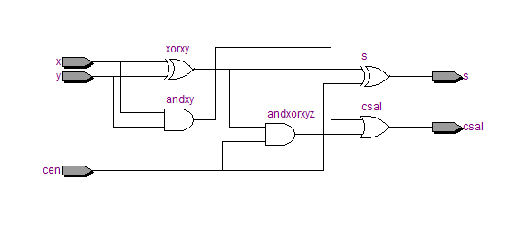
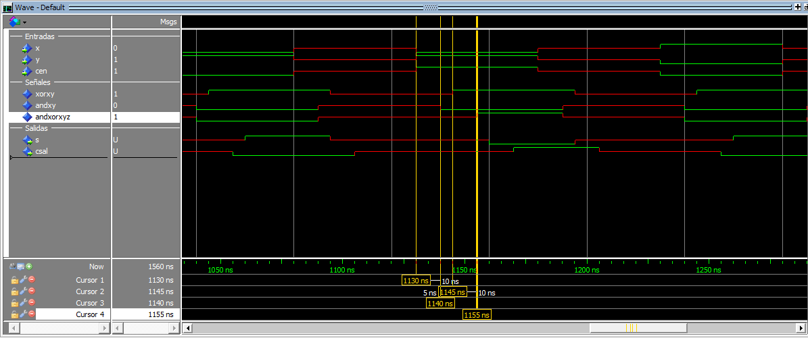
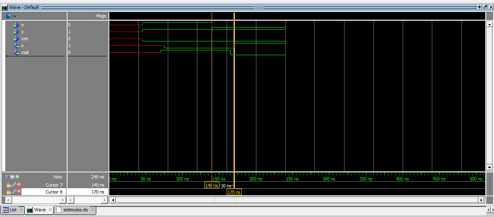
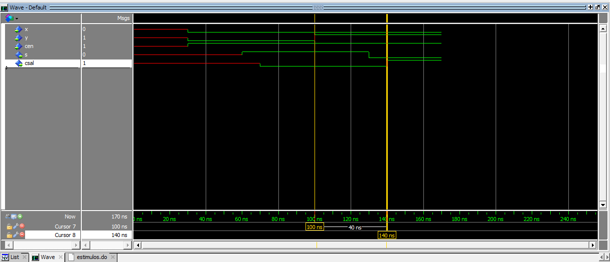

## Práctica 1 - Sumador de 1 bit

Victor Correal, Carlos Rodriguez

1. Entrega RTL del diseño del sumador de 1 bit:

2. Frente de onda para medir el retardo de las 8 poibles combinaciones

   Se adjunta el archivo con la lista (Ejercicio2-list).

   

| x y cen      | 000  | 001  | 010  | 011  | 100  | 101  | 110  | 111  |
| ------------ | ---- | ---- | ---- | ---- | ---- | ---- | ---- | ---- |
| Retardo (ns) | 30   | 40   | 30   | 40   | 30   | 40   | 30   | 30   |

**Justificación:** 

Los retardos son diferentes por que las puertas lógicas puede adelantar su cálculo (en el caso de la OR con una de sus entrada con un '1' no tiene que esperar a la otra entrada). 

En los casos que cen = '1' y X o Y son = '1' el retardo es de 40 ns ya que la andxorxyz tiene que espera el cáculo de xorxy, a diferencia de los demás casos, donde el retardo el 30 ns (Excepto en el caso 1 1 1 donde la orCsal ya obtiene un 1 de andxy.

3. 

| E0 (x y cen) | E1 (x y cen) | ret1 (ns) |
| ------------ | ------------ | --------- |
| 1 0 0        | 0 0 0        | 30        |
| 0 1 1        | 0 0 1        | 40        |
| 1 1 0 (a)    | 0 1 0        | 30        |
| 0 0 1 (b)    | 0 1 1        | 40        |
| 0 0 0        | 1 0 0        | 30        |
| 0 0 1        | 1 0 1        | 40        |
| 1 1 1        | 1 1 0        | 30        |
| 1 1 0        | 1 1 1        | 30        |

A) 

B)

