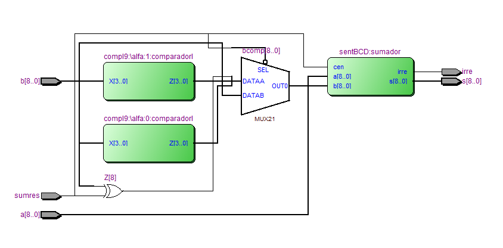

### Práctica 2 - Sumador de 4 bits y Sumador BCD

Victor Correal, Carlos Rodriguez

1. 

| A-B-cen     | A-B-cen     | ret1 (ns) |
| ----------- | ----------- | --------- |
| 0010-0000-0 | 0010-0010-0 | 40 ns     |

````vhdl
architecture prueba of prueba_S4bits is
    signal Aaux, Baux, SUMaux : std_logic_vector(3 downto 0);
	signal cenaux, csalaux : std_logic;
begin
    sum4: S4bits port map(A=>Aaux, B=>Baux, cen=>cenaux, SUM=>SUMaux, csal=>csalaux);
	prueba: process
		begin
		Aaux <= "0010";
		Baux <= "0000";
		cenaux <= '0';
		wait for 200 ns;
		Baux <= "0010";
		wait for 400 ns;
		wait;
	end process;
end prueba;
````

2. 

* Retardo mínimo: A = "0000", B = "0001", cen = '0'. Retardo = 40 ns

  Justificación: En este caso, todas las puertas trabajan en paralelo y hay que añadir el tiempo de cáculo de la última xor. (Tand + Tor + Txor= 10 + 15 + 15 = 25 ns)
* Retardo máximo: A = "0010", B = "0100", cen = '0'. Retardo  = 90 ns

  Justificación: Este es el camino critico del circuito, donde el tiempo de los acarreos se propaga ((Tand + Tor)*3 + Txor = (25 * 3) + 15 = 90 ns) 

3. 

````vhdl
-- para calcular el acarreo se utiliza:
(X(4) or (X(3) and X(2)) or (X(3) and X(1)))
````


````vhdl
architecture comportamiento of mayor9 is
-- senyales
	signal masigual9 : std_logic;
begin
	masigual9 <= (X(4) or (X(3) and X(2)) or (X(3) and X(1))) after retmayor9;
	S(1) <= '0' or masigual9;
	S(2) <= '0' or masigual9;
	S(3) <= '0';
	S(0) <= '0';
	csal <= masigual9;
end comportamiento;
````

4. 

|      | valor explícito      | vector de bits      |
| ---- | -------------------- | ------------------- |
| x    | xe = 25 mod 200 = 25 | X = (0, 0010 0101)  |
| y    | ye = -8 mod 20 = 12  | Y =  (1, 0001 0010) |

|               |         | Vector de bits     |
| ------------- | ------- | ------------------ |
| xe            | 25(10)  | X = (1, 0010 0101) |
| ye            | 8(10)   | Y = (0, 0000 1000) |
| se            | 33 (10) | S = (0, 0011 0011) |
| representable | Si      |                    |

5. 

El retardo en (ns) de n dígitos BCD se calcula:

````
sumaNBCD = retsumbin + retmayor9 + retsumbin
Retardo = sumaNBCD + rets1bit + retc9 + retmux
````

6. 

````vhdl
z(0) <= not x(0);
z(1) <= x(1);
z(2) <= x(1) xor x(2);
z(3) <= (not x(1) and not x(2) and not x(3));
````

7. 



8. 

* Retardo mínimo: A = "100000000", B = "00000000", sumares = '0'. Retardo = 2 ns

  Justificación: Este retardo mínimo es impossible, pero es el que da el simulador. 

* Retardo máximo: A = "100000000", B = "100000000", sumares = '0'. Retardo  = 22 ns

  Justificación: Este retardo máximo no es el esperado, esperabamos un 23.

  