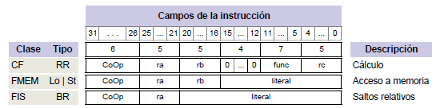
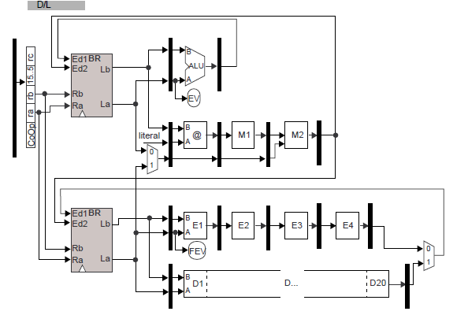
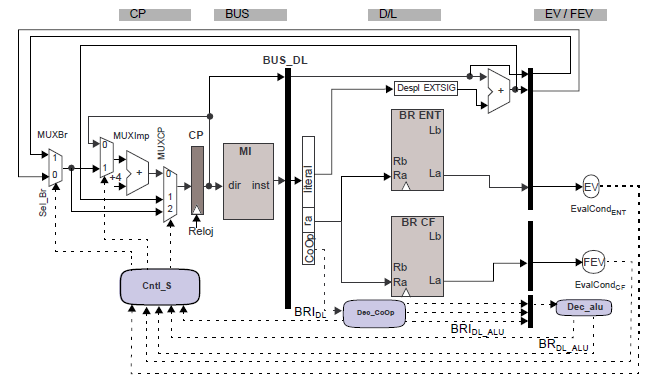
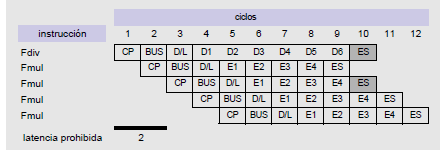
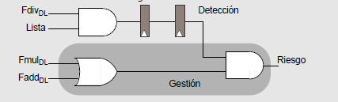
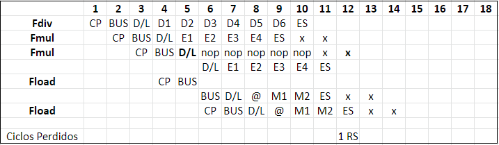
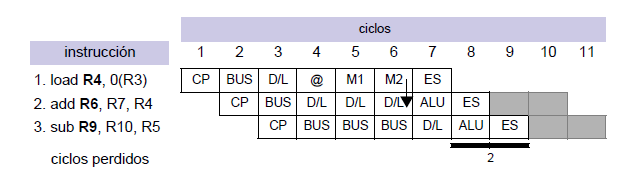
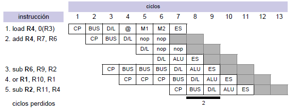

## TEMA 5 Procesador Segmentado Multiciclo

[TOC]

En este tema, se diseñan varios caminos de datos, en función del tipo de instrucción. Cada unidad de cálculo puede <u>estar segmentada o no</u> y tener una <u>latencia de cálculo diferente</u>.

### Instrucciones en coma flotante

Esta es una posible implementación de instrucciones en coma flotante:

* Se añadirá un BR para datos en coma flotante, prefijo F delante del ordinal.
* Las @ de memoria seguirán necesitando acceder al banco de registros de enteros(rb).
* Las operaciones RR serán la suma, multiplicación(ambas con 4 ciclos de latencia y latencia de inicio 1) y división (20 ciclos de latencia de ejecución y 20 de inicio).
* En general, la segmentación de las ramificaciones tendrán L etapas de cálculo y una última de escritura.

### Camino de datos

Con estas instrucciones obtenemos el siguiente camino de datos, lo dividiremos en <u>ejecución</u> y <u>subministro de instrucciones</u>.

#### Ejecución

* Las operaciones de enteros, solamente actualizan el banco de registros de enteros.
* Las operaciones de acceso a memoria siempre se calcula la @ efectiva con el rB(ent) y pueden:
  * Store de los dos bancos de registros.
  * Load al banco de registros entero y de coma flotante.
* La operaciones de suma y multiplicación estan segmentadas y tiene latencia de 4 ciclos. Utilizan el mismo camino de actualización del BRF que la división.
* La operación de división no esta segmentada y tiene una latencia de inicio de 20 ciclos.
* Las operaciones de salto condicional se evaluan en los módulos FEV y EV, actualizan el PC en el ciclo 4 (siguiente a DL); mientras que las de salto incondicional lo hacen en la etapa D/L.

#### Suministro de instrucciones

El registro CP puede "funcionar" con los siguientes modos, donde se pueden gestionar situaciones de salto:

* CP nuevo = CP anterior + 4 -> modo implícito.
* CP nuevo = CP anterior + Despl DL-> Salto incondicional.
* CP nuevo = CP anterior + Despl DL f(FEV o EV) -> Salto condicional.

**Instrucciones en fase de ejecución**: Esta característica viene dada <u>por la ramificación segmentada de más etapas</u> y sumando el numero de ramificaciones no segmentadas con latencia de ejecución superior a las segmentadas.

**Instrucción lista** : Una instrucción está lista para iniciar la ejecución si no existen riesgos estructurales y de datos.

### Gestión de riesgos - Lógica de interbloqueos

Deberemos contemplar los riesgos como anteriormente; se efectuará en la etapa DL. Estos riesgos harán que una instrucción no este lista.

Los posibles riesgos que se pueden dar. Los riesgos de datos actuarán sobre el control de cortocircuitos. 

* Riesgos de datos por dependencia verdadera (R(i), D(i+k)).
* Riesgos de datos por dependencia de salida (R(i), R(i+k)).
* Riesgos estructurales, por la escritura en el banco de registros.
* Riesgos de secuenciamiento (se gestionan como en el capitulo anterior).

La actuación ante un riesgo, será emular funcionamiento serie. En las ramificaciones (con riesgos) se <u>inyectaran</u> nop's y se <u>bloquearan</u> las etapas previas(CP, BUS y DL).

**Deberemos considerar que todas las instrucciones tiene la misma latencia de cálculo(cogeremos la máxima), para poder calcular los ciclos perdidos. Los ciclos perdidos serán aquellos ciclos donde finalice una operación.** 

#### Riesgos Estructurales - Detección

Se puede tener un riesgo estructural <u>por la escritura en el banco de registros de coma flotante</u> o debido a la <u>unidad de división</u>, que no esta segmentada(latencia de inicio > 1).

* La latencia prohibida es de 2 ciclos (entre Fdiv y Fmul/Fadd), pues una instrucción de coma flotante escribiría en el mismo ciclo que la Fdiv de dos ciclos antes.
* Con la operación de división, al no estar segmentada, la entrada debe mantenerse sin cambios todos los ciclos de cálculos. Con una latencia de ejecución de 6 ciclos las latencia prohibidas son {1,2,3,4 y 5}.

#### Riesgos Estructurales - Actuación

Los dos riesgos de gestionan de forma diferente:

* Operaciones no segmentadas (división): 

  Se mantiene un <u>vector de bits</u>, llamado vector de ocupadas(VO). Este vector tendrá una posición por cada unidad no segmentada y el bit correspondiente estará <u>activado</u> si la unidad esta siendo utilizada y esta entre el primer ciclo de ejecución y el penúltimo. En el último ciclo de ejecución se desactiva (antes de la etapa ES). 

  El control de riesgos, leerá este vector de ocupadas y si esta activado se habrá detectado un riesgo estructural. **No habrá que inyectar una nop por la ramificación**, pues la entrada tiene los datos que se están procesando actualmente.

* Conflictos con el banco de registros de coma flotante:

  

  Se utilizará un contador hardware. La instrucción más joven se bloquearan en la etapa DL y se inyectaran nop's por la ramificación correspondiente:

  

#### Riesgos de datos y uso de cortocircuitos - Detección

En este modelo, los bancos de registros se actualizan en el ciclos siguiente de finalizar el cálculo; con cortocircuitos podemos <u>reducir en un ciclo la latencia productor-uso</u>. 

* Se considera que antes de finalizar el ciclo de reloj ya se ha calculado el dato.

Tenemos los siguientes etapas <u>productores de datos</u>, en las diferentes ramificaciones: ALU, M2, E4 y D20.

Solo consideraremos la etapa D/L como destino de los cortocircuitos. Esto entonces no afectara al control de riesgos de datos. Existirán dos tipos de dependencias a estudiar, dado que ahora es posible que una instrucción mas joven actualice el BR antes que una mas antigua (desorden en el orden indicado por el programador).

<u>En general, perderemos tantos ciclos como la latencia de ejecución de la productora menos la distancia a la que se encuentra la consumidora.</u>

#### Riesgos de datos $ R(i)\cap D(i+k) \neq \empty $ - Dependencia verdadera

Deberemos inyectar una nop por la ramificación en los ciclos de bloqueo, pues tendremos que retener la instrucción mas joven hasta que la mas vieja haya obtenido el dato.

#### Riesgos de datos $ R(i)\cap R(i+k) \neq \empty $  - Dependencia de salida

Para evitar que las instrucciones actualicen en desorden los BR, actuando de forma conservadora retendremos la instrucción “joven” en la etapa DL hasta el ciclo antes de que esta escriba en el banco de registros.

### Cálculo del CPI