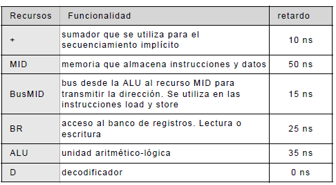
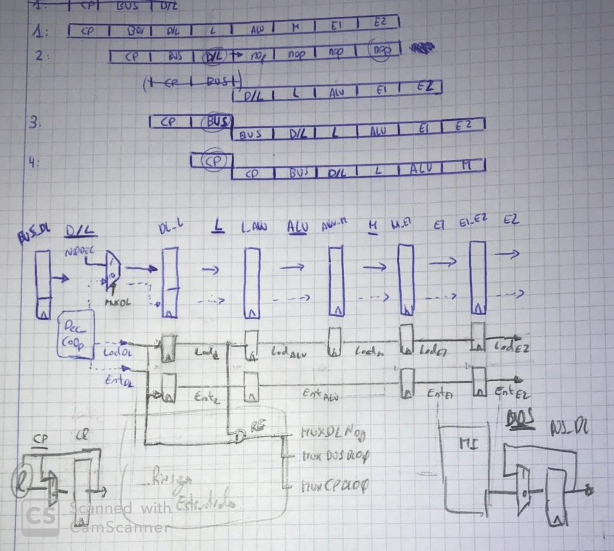

[TOC]

### Ejercicio 2.1

Un procesador segmentado tiene tres etapas (I , M y A). Existen, únicamente dos tipos de instrucciones X e Y y su interpretación utiliza las etapas en los ciclos especificados a continuación.

<u>Pregunta 1:</u> Compruebe que es posible que exista colisión al ejecutar un programa si la latencia de iniciación de instrucciones es de un ciclo.

>  En el caso de dos instrucciones del mismo tipo no habra colisión possible, pero si primero ejecutamos una instr. Y seguida de una X el recurso A se utilizaria a la vez.

> Esto viene dado porque en diferentes ciclos se utiliza el mismo recurso.

<u>Pregunta 2:</u> ¿Cuál es la latencia de iniciación mínima constante que garantiza que no existe colisión en la ejecución de un programa?. 

> La latencia seria 2, para evitar el problema de la pregunta anterior.

<u>Pregunta 3:</u> Rediseñe los dos tipos de instrucciones para que la latencia de iniciación constante sea la menor posible. (NOTA: analice el número de ciclos y utilización de las etapas). 

> Añadiendo a las instrucciones del tipo X una etapa de retardo en el segundo ciclo, solucionariamos el problema, ya que desde el inicio de la interpretación de cualquiera de las dos instr. se utilizan los mismo recursos en los mismo ciclos.

<u>Pregunta 4:</u> Razone si el nuevo diseño aumenta o disminuye el tiempo de ejecución de los programas al compararlo con los dos casos anteriores. Para ello, calcule la productividad en cada caso.

> $Productividad = \frac{\text{#}OPs}{Tiempo}  = \frac{OPs}{LMI}$

> Base(en el caso peor): $P_1 = 1/1.5 = 0.7 ops/ciclo$

> Latencia de Inicio = 2, $P_2 = 1/2 = 0.5$ ops/ciclo

> Rediseñando las instruciones: $P_3 = 1 / 1 = 1 $ ops/ciclo

### Ejercicio 2.2

<u>Pregunta 1:</u> ¿Cuál es el periodo mínimo de la señal de reloj (tiempo de ciclo)?. 

> $T_c \ge 20ps+300ps \ge 320 ps$

<u>Pregunta 2:</u> Calcule la productividad del módulo secuencial

> $P=\frac{OPs}{Tiempo} = 1 / 320ps = 3.12 G \space Ops/s$

Supongamos que la UF anterior se ha dividido en 6 bloques (A, B, C, D, E y F) que se conectan como se muestra en la figura y con los tiempos de retardo que se indican.

<u>Pregunta 3:</u> Utilizando 1 registro de desacoplo segmente la UF para maximizar la productividad (2 etapas). Indique la productividad.

> Añadir segmentación requiere que el tiempo de las etapas sea lo mas parejo possible, para que tenga sentido; entonces vemos que el tiempo de la etapa no debe ser superior a 300 / 2 -> 150 ps. Cojeremos las etapas A, B y C aunque sumen un poco más, pero es lo mas parejo a 150 que podemos obtener.

El tiempo de ciclo en este caso sera $T_c \ge Tp + max(Te_i) \ge 20 + 170(ps)$ 

$P = 1 / 190 ps = 5.26 G \space Ops/s$

<u>Pregunta 4:</u> ¿Cuál es la latencia de la operación en el diseño de la 3ª pregunta?.

> La latencia es de 2 ciclos.

<u>Pregunta 5:</u> Utilizando 2 registros de desacoplo segmente la UF para maximizar la productividad (3 etapas). Indique la productividad.

> $T_c \ge 20 + 110 (ps)$

> $P = 1 / 130 ps = 7.69 G\space Ops/s$

<u>Pregunta 6:</u> ¿Cuál es la latencia de la operación en el diseño de la 5ª pregunta?. 

> La latencia es de 3 ciclos.

<u>Pregunta 7:</u> ¿Cuál es el número de etapas mínimo para maximizar la productividad?.

> $P = (T_c)^{-1}$

> La productividad será máxima con el menor tiempo de ciclo.

Supongamos que un mejor particionado de la UF consigue que todos los bloques tengan el mismo retardo y que el número de bloques puede ser el que queramos.

<u>Pregunta 8:</u> Calcule la productividad en el caso de que el retardo de cada uno de los bloques (tB), en que se divide la UF, es despreciable frente al retardo que representa el registro de desacoplo (tRD) entre etapas (tB << tRD).

> En este caso, el tiempo del registro es el unico que importa para calcular el tiempo de ciclo:

$Tc \ge T_{RD} \rightarrow P = (T_{RD})^{-1} = 50 G \space  Ops/s$

### Ejercicio 2.3

Considere el siguiente circuito donde se muestran bloques combinacionales y el flujo de información entre bloques. Así mismo, dentro de cada bloque, se ha anotado la latencia en picosegundos.

<u>Pregunta 1:</u> ¿Cuál es la latencia del circuito?. Marque con trazo grueso las conexiones del camino crítico. Suponga que el retardo de almacenamiento en un registro de desacoplo es cero. 

> La latencia del circuito es 170 ps.(Tiempo en realizar una operacion desde el inicio)

Suponga que el retardo de almacenamiento en un registro de desacoplo es cero.

<u>Pregunta 2:</u> ¿Cuál es la máxima productividad, en operaciones por segundo, que se puede obtener al segmentar el circuito?. 

> $P_{max} = (Tc)^{-1} = (60ps)^{-1} = 16.7 G \space Ops/s$

<u>Pregunta 3:</u> Muestre una organización segmentada que maximice la productividad.

$T_c = 60ps$

> Etapa 1: ABDE

> Etapa 2: CHG

> Etapa 3: FI

> Etapa 4: J

<u>Pregunta 4:</u> Muestre un organización segmentada que minimice el número de etapas y mantenga una productividad de al menos una operación cada 85 ps.

> Etapa 1: ABCDE

> Etapa 2: FGHI

> Etapa 3: J

Entre dos etapas puede haber varios flujos de información. Cada uno de ellos requiere de un registro de desacoplo. La información que hay en la entrada de un registro de desacoplo se transfiere a la salida en el flanco ascendente de la señal de reloj. Suponga la siguiente segmentación.

<u>Pregunta 5:</u> Muestre en un esquema los registros de desacoplo numerándolos como 1 o 2 para indicar respectivamente si son registro de salida de la 1ª etapa o de la 2ª etapa.

> ToDo

### Ejercicio 2.16

Una reducción en la tensión de alimentación da lugar a un ahorro cuadrático en la potencia consumida y por tanto, es una alternativa muy atractiva para reducir el consumo de potencia. 

$P=C*V^2*f$

Sin embargo, dentro de un rango de funcionamiento, el retardo (r = 1/f) de las puertas CMOS se incrementa inversamente con la tensión de alimentación. En la siguiente tabla las filas muestran relaciones entre la tensión de alimentación y el retardo. La tensión de alimentación y el retardo original se denominan V0 y r0 respectivamente.

| Tension Alimentacion | Retardo |
| -------------------- | ------- |
| 0.58*Vo              | 2*Ro    |
| 0.40*Vo              | 4*Ro    |

Disponemos de un módulo sumador alimentado con una tensión de alimentación Vs , una capacidad efectiva equivalente Cs y con un retardo Ts = 1/fs , donde fs es la frecuencia de funcionamiento.

Suponga que se replica el sumador. La capacidad efectiva equivalente aumenta por un factor de 2. Además, este factor se incrementa en un 7% debido al necesario encaminamiento y multiplexación de los datos.

<u>Pregunta 1:</u> Calcule la potencia consumida respecto del original cuando el sistema con dos réplicas tiene la misma productividad que el dispositivo original. 

> Si la productividad es la misma, implica que se dividen el trabajo los dos sumadores, el retardo es el mismo Ts en cada una de las etapas, por tanto la frequencia que podemos utilizar en cada modulo es la mitad de la original.

$P^S = OPs/Tiempo = 1/Tc \rightarrow 2 * Ops / Tc/2$

$C'=2.07*C_s $ 

$f'= f_s * 0.5$

$V' = 2 * V_S$

$P_{cons} = C_S * V^2 *f = P_{cons}^S * 2.07 * 2 * 0.5$

<u>Pregunta 2:</u> El área del diseño con dos réplicas se incrementa en un factor de 3. Calcule la densidad de potencia respecto del original.

$D^s= \frac{Area^s}{Potencia} = $

El sumador original se puede seccionar en dos sumadores cada uno de tamaño mitad y segmentar el diseño.

Esta alternativa incrementa la capacidad efectiva un 15% debido a los registros adicionales necesarios.

<u>Pregunta 3:</u> Calcule la potencia consumida respecto del original cuando el sistema segmentado tiene la misma productividad que el dispositivo original. 

<u>Pregunta 4:</u> Suponga un sistema donde se utiliza la técnica de replicación y segmentación: 2 réplicas y 2 etapas en cada réplica. Calcule la potencia consumida respecto del original cuando este sistema tiene la misma productividad que el dispositivo original.

### Ejercicio 2.8

El lenguaje máquina de un procesador tiene instrucciones para leer o escribir datos en memoria (MEM), instrucciones para efectuar cálculos aritmético-lógicos (ENT) entre otros tipos de instrucciones que no consideraremos. En la figura se muestra el formato de las instrucciones.

<u>Pregunta 1:</u> Las fases de una instrucción son: determinar la dirección, búsqueda de la instrucción, decodificación, lectura de los datos fuente, ejecución y escritura del resultado.
Para las instrucciones especificadas describa mediante una tabla cuales son las acciones que deben efectuarse en cada fase.

>|       | Determinar @      | Busqueda Inst.       | DECO                     | Lectura datos Fuente | Ejecución          | Escritura    |
>| ----- | ----------------- | -------------------- | ------------------------ | -------------------- | ------------------ | ------------ |
>| RR    | **Actualizar CP** | **Acceso a Memoria** | **Decodificar Inst**     | Aceso a BR           | Cálculo            | Escritura BR |
>| RI    |                   |                      | **Generar Señales Ctrl** | Aceso a BR           | Cálculo            | Escritura BR |
>| Load  |                   |                      |                          | Aceso MD y BR        | Cálculo @ Efectiva | Escritura BR |
>| Store |                   |                      |                          | Aceso a BR           | Cálculo @ Efectiva | Escritura MD |
>
>En negrita, todos los tipos hacen la misma acción.

Un recurso puede utilizarse varias veces en un ciclo si su retardo o tiempo de acceso lo permite.

<u>Pregunta 2:</u> Utilizando la contestación de la pregunta anterior, los recursos disponibles y su retardo, proponga una segmentación en etapas del proceso de interpretación de las instrucciones descritas e indique el tiempo de ciclo. En la contestación minimice la latencia de interpretación, el tiempo de ciclo y los posibles riesgos estructurales.

> El tiempo de ciclo deberia ser 50ns, debemos esperar a los acesos a MID, no tendria sentido que el Tc fuera menor de 50ns.
>
> Para las instrucciones RR, RI:
>
> | ETAPA    | Determinar @ | Busqueda Inst. | DECO | Lectura datos Fuente | Ejecución | Escritura |
> | -------- | ------------ | -------------- | ---- | -------------------- | --------- | --------- |
> | RECURSOS | +            | MID            | D    | BR                   | ALU       | BR        |
>
> Para la instrución Load:
> | ETAPA    | Determinar @ | Busqueda Inst. | DECO | Lectura datos Fuente | Ejecución   | Escritura |
> | -------- | ------------ | -------------- | ---- | -------------------- | ----------- | --------- |
> | RECURSOS | +            | MID            | D    | BR                   | ALU, BusMID | BR        |
> 
>
> Para la instrución Store:
> | ETAPA    | Determinar @ | Busqueda Inst. | DECO | Lectura datos Fuente | Ejecución   | Escritura |
> | -------- | ------------ | -------------- | ---- | -------------------- | ----------- | --------- |
> | RECURSOS | +            | MID            | D    | BR                   | ALU, BusMID | MID       |

<u>Pregunta 3:</u> ¿Cuántos caminos de acceso son necesarios a la memoria MID para que no se produzcan riesgos estructurales?.

> Necesitaremos, un aceso para las instrucciones (camino lectura+camino escritura) y otro para los datos(L+E).

<u>Pregunta 4:</u> Justifique si son suficientes los caminos de accesos descritos al banco de registros para que no se produzcan conflictos.

> El BR dispone de un camino de lectura y otro de lectura o escritura. 
>
> En un momento dado, el caso peor será que una instrucción este leyendo del banco 2 operandos e otra instrucción mas antigua este escribiendo; entonces no son suficientes los caminos de acceso al banco de registros.

### Ejercicio 2.9

En la figura se muestra una segmentación del proceso de interpretación de instrucciones.

Las fases de lectura y escritura al banco de registros requieren 2 ciclos y están segmentadas. El número de caminos de lectura y escritura al banco de registros son 2 y 1 respectivamente. En las etapas BUS y M se accede a memorias distintas (MI y MD). Las situaciones de riesgo se detectan en la etapa D/L y la instrucción no prosigue su interpretación hasta que desaparece el riesgo.

<u>Pregunta 1:</u> Dada la siguiente secuencia de instrucciones, muestre en un diagrama temporal las acciones que se toman en el camino de datos para resolver riesgos estructurales. En el diagrama temporal utilice una nueva línea cuando una instrucción se bloquea en una etapa. Así mismo, indique la inserción de instrucciones nop y su avance en las etapas del procesador.

<u>Pregunta 2:</u> Añada las conexiones necesarias en el camino de datos, para gestionar riesgos estructurales. Diseñe el circuito de control de riesgos estructurales, especificando las entradas y salidas.

### Ejercicio 2.19

Un procesador segmentado utiliza la siguiente segmentación y recursos, describiéndose la funcionalidad de las etapas en la tabla que se adjunta. En este ejercicio no se consideran las instrucciones de secuenciamiento. 

El número de caminos de acceso al banco de registros es 1 para lecturas y 1 para escrituras. El número de caminos de acceso a la memoria MID es uno de lectura/escritura. Los recursos cuyo retardo se considera distinto de cero son los siguientes:

El número máximo de operandos fuente de una instrucción que deben leerse del banco de registros es 2. Una instrucción actualiza como máximo una posición de memoria o un registro del banco de registros.

<u>Pregunta 1:</u> Cuando se interpreta una secuencia de instrucciones, el recurso MID puede producir riesgos estructurales. Determine las latencias prohibidas.

> Teniendo en cuenta solamente el recurso MID, obtenemos que la latencia prohibida es 3. El riesgo viene dado por las instrucciones load y store (por el uso de MID) y una instruccion cualquiera posterior.

<u>Pregunta 2:</u> ¿Existen en el camino de datos otros recursos que puedan producir riesgos estructurales?. Justifique la respuesta.

> El BRE es el recurso en que tambien puede producir riesgos estructurales, ya que es utilizado por diferentes tipos de instrucciones en diferentes ciclos de su interpretación.

<u>Pregunta 3:</u> Añada al camino de datos, mostrado previamente, las conexiones que faltan para transportar datos y gestionar los riesgos debidos al recurso MID. Indique también desde dónde se inyectan las instrucciones nop. Un cable que cruce un registro de desacoplo se considerará afectado por el funcionamiento del registro de descoplo.

<u>Pregunta 4:</u> Diseñe la lógica de control de los multiplexores MUX1, MUX2, MUX3 y MUX4.

### Ejercicio 2.14

