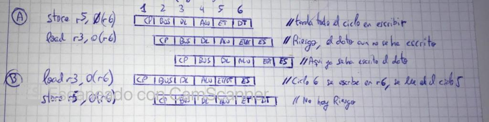
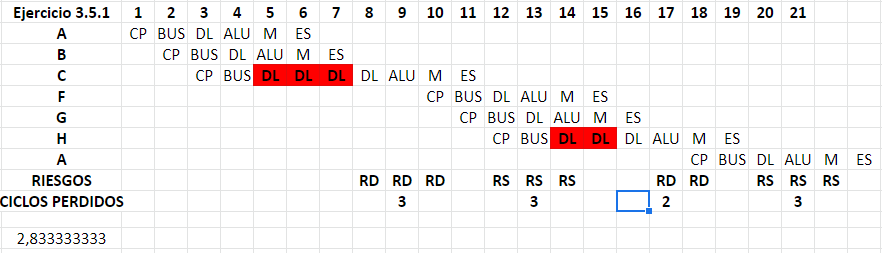
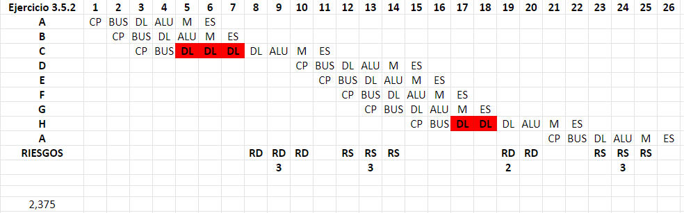
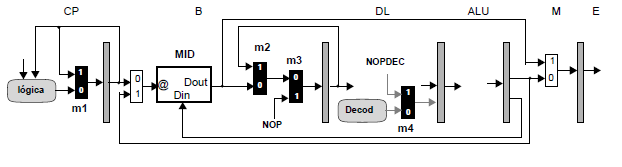
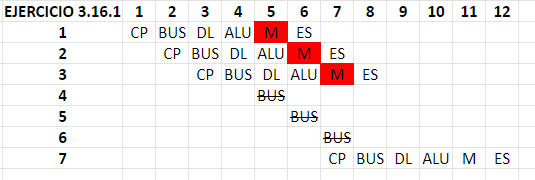
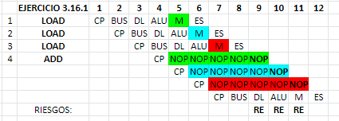
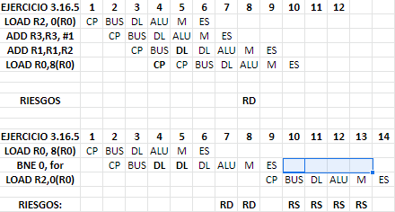
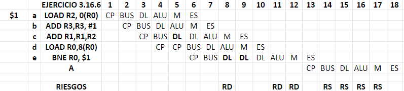

# Ejercicios tema 3

[TOC]

### Ejercicio 3.1

En la parte izquierda de la siguiente figura se muestra el código de la operación suma de dos vectores elemento a elemento en un lenguaje de alto nivel. En la parte derecha se muestra una traducción a lenguaje máquina.

El tamaño de un dato son 8 bytes. El registro r9 se ha inicializado con el número de iteraciones y los registros r2, r4 y r6 se han inicializado con la dirección base de los vectores C, B y A respectivamente.

<u>Pregunta 1:</u> En un procesador que interpreta las instrucciones de forma serie, calcule los ciclos de ejecución de una iteración del bucle. Para ello suponga que la latencia de todas las instrucciones son 6 ciclos.

$Ciclos = Instruciones * Latencia = 9 * 6 = 54 \space Ciclos$

<u>Pregunta 2:</u> En el procesador segmentado con control de riesgos descrito en este capítulo, calcule los ciclos de ejecución por iteración. Así mismo, indique los ciclos perdidos por tipo de riesgo y calcule el CPI.

> Debemos ver el grafo de dependencias para contar los ciclos perdidos y el cronograma:
>
> ````mermaid
> 	graph TB;
> 	A==>C
> 	B==>C==>D
> 	A-.->E
> 	B-.->F
> 	D.->G
> 	H==>I
> ````
>
> Se perderan 6 ciclos por las dependencias verdaderas AC, BC i CD i HI. Se perderan 4 ciclos por el riesgo de secuenciamineto.
>
> Entonces, el $CPI = 9inst+10ciclos/9 instr = 2.11$
>

<u>Pregunta 3:</u> Suponga que las frecuencias de funcionamiento del procesador serie y segmentado son iguales. Calcule la ganancia de una interpretación segmentada respecto de una interpretación serie al ejecutar una iteración del bucle.

> $G= \frac{T_{ori}}{T_{new}}=\frac{N*CPI*T_c}{N*CPI^{seg}*T_c} = \frac{CPI}{CPI_{seg}}=\frac{6}{1.44} = 4.17$

Una nueva versión del procesador segmentado tiene una frecuencia de funcionamiento 1.5X mayor. En estas condiciones, es necesario todo el ciclo de reloj para escribir o leer un registro del banco de registros.

<u>Pregunta 4:</u> En esta versión del procesador, calcule los ciclos de ejecución por iteración. Así mismo, indique los ciclos perdidos por tipo de riesgo y calcule el CPI.

> En este caso, los ciclos por riesgo de datos perdidos seran 3 por cada RD, dado lugar a 6 ciclos perdidos por RD en cada iteración.  El total de ciclos sera de 20
>
> El $CPI=\frac{9+6}{9}=1.67$

<u>Pregunta 5:</u> Calcule la ganancia de la nueva versión del procesador segmentado respecto de la versión previa.

> $G= \frac{T_{ori}}{T_{new}}=\frac{N*CPI*T_c}{N*CPI*1.5*T_c} = \frac{CPI}{CPI*1.5}=\frac{1.44}{1.67*1.5} = 0.57$ 
>
> En este caso, se pierde tiempo con esta nueva versión. (1-0.57)*100 = 43% de perdida

### Ejercicio 3.7

Un procesador, que interpreta las siguientes instrucciones(INT, Load, Store, BR) esta segmentado en 6 etapas (CP, B, DL, ALU, M, ES).

El banco de registros permite la escritura y la lectura, en este orden, de un mismo registro en un ciclo de reloj. El camino de datos dispone de recursos suficientes para que no se produzcan riesgos estructurales.


<u>Pregunta 1:</u> Indique las entradas de los multiplexores del camino de datos que hay que seleccionar para cada tipo de instrucción en los ciclos 4, 5 y 6 del proceso de interpretación. Por ejemplo, para una instrucción Store, donde la marca x denota indistinto:

| Ciclo               | 4      | 4      | 4      | 5      | 6      | 6      |
| ------------------- | ------ | ------ | ------ | ------ | ------ | ------ |
| **Instruccion/MUX** | **m3** | **m4** | **m5** | **m6** | **m1** | **m2** |
| Store               | 5      | 6      | 9      | X      | 0      | 2      |
| Load                | 5      | 6      | 9      | 11     | 0      | 2      |
| Int                 | 5      | 7      | 9      | 10     | 0      | 2      |
| BR                  | 4      | 6      | EV     | 10     | 1      | EV     |

Supongamos que el retardo de propagación (en ps) de los componentes mostrados en el camino de datos es: Sumador(150), ALU(200), EV(100), MD(350), mx(100), ri(50).

<u>Pregunta 2:</u> Calcule el tiempo de etapa máximo y mínimo de CP, ALU y M. Considerando sólo las etapas CP, ALU y M, calcule el tiempo de ciclo de reloj.

> $MAX_{CP} = MIN_{CP} = 2*(T_{MUX})+T_S + ri = 400ps$
>
> $MAX_{ALU}= 2*(T_{MUX})+T_{ALU} + T_{EV} + ri= 550ps$
>
> $MIN_{ALU} = 2*(T_{MUX})+T_{ALU} + ri = 450ps$
>
> $MAX_M= MIN_M = T_{MD} + t_{MUX}+ ri= 500ps$
>
> El tiempo de ciclo deberá ser el máximo de los tiempos calculados: 550ps.

En la etapa DL se detectan los riesgos de datos y de secuenciamiento. Cuando se detecta un riesgo de datos, la lógica de control bloquea la interpretación de las instrucciones que estan en las etapas DL, B i CP mientras perdura el riesgo. 

En caso de riesgo de secuenciamiento, la lógica de control descarta las instrucciones buscadas hasta que se actualiza el Contador de Programa con la dirección de la siguiente instrucción. 

El procesador ejecuta un programa que localiza el elemento máximo de una lista.

````asm
1$: load r2, 8(r0) 	;r2 ← mem[r0+8]
cmpgt r3, r2, r1 	;r3 ← (r2 > r1)
beq r3, 2$ 			;si (r3=0) salta a 2$
add r1, r2, r10 	;r1 ← r2
add r5, r0, r10 	;r5 ← r0
2$: load r0, 0(r0) 	;r0 ← mem[r0+0]
bne r0, 1$ 			;si (r0≠0) salta a 1$

;Valores iniciales:
;r0 = dirección del primer elemento de la lista
;r1 = 0; r10 = 0
````


<u>Pregunta 3:</u> Muestre el cronograma de ejecución de las instrucciones de una iteración entera del bucle y de la primera instrucción de la siguiente iteración, en el caso en que p->dat > max. Identifique los ciclos perdidos en el cronograma e indique cuál es el motivo.

> Hay dos riesgos de secuenciamiento (C y G) que hacen perder 8 ciclos.
>
> Hay 3 riesgos de datos(B, C y G)  que hacen perder 6 ciclos


<u>Pregunta 4:</u> Calcule el CPI medio suponiendo que la condición p->dat > max se cumple en el 10% de las iteraciones.

> $CPI=0.1*CPI_{salto}+0.9*CPI_{NoSalto} = 0.1*\frac{8+14}{8}+0.9*\frac{6+12}{6} = 2.97$

### Ejercicio 3.10

En la siguiente figura se muestra la segmentación en etapas del proceso de interpretación de las instrucciones en un procesador.


El conjunto de instrucciones del procesador puede interpretarse sin que se produzcan riesgos estructurales. En el mismo ciclo se puede escribir y leer, en este orden, un registro del banco de registros. Las instrucciones de secuenciamiento actualizan el registro CP en la etapa ES.

<u>Pregunta 1:</u> Dibuje un diagrama temporal que muestre la interpretación de una iteración del bucle. En el diagrama temporal debe mostrarse la inyección de instrucciones nop cuando se gestiona un riesgo. Indique los ciclos perdidos por cada tipo de riesgo y calcule el CPI de una iteración.


> Se pierden 3 ciclos por riesgo de datos y 4 por riesgo de secuenciamiento.
>
> El $CPI = \frac{4+3+4}{4} = 2.75$

El computador donde se ejecuta el programa funciona a una frecuencia de 500 Mhz y consume una potencia de 30 W (vatios). La batería que alimenta al procesador suministra 1 A . H (amperios por hora) a 5 voltios.

<u>Pregunta 2:</u> Calcule la energía de la batería. 

> $E = P * \Delta T, P = V*I$
>
> $E_B = 1 A*H *\frac{3600s}{1 hora}* 5 V= 18.000J$

<u>Pregunta 3:</u> Calcule la energía consumida por el procesador en un ciclo.

> $E_{procesador}^{ciclo} = Potencia * T_c = 30W(\frac{J}{S})*(500MHz)^{-1} = 6*10^{-8}J$

<u>Pregunta 4:</u> ¿Cuántas iteraciones del bucle se pueden ejecutar antes de que la carga de la batería se reduzca a la mitad?. Exprese el resultado en millones de iteraciones.

> $Iteraciones = \frac{0.5*E_B}{E_{P}^{C}*CPI} = \frac{9.000}{6*10^{-8}*2.75} = \space Millones \space It.$

### Ejercicio 3.3

En un procesador segmentado con 7 etapas (CP, BUS, D/L, ALU, ET, DT, ES), el proceso de interpretación de instrucciones se ha segmentado de la forma que se muestra en la siguiente figura.


La única diferencia con el procesador segmentado lineal descrito en el capítulo 3 es la segmentación del acceso a memoria de datos. Los posibles <u>riesgos de datos debidos a registros y riesgos de secuenciamiento se gestionan de la misma forma que en el capítulo 3</u>, dando lugar a que el inicio de la fase de ejecución de las instrucciones sea en orden de programa. 

El procesador dispone en el primer nivel de la jerarquía de memoria de una cache para instrucciones y una cache para datos. Nosotros supondremos que un acceso a cualquiera de las dos cache de primer nivel siempre es un acierto. Tanto el acceso al campo etiqueta como al campo dato de un contenedor de cache requiere un ciclo. 

En una <u>instrucción load</u> los campos etiqueta y dato de un contenedor se leen en paralelo (ciclo 5) y en el siguiente ciclo el dato leído se escribe en el banco de registros (ciclo 6). 

En el caso de una <u>instrucción store</u> es necesario en primer lugar acceder al campo etiqueta para comprobar si el dato está almacenado en cache antes de actualizar el campo dato. Como es necesario un ciclo para acceder a cada campo de información de un contenedor de cache y hay que efectuarlo  secuencialmente son necesarios dos ciclos (ciclos 5 y 6). 

Supondremos que no existen riesgos estructurales cuando se interpretan de forma solapada varias instrucciones. En particular supondremos que la cache de datos dispone de un puerto de lectura y un puerto de escritura. Estos puertos de acceso son independientes y una acción de lectura o escritura en cualquiera de los campos del contenedor requiere todo el ciclo de la señal de reloj.

<u>Pregunta 1:</u> Analice los posibles riesgos de datos al acceder a la memoria de datos. 

> Los riesgos de datos al acceder a memoria tendran que ver con las operacion load y store, siempre que no se cumpla:
>
> * Una instrucción store siempre escribe antes de que lea una instrucción load más joven. A
>
> * Una instrucción load siempre lee antes de que escriba una instrucción store más joven. B
>
>   
>
> * Una instrucción store siempre escribe antes de que escriba una instrucción store más joven.
>
>   En nuestro caso, las instrucciones store siempre escriben en el mismo ciclo.

<u>Pregunta 2:</u> Indique las acciones que deben efectuarse y el ciclo en el cual pueden efectuarse, para detectar el riesgo de datos al acceder a memoria.

> Como la dirección de memoria se calcula en la etapa ALU, debemos efectuar las acciones en esta etapa. Las acciones deberán emular un funcionamiento serie; entonces retendremos las etapas posteriores a ALU (CP, BUS y D/L) y ALU.

En el procesador segmentado que se utiliza, la última etapa del proceso de interpretación de una instrucción donde se puede retener una instrucción es la etapa D/L.

<u>Pregunta 3:</u> Describa un mecanismo para controlar los posibles riesgos de datos al acceder a memoria. Posteriormente muestre en un diagrama temporal, utilizando la siguiente secuencia de instrucciones, el mecanismo de control de riesgo descrito. Justifique de forma detallada las retenciones o bloqueos en la etapa D/L.

> La gestion conservadora controla la ejecucion a distancia 1 de un store y un load, independientemente de la dirección de memoria.

<u>Pregunta 4:</u> Diseñe un circuito combinacional que, con las señales descritas, controle los multiplexores MUXCPBloq, MUXBUSBloq y MUXDLNop de la figura previa, en el caso de que se detecte un riesgo de datos, ya sea debido a registros o a memoria.

>

<u>Pregunta 5:</u> Calcule el CPI medio en el nuevo procesador que funciona a una frecuencia de 1 Ghz.

>

<u>Pregunta 6:</u> Calcule la ganancia del nuevo procesador respecto del diseño previo.

>

### Ejercicio 3.5

Un procesador segmentado lineal, con las 6 etapas típicas (CP,  BUS, D/L, ALU, M, ES) sin riesgos estructurales, que NO puede escribir y leer un registro en el mismo ciclo y pone el siguiente valor en el CP en el PENULTIMO ciclo cuando interpreta una instrucción de salto, ejecuta el siguiente código:

`````assembly
L : 	r8 <--- M [ r7 + 0 ]	A
		r9 <--- M [ r7 + 4 ]	B	
		si (r9) saltar a T		C
		M[ r7 + 0 ] <--- r9		D
		M [ r7 + 4 ] <--- r8	E
T : 	r6 <--- r6 + 1			F
		r7 <--- r7 + 4			G
        si (r6) saltar a L		H
`````

<u>Pregunta 1:</u> Presente el cronograma de una iteración, suponiendo que las dos instrucciones de salto condicional rompen la secuencia (siempre saltan).

> Debemos ver el grafo de dependencias debidas a registros:
>
> (Dependencia verdadera: flecha continua, antidependencia: felcha discontinua, dep de salida: flecha sin punta)
>
> `````mermaid
> graph TB;
> B ==> C
> B ==> D 
> A ==> E
> F ==> H
> A-.->G
> B-.->G
> D-.->G
> E-.->G
> `````
>
> 

<u>Pregunta 2:</u> Presente el cronograma de una iteración , suponiendo que la primera instrucción de salto no rompe la secuencia (no salta a T) y que la segunda instrucción de salto rompe la secuencia (siempre salta a L).

> 

<u>Pregunta 3:</u> Calcule el número de ciclos perdidos en una iteración, indicando cuántos son por Riesgo de Datos y cuántos son por Riesgo de Secuenciamiento, en cada uno de las dos preguntas anteriores.

> En el primer caso(siempre saltan) se pierden 5 por riesgo de datos y 6 por riesgo de secuenciamiento.
>
> En el segundo caso(no salta T) se pierden los mismos ciclos, las instrucciones que se ejecutan no aportan perdida de ciclos.

<u>Pregunta 4:</u> Calcule el valor del CPI medio en una iteración, sabiendo que el primer salto condicional rompe la secuencia el 20% de las veces.

>Hay que dividir los ciclos totales ponderados por el numero de instrucciones ponderado:
>
>$CPI=\frac{0.2*(6+5)+0.8*(5+6)}{0.2*(6)+0.8*(8)} = 1.45$

<u>Pregunta 5:</u> Calcule la ganancia de este procesador sobre otro procesador con la misma frecuencia de reloj, pero que opera en serie porque no está segmentado, y que interpreta este mismo código suponiendo que el primer salto condicional rompe la secuencia el 30% de las veces.

> El CPI del procesador serie sera 6(1 instrución tarda 6 ciclos). 
>
> $G = \frac{T_0}{T_n} = \frac{N*CPI*T_c}{N*CPI'*T_c} = \frac{CPI}{CPI'}=6/1.45=4.13$

### Ejercicio 3.16

El camino de datos de un procesador con frecuencia de reloj de 2 GHz, segmentado en 6 etapas, dispone de un único puerto para acceder a la memoria de instrucciones y de datos (MID), tal como se muestra en la figura.



Para contestar a las preguntas 1) y 2) suponga que los riesgos estructurales se pueden resolver retardando el inicio de la interpretación de las instrucciones. También, supondremos que no hay riesgos de datos y de secuenciamiento entre las instrucciones.

<u>Pregunta 1:</u> Analice los posibles riesgos estructurales durante la interpretación de una secuencia de instrucciones. Indique la latencia de inicio prohibida.

> La segmentación de 6 etapas tendra en la tabla de reservas:
>
> |      | CP   | BUS  | DL   | ALU  | M    | ES   |
> | ---- | ---- | ---- | ---- | ---- | ---- | ---- |
> | MID  |      | X    |      |      | X    |      |
>
> Entonces las MID es fuente de riesgos estructurales, en una ejecuccion concurrente que usen la etapa M y no sea una etapa de retardo, tendremos:
>
> 
>
> La latencia prohibida sera 3. Desde la instrucción 1 pasan 3 instrucciones hasta el riesgo estructural, identico para las instrucciones 2 y 3.
>
> Entonces una operacion store o load hara que cualquier instruccion que empiece 3 ciclos despues genere un riesgo estructural.

<u>Pregunta 2:</u> Deduzca una secuencia de instrucciones periódica (i1, i2, i3, i4) e ilimitada que produzca un rendimento de 1600 MIPS.

> Sobre los MIPS podemos deducir las instrucciones por ciclo que hay que iniciar/acabar.
>
> $Inst/Ciclo= 1600*10^6*\frac{Inst}{Segundo}*\frac{(2GHz)^{-1}Segundos}{1 Ciclo} = 0.8$
>
> $CPI = 0.8^{-1} = 1.25$
>
> Tenemos que el CPI sin riesgos estructurales (ideal) es 1, entonces hay que añadir 0.25(1/4) al CPI para cumplir los 1600 MIPS. Este 1/4 simboliza que se pierde un ciclo de cada 4 instrucciones, entonces solo queda garantizar que el ciclo solo se pierde entre las instrucciones i1 y i4 de cada 'iteracion de i'.
>
> i1 = load rX, 0(rX), i2 = add ..., i3 = sub ..., i4 = add ...
>

En este procesador, la latencia efectiva de las instrucciones que actualizan el banco de registros es de 3 ciclos; la latencia efectiva de las instrucciones que modifican el secuenciamiento implícito es
de 5 ciclos. La figura muestra el esquema de la lógica para controlar los riesgos.

El módulo RE detecta los riesgos estructurales debidos al único camino de acceso a memoria. El módulo RD detecta riesgos de datos y el módulo RS detecta riesgos de secuenciamiento.

Para resolver un conflicto estructural, el control de la segmentación bloquea las etapas B y CP durante un ciclo de reloj e inyecta una NOP en la salida de la etapa B.

<u>Pregunta 3:</u> Indique el número de ciclos que se puede conocer anticipadamente un riesgo estructural debido al único camino de acceso a memoria. Diseñe el módulo detector de riesgos estructurales RE.

> Podemos conocer 3 ciclos antes el RE, debemos utilizar un contador HW que se inicie con si la operación en la etapa DL es un Load o store.
>
> ````vhdl
> entity RE is     
> port(	clock: in std_logic;
>     	opDL: in op;
> 		re: out std_logic);
> end RE;
>     
> architecture estructura of RE is
>     signal reAUX, r0,r1,r2 : std_logic;
> begin
>     reAUX <= (opDL and OP_LOAD) or (opDL and OP_STORE);
>     r0: reg_1 port map(clock => clock, D=>reAUX, Q=>r0);
> 	r1: reg_1 port map(clock => clock, D=>r0, Q=>r1);
> 	r1: reg_1 port map(clock => clock, D=>r1, Q=>r2);
>     re <= r2;
> end;
> ````
>
> 

<u>Pregunta 4:</u> Muestre el cronograma de interpretación de la secuencia de instrucciones independentes
Load, Load, Load, Add.

> 
>
> el $CPI= \frac{cp+inst}{instr} = \frac{3+4}{4} = 1.75$

Cuando se produce un riesgo de datos, el control bloquea las etapas CP, B y DL; durante los ciclos de bloqueo se inyectan instrucciones NOP decodificadas en la salida de la etapa DL. 

Para resolver un riesgo de secuenciamiento, el control descarta las instrucciones buscadas hasta que se actualiza el contador de programa con la dirección de la siguiente instrucción que debe interpretarse.

<u>Pregunta 5:</u> Muestre los cronogramas de interpretación de las 2 secuencias de instrucciones:



<u>Pregunta 6:</u> Diseñe la lógica de control de los multiplexores m1, m2, m3 y m4.

> Hay que tener en cuenta que el riesgo estructural es mas prioritario que el riesgo de datos y que el riesgo de secuenciamiento. El control de multiplexores se situara en la etapa DL, donde se decodifican las instrucciones y se pueden calcular los riesgos de datos.
>
> ````vhdl
> --control CP: 1 bloquea CP(RD o RE)
> m1<= '1' when (RD or RE) else '0';
> --control B_DL: 1-0 bloquea B_DL(RD), X-1: nop a DL(RS)
> m2<= '1' when RD else '0';
> m3<= '1' when RS or RE else '0';
> --control DL_ALU: 1 nopDecodificada, 0 decodificar instr.
> m4<= '1' when RD else '0';
> ````
>
> Si hay un Riesgo estructural -> Bloquear CP y B + nop a DL
>
> Si hay un Riesgo de datos -> Bloquear CP, B y DL + nop a ALU
>
> Si hay un Riesgo estructural -> descartar hasta nuevo CP, 

<u>Pregunta 7:</u> Calcule el número de ciclos para ejecutar una iteración, indicando los ciclos perdidos por riesgos de datos, secuenciamiento y estructurales. Calcule el rendimiento del procesador en MIPS al ejecutar el programa de prueba.

> ````mermaid
> graph LR;
> A==>C
> A-.->|salida|D==>E
> ````
>
> 
>
> Se tardan 13 ciclos en una iteración. Se pierden 1 ciclos por RD en la instrucción C, 2 ciclos por RD en la instrucción E y 4 ciclos por el riesgo de secuenciamineto de E.
>
> Los riesgos estructurales no se dan, ya que se pierden justamente los ciclos de RE en otros tipos de riesgo.
>

### Ejercicio 3.14

### Ejercicio 3.21

### Ejercicio 3.15 

### Ejercicio 3.22

