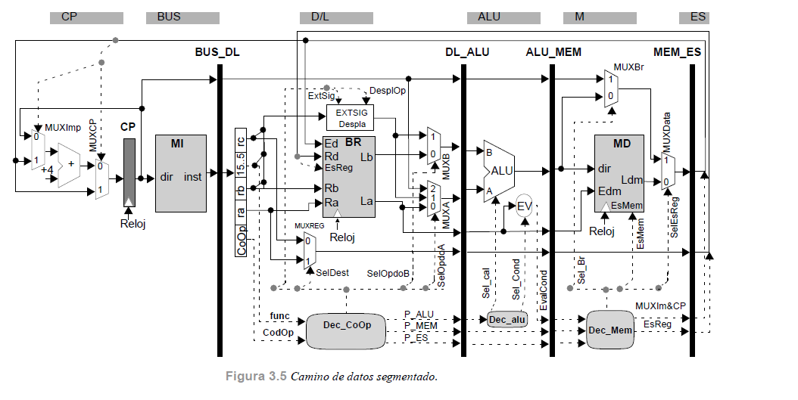
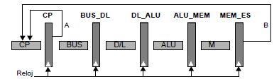
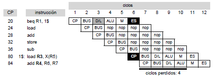
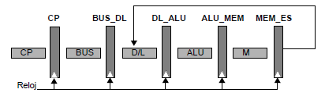
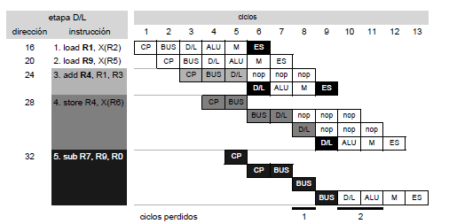
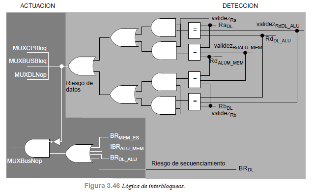
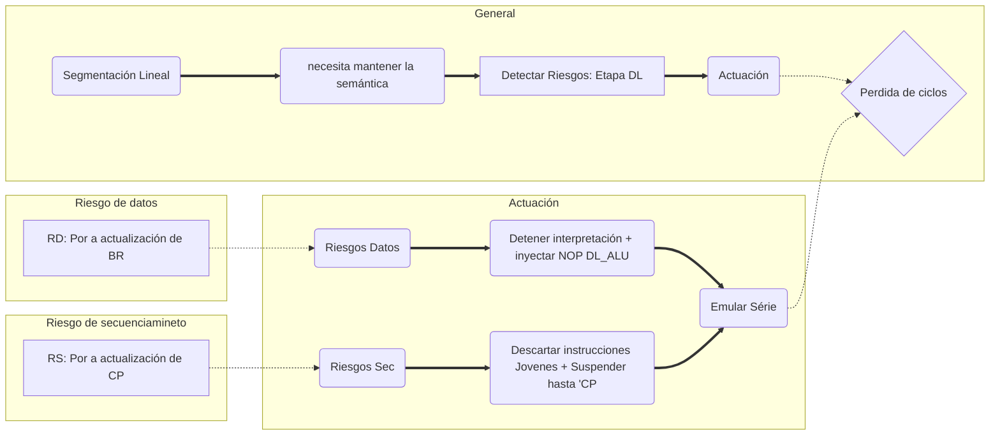

# Procesador segmentado lineal

## Segmentación lineal

Esta es una posible segmentación de un procesador, con su lenguaje maquina:

| 1                    | 2                                     | 3                                        | 4                                  | 5                     | 6                                                      |
| -------------------- | ------------------------------------- | ---------------------------------------- | ---------------------------------- | --------------------- | ------------------------------------------------------ |
| CP                   | BUS                                   | D/L                                      | ALU                                | M                     | ES                                                     |
| Contador de programa | Búsqueda en memoria de la Instrucción | Decodificación + lectura operandos en BR | Operar con los datos suministrados | Acceso a MD o retardo | Escritura en BR y actualización CP(operaciones de  BR) |



| NEMO  | Descripción                        | Semántica instrucción |
| ----- | ---------------------------------- | --------------------- |
| RR    | Instrucción Registro Registro    | ra op rb => rc        |
| RI    | Instrucción Registro Literal      | ra op lit => rc       |
| LOAD  | Carga de memoria                   | MEM[rb+lit] => ra     |
| STORE | Guarda en memoria                  | MEM[rb+lit] <= ra |
| BR    | Saltos condicionales/incondicionales | PC = PC'              |


<u>Lazo o bucle hardware.</u> Es una comunicación entre etapas que permite que en una etapa se utilice información suministrada desde etapas posteriores. La longitud será el número de etapas entre inicio y final más esta última.

## Semántica del procesador segmentado

Una ejecución segmentada debe dar el mismo resultado que una serie, por eso es importante que se respete la semántica que ha expresado el programador en el programa; es decir, que se respete el orden de las lecturas y escrituras a posiciones de almacenamiento.

Respetar este orden viene caracterizado por <u>latencia efectiva de la segmentación</u>, los ciclos entre el inicio de un calculo y el ciclo donde se puede utilizar ese calculo. Se producen riesgos por los necesarios bucles hardware presentes, pueden ser de varios tipos:

### Riesgos de datos

Modificación del orden de escrituras/lecturas especificado sobre una posición de almacenamiento, debido a que el procesador tarda en actualizar los valores de las posiciones de almacenamiento(latencia efectiva de la segmentación).

| TIPO                  | EJEMPO                             |
| --------------------- | ---------------------------------- |
| Dependencia Verdadera | **r1** = r2 + r3; r5 = **r1** + r7 |
| Antidependencia       | r1 = **r2** + r3; **r2** = r1 + r7 |
| Dependencia de salida | **r1** = r2 + r3; **r1** = 6 + r7  |

Existen riesgos de datos por posiciones de memoria y por registros, que son los dos tipos de posiciones de almacenamiento que existen.

#### Debidos a registros

Si existen alguna de las dependencias, entonces es posible que tengamos que emular el funcionamiento serie para respetar la semántica del procesador.

#### Debidos a memoria

Segmentando el camino de datos, es posible que se modifique el orden de las lecturas/escrituras. Siempre debemos cumplir:

* Un store siempre escribe antes de que lea un load posterior. (Dependencia Verdadera)
* Un load siempre lee antes que escriba un store posterior. (Antidependencia)
* Un store siempre escribe que un store posterior. (Dependencia de salida)

### Riesgos de secuenciamiento

Interpretación de instrucciones distinta a la especificada por el programador.

Mientras se evalúa una instrucción de salto condicional, este procesador puede estar ejecutando instrucciones que modifican el estado de la maquina. Deberemos detener la interpretación hasta resolver el riesgo.

### Lógica de interbloqueos - Gestión de riesgos

Para gestionar estos riesgos hay que añadir unidades de control(lógica interbloqueos), trataremos los riesgos en la etapa D/L, la primera donde podemos 'saber' si hay riesgo. La actuación de la lógica será emular el funcionamiento serie, al coste de perder ciclos.


## Segmentación lineal con control de riesgos

### Riesgos de secuenciamiento



El bucle HW A es de latencia 1, no tendremos problemas aquí. Sin embargo, el bucle B tiene latencia 5 y hará perder 5-1=4 ciclos.

En este diseño de procesador, al detectar el Riesgo de secuenciamiento en la etapa D/L deberemos: 

* <u>Descartar</u> las dos instrucciones mas jóvenes que ya habrían empezado su CP y BUS.
* <u>Suspender</u> la interpretación de nuevas instrucciones hasta que desaparezca el RS.



En la practica CP y BUS seguirán haciendo su “trabajo”, pero <u>a la etapa D/L se inyectara una 'NOP'</u>.  En la misma etapa que se escriba el CP correcto, ya podemos reanudar la interpretación serie.

El circuito de detección de Riesgo de secuenciamiento controlara la inyección de NOP a la etapa DL( registro BUS_DL ).

````vhdl
RD<= BR_DL or BR_DL_ALU or BR_ALU_MEM or BR_MEM_ES;
--BR_DL : operacion de BR en la etapa DL
--BR_et_* : operacion de BR en la etapa *
````

### Riesgos de Datos

Tenemos comprobar cada tipo de dependencia de datos para ver si realmente genera riesgo de datos.

* Riesgo de datos por dependencia verdadera

  Existe riesgo si una instrucción mas vieja aun no ha actualizado la posición de almacenamiento para una instrucción mas nueva. Esto se da por que se tardan 3 ciclos en actualizar el banco de registros.

* Riesgo de datos por antidependencia

  Existe riesgo si una instrucción más nueva actualiza una posición antes que una instrucción antigua haya usado este dato; es decir, una instrucción siempre lee antes de que escriba una instrucción anterior. No se da en esta segmentación

* Resigo de datos por dependencia de salida

  Igual que la antidependencia, una instrucción siempre escribe antes de una instrucción posterior. No se da en esta segmentación

* Riesgos debidos a memoria

  En cualquier secuencia de instrucciones, el acceso a memoria siempre se efectúa en el mismo ciclo. No habrá problemas en esta segmentación

En la segmentación por etapas, vemos que la latencia real de la segmentación es de 3 ciclos, desde que se calcula el resultado (etapa ALU) hasta que se actualiza el banco de registros (etapa ES).



Para solventar los riesgos de datos deberemos <u>bloquear la interpretación</u> de instrucciones en la etapa DL y las posteriores además de inyectar NOP en la etapa ALU(<u>inyectar</u>). 



El circuito de control tomará los registros fuente (A y B) de la instrucción en la etapa DL y los comparamos con los registros destino de las instrucciones en las etapas ALU y M; si alguna comparación es cierta, activaremos la señal de riesgo de datos. Además de señales de validación de control.



### Solapamiento de riesgos

Si tenemos a la vez, riesgo de datos y riesgo de secuenciamiento; deberá primar resolver el riesgo de datos ya que este bloquea la interpretación de instrucciones; una vez resuelto este riesgo, se actuará sobre el riesgo de secuenciamiento.

## Resumen



````mermaid
graph LR;
subgraph Registros
a ==> C(Debido a registros)
C -.-> f(Dependencia verdadera) ==> s("R1 = r2+r4 y r6 = R1 + r9")
C -.-> e(Antidependencia) ==> u("r1 = R2 + r3 y R2 = r2 + r9")
C -.-> r(Dependencia de salida) ==>b("r1 = 80+2 y r1 = 82+3")
end
subgraph Memoria
a[RD] ==> B(Debido a memoria)
B -.-> y(Load lee antes que un store posterior escriba)==>u
B -.-> x(Store escribe antes que un store posterior escriba)==>b
B -.-> v(Store escribe antes que un Load posterior lea) ==>s
end
````


