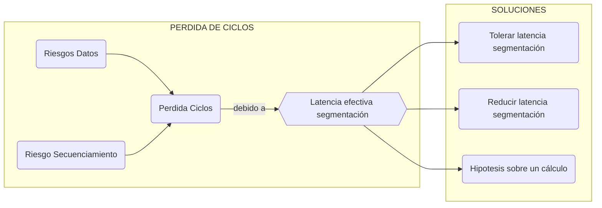
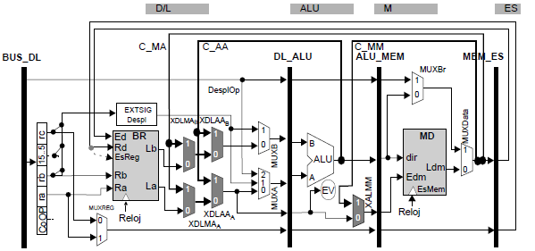
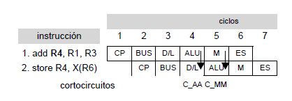
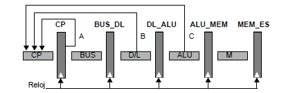
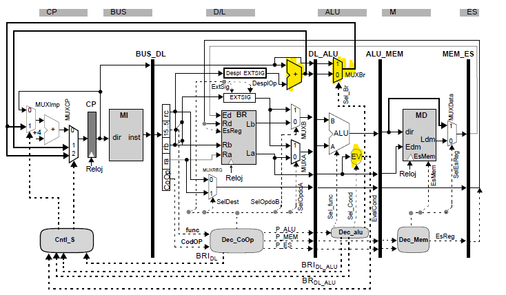
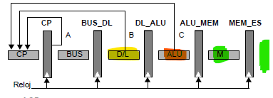

# Técnicas para tolerar/reducir la latencia efectiva

Con la segmentación del tema 3 tenemos ciertos momento de riesgo donde perdemos ciclos, en este tema se exponen varias soluciones.



## Planificación de instrucciones - Tolerar latencia segmentación

Sobre un conjunto de instrucciones, puede existir una ordenación que no afecete en el resultado final y tolere la latencia de segmentación. Entre una instrucción productora y una consumidora se colocan otras instrucciones que no afecten el resultado y que 'den tiempo' a la productora a escribir el resultado. 

> Tres ordenaciones diferentes de las instrucciones, que dan el mismo resultado
>
> ````asm
> add r4, r1, r3 		add r4, r1, r3 		add r4, r1, r3
> sub r5, r2, r4 		sub r9, r8, r6 		sub r9, r8, r6
> sub r9, r8, r6 		sub r5, r2, r4 		cmple r12, r13, r14
> add r10, r0,r9 		add r10, r0,r9 		sub r5, r2, r4
> cmple r12, r13, r14 cmple r12, r13, r14 add r10, r0, r9
> CP = 2 + 2			CP = 1				CP = 0
> ````
>
> El diagrama resultante es:
>

El grafo de dependencias expresa un orden parcial.

### Bloque básico estático BB

Los bloques de instrucciones a ordenar a traves de un algoritmo de planificación se llaman bloques básicos estáticos. 

* Empezará en un *líder* que se identifica:
  * En el principio del código,
  * Una instrucción destino de secuenciamiento,
  * Una instrucción de secuenciamiento, acaba en el próximo líder.
* Acabará en el próximo líder, esta ultima instrucción tendra una dependencia de control. Deberá interpretarse siempre en úlitmo lugar.

Cualquier ordenanción del grafo del BB es una planificación correcta. El objetivo es perder el menor numero de ciclos posible.

### Algoritmo de planificación de instrucciones

* Una planificación para reducir los ciclos perdidos deben tener en cuenta el retardo/latencia productor-uso. 

* Los compiladores son los encargados de aplicar los algoritmos (medio transparente al programador).

* Un algoritmo de planificación, por lista tendrá las siguientes caracteristicas:

  1. Partir del grafo de dependencias, añadir etiqueta con  el retardo productor-uso -1.
  2. Antidependencias y dependencias de salida etiqueta 0. Arcos adicionales para la última instrucción(BR).
  3. Lista elegibles:
     1. Raices del árbol o nodo sin predecesor
     2. Tiene predecesor y t >=TMC(se calcula->TMC=t+tag)
  4. Euristica selección: Se eligira de la lista de elegibles el que cumpla
     1. Camino más largo
     2. Si hay empate, el que aparecia primero en el orden del programa

  ````c
  //PSEUDOCODIGO:
  int t = 0;
  List<ints> ret; Graph<inst> dep; List<inst> ele;
  ele = init(dep); //inicializar lista elegibles
  while(!dep.isEmpty()){
      if(ele.isEmpty()) ++t, break;
      inst n = heuristica(ele);
      del_graph_list(n);
      append(ret, n);
      ++t;
  	for_each(node s: n->succesors) 
          s.tag = max(s.tag, t+s.arco);
      for_each(node s: dep)
          if(s->tag < 0) ele.add(s);
     	ele.add(dep.roots);
  }
  return ret;
  ````

## Cortocircuitos - Reducir laténcia segmentación

Observamos que el resultado de una operación ya se conoce antes de que se escriba, entonces se puede enviar este resultado a etapas posteriores para su uso. Tomando la segmentación clásica, tenemos los siguientes cortocircuitos para reducir la latencia de actualización del banco de registros:

````mermaid
graph LR;
subgraph Etapas
	M -.-> D/L
	ALU -.-> D/L
	ES -.-> M
	CP ==> BUS ==> D/L ==> ALU ==> M ==> ES
end
````

### Características de los cortocircuitos

Un cortocircuito añade un bucle hardware, y almenos un multilpexor para poder selecionar la información.

* Nomenclatura : C_FuenteDestino. donde fuente y destino son las unidades funcionales productora y consumidora.

La comunicación entre etapas puede hacerse al final de una etapa:

* Finalizando el ciclo : El tiempo de la etapa solo se suma el tiempo del multiplexor.
* Al inicio del ciclo: El tiempo total es la suma de los dos tiempos de lógica.

Para hacer un análisis hay que estudiar:

* Latencia de cálculo (fase de ejecucción): Ciclos desde que se usan los datos hasta obtener el resultado

* Instrucciones consumidoras de datos: Instrucciones que necesitan datos de las productoras. (ENT, STORE, LOAD y BR).

* Instrucciones productoras de datos: Instrucciones que generan resultados y las guardan (ENT, LOAD).

* Distancia (en ciclos) entre el inicio de la ejecución de una productora y la necesidad del dato por la consumidora

En nuestro caso, tenemos que la latencia de cálculo es de 1 ciclo para las instrucciones ENT (ciclo ALU) y 2 ciclos para las instrucciones STORE (ciclo ALU + ciclo M). Podemos organizar la información como:

| **D=1**  |           | Con       | su        | mi        | dor       | as/      | Lec      | tur      | as        |
| -------- | --------- | --------- | --------- | --------- | --------- | -------- | -------- | -------- | --------- |
| **esc**  |           | **RR.ra** | **RR.rb** | **RI.ra** | **RI.rb** | **L.rb** | **S.ra** | **S.rb** | **BR.ra** |
| **ritu** | **RR.rc** | C_AAa     | C_AAb     | C_AAa     | C_AAb     | C_AAb    | C_AAa    | C_AAb    | C_AAa     |
| **ras**  | **RI.rc** | C_AAa     | C_AAb     | C_AAa     | C_AAb     | C_AAb    | C_AAa    | C_AAb    | C_AAa     |
| **PROD** | **L.ra**  | *         | *         | *         | *         | *        | C_MM     | **       | *         |

En distancia 1, la instrucción de hace 1 ciclo estara en la etapa ALU y el dato se necesita en la ALU, se utiliza el corto ALU-ALU. En el caso que un load produzca un dato necesario para un store posterior se utiliza el corto M-M.

'*' Se necesita consumir el dato en la etapa ALU para realizar el cálculo.  En este caso <u>hay un riesgo de datos.</u>

'**' Se necesita consumir el dato en la etapa ALU para calcular la @ efectiva del Store. En este caso <u>hay un riesgo de datos.</u>

En el caso de S.ra, este dato se consume en la etapa M.

| **D=2**  |           | Con       | su        | mi        | dor       | as/      | Lec      | tur      | as        |
| -------- | --------- | --------- | --------- | --------- | --------- | -------- | -------- | -------- | --------- |
| **esc**  |           | **RR.ra** | **RR.rb** | **RI.ra** | **RI.rb** | **L.rb** | **S.ra** | **S.rb** | **BR.ra** |
| **ritu** | **RR.rc** | C_MAa     | C_MAb     | C_MAa     | C_MAb     | C_MAb    | C_MAa    | C_MAb    | C_MAa     |
| **ras**  | **RI.rc** | C_MAa     | C_MAb     | C_MAa     | C_MAb     | C_MAb    | C_MAa    | C_MAb    | C_MAa     |
| **PROD** | **L.ra**  | C_MAa     | C_MAb     | C_MAa     | C_MAb     | C_MAb    | C_MMa    | C_MAb    | C_MAa     |

En este caso se utiliza el corto entre memoria y la ALU, pues a distancia 2 la instruccion de 2 ciclos antes ya habra leido el dato de memoria o el dato estara en esa etapa.



Los cortocircuitos necesitaran de multiplexores y señales de control. La leyenda para las señales de control es X.etapa.nombreCorto{.operando}.

### Cortocircuitos lógicos vs hardware

Con este modelo, es possible que se pueda enviar el mismo dato en diferentes etapas:



Varios cortos lógicos pueden implementarse con un único físico también varios cortocircuitos físicos pueden implementar el mismo corto lógico.

El dato lo proporciona ALU a la etapa DL y M a la etapa ALU.

### Lógica de interbloqueos

Dedicada a la gestión de los cortos y de los bloqueos necesarios. Como los cortos eliminan RD, el circuito de deteción es el mismo, variando la parte de actuación.

La actuación se dedica a validar los datos de los cortocircuitos y fijar el camino de los multiplexores.

## Secuenciamiento - Reducir la latencia de segmentación

Hasta ahora, el bucle HW de las instrucciones de secuenciamiento tenia un latencia de 5 ciclos (perdiendo 4 ciclos) pero el calculo del salto y la actualización del registro CP se puede adelantar(en la etapa M ya se conoce el nuevo CP) :



### Secuenciamiento condicional

Al final de la etapa ALU ya se ha evaluado la condición de salto y se puede alimentar la etapa CP (Bucle C). El nuevo bucle HW tiene longuitud de 3  y se perderan 3-1 = 2 ciclos.

### Secuenciamiento incondicional

En este caso no hace falta esperar a la etapa ALU, pues si o si tomaremos el salto. Añadiendo un <u>sumador</u> en la etapa DL (calculo de la @ efectiva) y <u>alimentando la etapa CP</u> (Bucle B). 

El nuevo bucle HW tiene longutiud 2 y se perdera 1 ciclo.

### Camino de datos



El camino con estas mejoras de secuenciamiento seguirá con el secuenciamiento por defecto (bucle A) y se añadira un circuito de control para el multiplexor del registro CP. 

Tambien hay que modificar el circuito de detección y actuación de riesgos de secuenciamiento(se debe eliminar las dos instrucciones que se estan interpretando e inyectar una nop).

## Secuenciamiento - Hipotesis / Predicción fija del sentido

En este caso, reduciremos la penalización de las instrucciones de secuenciamiento sin reducir la latencia efectiva de la segmentación.

La idea es efectuar una <u>predicción</u> (fija, siempre la misma en este caso) sobre el salto y seguir en secuencia. En caso de hacer una hipotesis erronea, se perderan ciclos. Debemos garantizar :

* Verificar la predicción (etapa ALU).
* Las instrucciones predichas no modifican el estado del procesador (etapas M y ES).
* Poder restaurar el flujo correcto, si se necesita (actualizar etapa CP).

Un salto puede <u>seguir en secuencia</u> (no saltar, CP = CP +4) o <u>modificar el secuenciamiento</u> (saltar, CP = CP'). 



### Modelo de predicción

Este modelo esta basado en las estructuras de bucle; con alta frecuencia los bucles saltan con valor negativo a su inicio. Entonces obtenemos el modelo:

* Si es positivo, se predice seguir en secuencia.
* Si es negativo, se predice saltar.

La predicción se efectua en el ciclo DL y se verifica en la etapa ALU (módulo EV). Si es necesario recuperarse de una predicción, el mecanismo se inicia después de la verificación y actualiza el registro CP y descarta la instrucciones predichas.

En D/L se conoce la @ efectiva del salto.

| Predicción  | Seguir en Secuencia                                          | Saltar/Modificar                                             |
| ----------- | ------------------------------------------------------------ | ------------------------------------------------------------ |
| **Acierto** | Las etapas posteriores tiene las instrucciones correctas.    | Se descartan las instrucciones posteriores y la etapa DL modifica el CP. |
| **Fallo**   | Se modifica el CP desde la etapa ALU y se descartan las instrucciones predichas. | La recuperación consiste en comunicar el nuevo CP y descartar las instrucciones que se habian predicho. |

<table>
    <tr>
        <th>Predicción</th>
	    <th>Seguir en secuencia</th>
    	<th>Saltar/Modificar</th>
    </tr>
    <tr>
    </tr>
	<tr>
        <td>Acierto</td>
		<td></td>
		<td></td>
    </tr>
    <tr>
        <td>Fallo</td>
		<td></td>
		<td></td>
    </tr>
</table>


### Riesgos con instrucciones predichas

Un riesgo en las instrucciones predichas esta <u>condicionada</u> por el caso que no se deba ejecutar esa instrucción (<u>ciclo de recuperación a la vez que el riesgo</u>). Una instrucción en D/L puede:

* Detectar RD
* Detectar RS

Solo debemos tratar esto riesgos <u>SI</u> hemos acertado en la predicción.

Si detectamos un RS o RD y un fallo en la predicción, el fallo ya descarta las instrucciones posteriores.

Si no hay fallo en la predicción, deberemos usar las técnicas para evitarlos(inyectar nop's).

