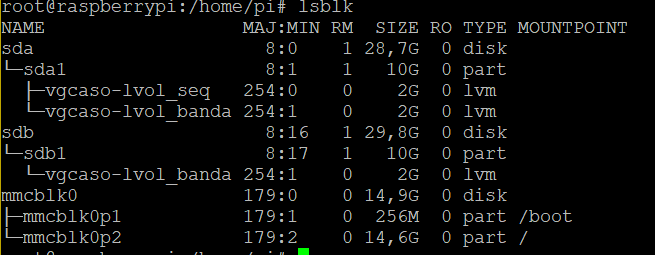

## Administració de RAID

#### Victor Correal - Sergil Gil

1. Crea una partició a cada disc físic:

   ````shell
   sudo fdisk -l
   sudo fdisk /dev/sda
   fdisk: d
   fdisk: n
   fdisk: p
   fdisk: 1
   fdisk: +10G
   fdisk: w
   
   sudo fdisk /dev/sdb
   fdisk: d
   fdisk: n
   fdisk: p
   fdisk: 1
   fdisk: +10G
   fdisk: w
   
   sudo partprobe
   
   ````

2. Crear un volum físic (Physical Volume) a cada partició (pvcreate).

   ````shell
   pvcreate /dev/sda1
   pvcreate /dev/sdb1
   pvdisplay
   "/dev/sda1" is a new physical volume of "10,00 GiB"
   --- NEW Physical volume ---
     PV Name               /dev/sda1
     VG Name
     PV Size               10,00 GiB
     Allocatable           NO
     PE Size               0
     Total PE              0
     Free PE               0
     Allocated PE          0
     PV UUID               u3yefE-udAB-fvub-HPvE-0m12-v6ZM-YgQAjc
   
   "/dev/sdb1" is a new physical volume of "10,00 GiB"
   --- NEW Physical volume ---
     PV Name               /dev/sdb1
     VG Name
     PV Size               10,00 GiB
     Allocatable           NO
     PE Size               0
     Total PE              0
     Free PE               0
     Allocated PE          0
     PV UUID               tv3Jmd-0Sg2-D156-zaa0-R3O0-jn8Z-tcBEQZ
   ````

3. Crear un grup de volums (Volume Group) que agruparà als volums físics de varis discs en un sol
   disc (vgcreate). Agrupeu els dos pv que heu creat a l’apartat anterior en un Volume Group
   anomenat vgcaso.

   ````shell
   vgcreate vgcaso /dev/sda1 /dev/sdb1
    Volume group "vgcaso" succesfully created
   ````
   
4. Crear n volum lògic (Logical Voume). És un dispositiu de blocs virtual, creat a sobre d’un VG
   (lvcreate). Aquest és el pas més important, on decidiu és lineal, stripped i el nivell de RAID. Us
   demanen crear dos LV, tots dos de tamany 2GB. Un d’ells, anomenat lvol_banda, ha de ser stripped
   sobre els dos PV i l’altre lineal, anomenat lvol_seq.

   ````shee
   lvcreate --stripes 2 --size 2GB vgcaso -n lvol_banda
   lvcreate --size 2GB vgcaso -n lvol_seq
   ````

   

5. Crear un sistema de fitxers pel volum lògic (mkfs). Creieu que el tipus de sistema de fitxers afecta al
   rendiment? Trieu dos sistemes de fitxers qualssevol (per exemple, ext3 i xfs). Per a cadascun, doneu
   format als LVs creats a l’apartat 4 i avalueu el rendiment d’escriptura i de lectura amb la comanda dd

   `````shell
   mkfs.ext3 /dev/vgcaso/lvol_seq
   mkfs.ext3 /dev/vgcaso/lvol_banda
   mkfs.fat /dev/vgcaso/lvol_seq
   mkfs.fat /dev/vgcaso/lvol_banda
   #Escriptura de paquets 10000 de 4K sobre els diferents
   dd if=/dev/urandom of=/dev/vgcaso/lvol_seq bs=4k count=100000
dd if=/dev/urandom of=/dev/vgcaso/lvol_banda bs=4k count=100000
   #Lectura de paquets 10000 de 4K sobre els diferents
   dd of=a.txt if=/dev/vgcaso/lvol_seq bs=4k count=100000
   dd of=a.txt if=/dev/vgcaso/lvol_banda bs=4k count=100000
   `````
   


| Sistema de Fitxers | ext3 - Escriptura | ext3 - Lectura   | fat - Escriptura  | fat-Lectura     |
| ------------------ | ----------------- | ---------------- | ----------------- | --------------- |
| **lvol_banda**     | 46.47 - 8.8 MB/s  | 35.18-11.36 MB/s | 40.64 - 10,1 MB/s | 36.65-11,2 MB/s |
| **lvol_seq**       | 25.17 - 16.3 MB/s | 58.84-7.0 MB/s   | 24.82 - 16,5 MB/s | 37.65-10,9 MB/s |

Nota: Són verosimils els nombres obtinguts? 

> Aquests resultats els hem obtingut sobre una Raspberry Pi 3 model B amb 2 pendrives externs. Tal i com podem observar, no hi ha diferències abismals en termes generals amb els sistemes de fitxers, però si que es nota una millora en el temps de lectura i escriptura quan s'usa FAT enlloc de EXT3. 
>
> Diferents sistemas de fitxers tindran rendiments diferents. El tamany de bloc es una característica fundamental i el rendiment variara amb la selecció del tamany de lectura/escriptura (en el cas del dd el paràmetre bs)

Executeu la línia de comandes sudo /sbin/sysctl -w vm.drop_caches=3. I repetiu l’experiment. Justifiqueu la diferència de resultats obtinguts:

| Sistema de Fitxers | ext3 - Escriptura | ext3 - Lectura   | fat-Escriptura    | fat-Lectura       |
| ------------------ | ----------------- | ---------------- | ----------------- | ----------------- |
| **lvol_banda**     | 46.91 - 8.7 MB/s  | 54.36 - 7.5 MB/s | 25.98 - 15.8 MB/s | 66.63 - 6.1 MB/s  |
| **lvol_seq**       | 25.44 - 16.1 MB/s | 60.38 - 6.8 MB/s | 38.92 - 10.5 MB/s | 37.10 - 11.0 MB/s |

> Per saber si són realment verosímils potser caldria executar en un entorn diferent a una Raspberry. En el nostre cas, com a molt, hem pogut concloure que els ports de USB de la Raspberry Pi comparteixen els recursos.
>
> Esta clar que el rendiment del sistema banda hauria de ser major que el rendiment secuencial, un RAID ha d'implementarse per guanyar ampla de banda.