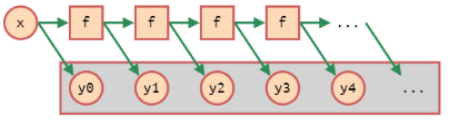
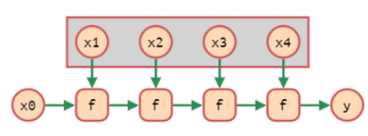
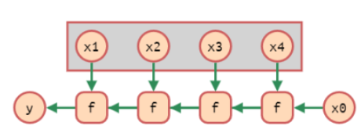
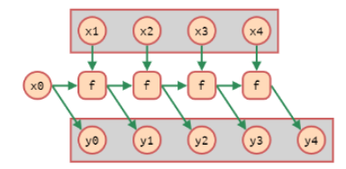
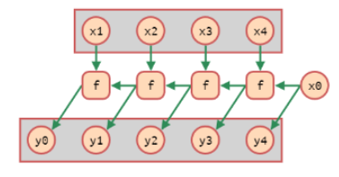

# Funcions d’ordre superior (FOS)

Aquelles funcions que reben o retornen una funció:

````haskell
apli2 :: (a->a) -> a -> a
apli2 f x = f (f x)
````

Aquí apliquem una funció dos cops, la capçalera descriu que donada una funció de ‘a’ en ‘a’ i un element a, retorna l’aplicació de dos cops de la primera funció.

### Funcions anònimes

O $\lambda$ funcions, son aquelles expressions que representen una funció sense nom. Útil per a funcions curtes:

````haskell
\x-> x + 3 	--funció que donada una x, retorna x+3. 
(\x->x+3) 4 --Per aplicar-la sobre un paràmetre:
map (\x->2*x) [1..10] --el map rep la funció anònima.

\x y -> x + y --lambda amb multiples paràmetres
\x-> \y -> x+y
````

### Seccions

Permeten aplicar operadors infixos parcialment:

`````haskell
(op y) => \x -> x op y	--per la dreta
(y op) => \x -> y op x  --per l'esquerra
meitat = (/2)
`````

## FOS habituals

Haskell te predefinides algunes funcions d’ordre superior:

| Nom / Operador |            Capçalera ::            |                  Descripció                   |
| :------------- | :--------------------------------: | :-------------------------------------------: |
| composició (.) |   b -> c) -> (a -> b) -> a -> c    |       t+Grans= take 3 . reverse . sort        |
| aplicació ($)  |          (a->b) -> a -> b          |              tail $ tail "Jordi"              |
| const          |            a -> b -> a             |          const 42 sempre retorna 42           |
| id             |               a -> a               |              id [1..5] -> [1..5]              |
| flip           |       (a->b->c) -> (b->a->c)       |        funcio amb parametres invertits        |
| map            |        (a->b) -> [a] -> [b]        |       aplica una funcio a la llista d'a       |
| filter         |      (a->Bool) -> [a] -> [a]       |           llista d'a que compleix f           |
| zipWith        |   (a->b->c) -> [a] -> [b] -> [c]   |       opera element a element a (op) b        |
| zip            |       [a] -> [b] -> [(a,b)]        |         Retorna una llista de tuples          |
| all            | all :: (a -> Bool ) -> [a] -> Bool |          Tots elements compleixen f           |
| any            |      (a->Bool) -> [a] -> Bool      |           Algun element compleix f            |
| dropWhile      |      (a->Bool) -> [a] -> [a]       | elimina els primers elements que compleixen f |
| takeWhile      |      (a->Bool) -> [a] -> [a]       |  agafa els primers elements que compleixen f  |
| iterate        |         (a->a) -> a -> [a]         |   llista infinita d'aplicar f recursivament   |
| foldl          |   (b -> a -> b) -> b -> [a] -> b   |      desplega per l'esquerra un operador      |
| foldr          |   (a -> b -> b) -> b -> [a] -> b   |       desplega per la dreta un operador       |
| scanl          |  (b -> a -> b) -> b -> [a] -> [b]  |      com foldX pero resultats intermedis      |
| scanr          |  (a -> b -> b) -> b -> [a] -> [b]  |      com foldX pero resultats intermedis      |

| Funció  |                          Descripció                          |
| ------- | :----------------------------------------------------------: |
| Iterate |  |
| foldl   |  |
| foldr   |  |
| scanl   |  |
| scanr   |  |
|         |                                                              |

Els clàssics paradigmes de programació es poden traduir a haskell de forma molt més concisa:

````haskell
ys = map func xs 	--bucle que aplica una funció i dona el resultat
ys = filter func xs	--igual que map pero amb un if	
y = foldl oper zero xs --aplicar un operador sobre tot un vector
````
