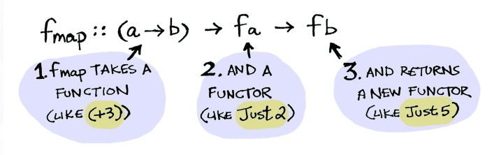
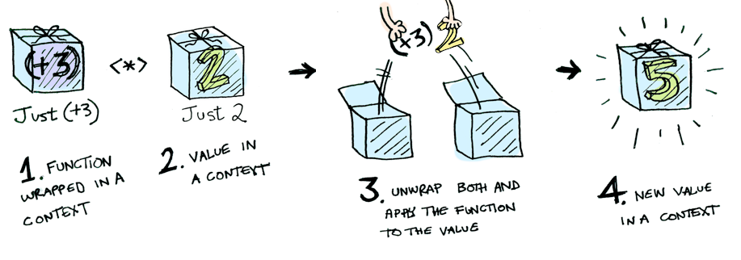
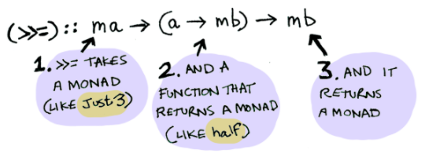

## Functors

Tenim alguns casos on volem aplicar funcions més enllà:

````haskell
λ>(+3) 2			👉--5
λ>(+3) (Just 2) 	👉--error compilacio -> podem fer servir fmap
````
En una aplicació real, tenim que aquest functor ens cobreix les típiques situacions de comprovar nulls/none:

````python
post = Posts.find(1234)
if post is None:
    return None
else:
    return post.title
````

A haskell, tindríem:

````haskell
fmap getPostTitle (findPost 1234) --findPost retorna Maybe
--formes alternatives:
getPostTitle `fmap` findPost 1234
getPostTitle <$> findPost 1234
````

La definició de fmap es:



````haskell
λ> :info Functor
class Functor f where
    fmap :: (a -> b) -> f a -> f b
````

Aplica una funció a un contenidor genèric ``f a`` retornant un contenidor del mateix tipus.

````haskell
λ> fmap (+3) (Right 2)      👉  Right 5
λ> fmap (+3) (Left "err")   👉  Left "err"
λ> fmap (+3) [1, 2, 3]      👉  [4, 5, 6]        -- igual que map
λ> fmap (+3) (1, 2)         👉  (1, 5)           -- perquè (,) és un tipus
λ> (fmap (*2) (+1)) 3       👉  8                -- igual que (.)
````

Per aplicar fmap, necessitem que la classe de tipus sigui instancia de functor, als tipus predefinits tenim:

````haskell
instance Functor Maybe where
	fmap f Nothing = Nothing
	fmap f (Just x) = Just (f x)  
instance Functor (Either a) where
	fmap f (Left x) = Left x
	fmap f (Right x) = Right (f x)
instance Functor [] where
	fmap = map
--Al instancia el functor, deixem un paràmetre lliure.
````


Inclús, les funcions son functors també:

`````haskell
instance Functor ((->) r) where
	fmap = (.)
`````

### Lleis de functors

Els functors han de complir aquestes lleis, Haskell no les comprovarà:

1. Identitat: ``fmap id = id``; aplicant la funció identitat ha de quedar el mateix contenidor amb el mateix valor.
2. Composició: ``fmap(g1 . g2) = fmap g1 . fmap g2``; 

//ToDo: Comprovar que Maybe, Either a, [], (,), (->) compleixen les lleis dels functors.

## Aplicatius

El següent pas es aplicar funcions sobre contenidors, que estan a un contenidor:

```haskell
λ> (+3) 2 --aplicacio normal funció
λ> fmap (+3) (just 2) --aplicació de functors
λ> ((Just (+3)) (Just 2) -- error -> podem fer servir aplicatius
λ> Just (+3) <*> Just 2 -- app

--tenim aquest comportament:
λ> Just (+3) <*> Just 2             👉   Just 5
λ> Just (+3) <*> Nothing            👉   Nothing
λ> Nothing <*> Just (+3)            👉   Nothing
λ> Nothing <*> Nothing              👉   Nothing
λ> Right (+3) <*> Right 2           👉   Right 5
λ> Right (+3) <*> Left "err"        👉   Left "err"
λ> Left "err" <*> Right 2           👉   Left "err"
λ> Left "err1" <*> Left "err2"      👉   Left "err1 "
```

L'operador <*> és una operació de la classe applicative (tmb ha de ser functor).

````haskell
class Functor f => Applicative f where
    (<*>) :: f (a -> b) -> (f a -> f b)
    pure  :: a -> f a --construeix un contenidor amb un valor
````

### Lleis dels aplicatius

1. Identitat `pure id <*> v = v`
2. Homomorfisme `pure f <*> pure x = pure (f x)`
3. Intercanvi `u <*> pure y ≡ pure ($ y) <*> u`
4. Composició `u <*> (v <*> w) ≡ pure (.) <*> u <*> v <*> w`
5. Relació amb el functor `fmap g x = pure g <*> x`

//ToDo: Instancieu les llistes com aplicatius (hi ha 2 formes).

La definició mes adient del aplicatiu es:



## Mònades

L'ultima aproximació que farem serà per aplicar funcions a valors "empaquetats", cal un desempaquetador. L'operador `>>=` (bind) es aquest desempaquetador.

````haskell
class Applicative m => Monad m where
	return:: a -> m a 					--desempaqueta
    (>>=) :: m a -> (a -> m b) -> m b	--desempaqueta, aplica i empaqueta
	(>>)  :: m a -> m b -> m b			--estètica
	r >> k   =   r >>= (\_ -> k) 		--estètica
meitat :: Int -> Maybe Int
meitat x
    | even x    = Just (div x 2)
    | otherwise = Nothing
Just 40 >>= meitat -- resultat 20 int
Just 31 >>= meitat -- Nothing
Nothing >>= meitat -- Nothing

instance Monad Maybe where
    Nothing >>= f   =   Nothing
    Just x  >>= f   =   f x
--tmb son monades, either a i [].
````



`Maybe`, `Either a`, `[]` son instàncies de mònades.

### Lleis de les mònades

1. Identitat per l'esquerra `return x >>= f ≡ f x`
2. Identitat per la dreta `m >>= return ≡ m`
3. Associativa `(m >>= f) >>= g = m >>= (\x -> f x >>= g)`

//ToDo: Comproveu que Maybe, either a i [] compleixen les lleis de les mònades.

### Notació `do`

Sucre sintàctic, fa semblar codi imperatiu, facilita l’ús de les mònades.

Es pot “extreure“ un resultat amb l’operador `<-`

````haskell
do
	x <- e1
	e2
--Codi equivalent a
e1 >>= \x -> e2
do
	e1
	e2
--Codi equivalent a 
e1 >>= \_ -> e2
````

