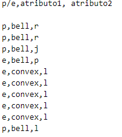
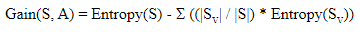
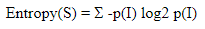
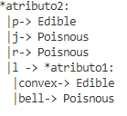

# Arboles de decisión para identificar setas

Este proyecto se divide en dos partes:

* Una primera se centra en generar un árbol de decisión, basado en el algoritmo ID3, para discernir entre setas comestibles o venenosas.
* En la segunda etapa, se pueden hacer pronósticos sobre diferentes setas.

Una seta esta representada por una lista de atributos con diferentes valores. Se ha usado el [*Mushroom data set* ](https://archive.ics.uci.edu/ml/datasets/Mushroom).

# Tabla de contenidos

1. [Instalación](#Instalación)
2. [Uso](#Uso)
3. [Descripción del algoritmo](#Descripción-del-algoritmo)
4. [Heurística](#Heurística-del-algoritmo)
5. [Créditos - Bibliografía](#Créditos-y-Bibliografía)

### Instalación

El proyecto esta desarrollado en Haskell, se puede compilar con la orden `ghc main`.

En esta carpeta se pueden encontrar los archivos ``*.hs`` que contienen el código fuente.

### Uso

Se generara un archivo ejecutable con la anterior orden; una vez el programa haya construido el árbol de decisiones, se pueden hacer pronósticos entrando los valores pedidos por el programa.

Los datos son cargados automáticamente del archivo `agaricus-lepiota.data`.

### Descripción del algoritmo

Se ha implementado, siguiendo el algoritmo ID3 (*Iterative Dichotomiser 3*), tenemos los siguientes pasos:

1. Retirar los datos 

2. Para la lista de setas que tengamos para clasificar, calculamos la entropía de todas las setas y de cada atributo, para poder calcular la ganancia de información.

3. Para el atributo que tenga mas ganancia de información, dividimos la lista por los posibles valores que tengamos; una vez hecho esto podemos tener los siguientes casos para cada valor del atributo:

   * Todos las setas con ese valor del atributo son comestibles/venenosas 

     :arrow_right: Podemos añadir al árbol, donde la raíz es el atributo en cuestión esta deducción.

   * No todas las setas son comestibles/venenosas. 

     :arrow_right: En este caso, volvemos al punto 2 con la lista de setas con este valor de atributo

4. Una vez clasificados todos, tenemos un árbol de decisión sobre la lista de setas.

Se puede encontrar mas información sobre ID3 en la bibliografía.

#### Mushroom Data Set 

El data set utilizado esta descrito en el archivo `agaricus-lepiota.names`

Podemos ver en la descripción que para el atributo numero 11 tenemos valores faltantes, se ha optado por retirar la columna entera del data set.

#### Heurística del algoritmo

Veamos un ejemplo con datos pequeños; tomemos el siguiente datos, los valor siguiente (son valores de prueba, no tienen mayor significado):

Para estos datos, calculamos la ganancia que tendríamos usándolos como raíz del árbol. La entropía es un estadístico que determina la cantidad de indeterminación (valores cercanos a 0 indican mucha determinación, cercanos a 1 lo contrario)

Una vez hechos los cálculos, podemos seleccionar el atributo que nos servirá para crear el árbol; en las sucesivas llamadas recursivas se realizara el mismo calculo pero con los datos que todavía no han sido clasificados

El resultado final seria:

### Créditos y Bibliografía

Este código ha estado desarrollado por Victor Correal Ramos, para la asignatura de LP, impartida en la UPC-FIB.

Como bibliografía, se han visitado los siguientes recursos:

* [Explicación detallada del ID3](https://www.kdnuggets.com/2020/01/decision-tree-algorithm-explained.html)

* [Wikipedia ID3](https://en.wikipedia.org/wiki/ID3_algorithm)

* [Ejemplos sobre Entropia/Ganancia Información](https://www.cise.ufl.edu/~ddd/cap6635/Fall-97/Short-papers/2.htm)
