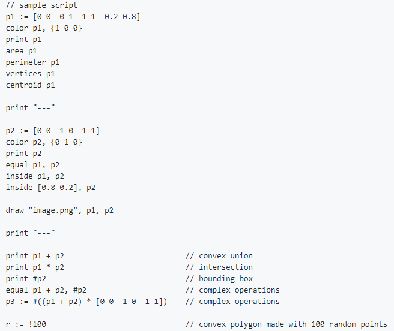

# PolyBot

Petit projecte en Python3 per visualitzar, operar i calcular amb polígons convexos.
El projecte consta d'un bot de Telegram per interactuar amb els polígons. El bot de Telegram llegeix un llenguatge definit amb ANTLR4.

## Executar el projecte

Instruccions per executar el projecte en local.

### Prerequisits

El projecte està desenvolupat per Python 3.8.5.
Es proporciona un `requeriments.txt` amb les llibreries necessàries.

```
pip3 install -r requeriments.txt
```
Els paquets utilitzats son:
* antlr4-python3-runtime : Runtime per interactuar amb la gramàtica definida amb ANTLR4.
* python-telegram-bot : Crides per gestionar el bot de telegram.
* pillow : Crides per generar imatges de polígons.
* unittest : Test automàtics.

### Llenguate de poligons
S'ha definit un llenguatge per treballar amb els objectes polígons, poder operar-los i consultar dades. La gramàtica esta definida a `/cl/poli.g4`, podem definir-la amb els següents punts:

* Identificadors : Cualsevol nom començant per una lletra, identifiquen un polígon. Podem crear nous poligons amb la sintàxis : id := [1 2 3 4].

* Comentaris : Les linies que comencen per '//' son ignorades.

* Operacions: 'area', 'perimeter', 'vertices', 'centroid', 'color', 'inside', 'equal', 'draw', '+' (convex union), '*' (intersecció), '#' (bounding box), '!'(poligon random). aplicades sobre un identificador de poligon i retornen el resultat.

Un exemple de codi:




Per tal de treballa amb el parser, s'ha definit un *visitor* (recorre l'arbre generat per ANTLR4) al arxiu `myVisitor.py`.

### Configurar i executar

Per executar el bot, caldrà un _token_ de telegram-bot; cal registrar-lo al *Bot Father* de Telegram.

Un cop fet això, s'ha de cridar el script dins de la carpeta de `bot/bot.py`, que executara el bot.

```shell
cd bot
python3 bot.py
```

Això iniciarà el bot, que podrà començar a rebre comandes dels usuaris.

Es pot tancar el bot, enviant des de Telegram **/down**.
Es pot demanar ajuda sobre les comandes amb la comanda **/help**.

## Test

A la carpeta `test` es proporcionen els següents scripts:
* testPoly1.py : Script pel test de `polygon.py` i `printPoly.py`
* testPoly2.py : Script de test automàtic per `polygon.py`.
* testANTLR1.py : Script per interactuar amb el *runtime* de ANTLR4.
* testANTLR2.py : Script de test automàtic per ANTLR4 i el domini dels polígons convexos.


## Distribució d'arxius
* polygon.py : Implementació d'operacions i gestió de polígons convexos.
* printPoly.py : Funció per imprimir
* Carpeta cl : Definició de la gramàtica a `poli.g4` i del visitor a `myVisitor.py`.
* Carpeta bot : `bot.py` Script del bot per rebre missatges i cridar al parser.

## Construït amb

* [Python](https://www.python.org/) - Llenguatge de programació.
* [ANTLR](https://www.antlr.org/) - Disseny de gramàtica i parser.
* [Telegram](https://core.telegram.org/bots) - Interfície amb el sistema.
* [Pillow](https://pillow.readthedocs.io/en/stable/) - Creació d'imatges.

## Autor

**Victor Correal**. Treball per l'assignatura de LP de la Facultat d'Informàtica de Barcelona (UPC).