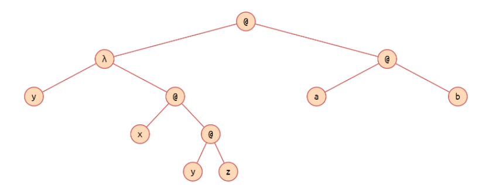

# Fonaments $\lambda-$ càlcul

Basat en substituir símbols, es tracta de l'origen dels llenguatges funcionals.
$$
(\lambda y.x(yz))(ab) \rightarrow x(abz)
$$

[TOC]

## Gramàtica

La seva gramàtica es:

> Un **terme** correspon a una "variable", per exemple $x$. Una lletra no té cap significat, si dos lletres tenen el mateix nom, són la mateixa cosa
>
> $(x)terme := lletra|(terme)|abstraccio|aplicacio$ 
>
> Els termes es poden "operar" amb amb **l'abstracció**, on $\lambda x.x$ representa una funció que donada un terme x, ens retorna el mateix terme.
>
> $(\lambda)abstracio:= \lambda lletra . terme$ 
>
> Dos termes es poden **aplicar**, per donar lloc a fórmules:
>
> $(@)aplicacio := terme terme$
>
> Els parèntesis s'agrupen termes, per l'esquerra.

Al exemple, tenim la següent formula: $(\lambda y.x(yz))(ab)$

Totes les funcions a $\lambda$ només tenen un paràmetre. Si tenen dos o més, s'aplicarà el _currying_

> La suma, es pot considerar +:: int -> (int -> int). 
>
> (+ 2) 3 s'interpreta com (+ 2) funció que suma dos a un paràmetre x qualsevol.

Per simplificar, es poden agrupar les $\lambda$:
$$
\lambda x.\lambda y a = \lambda x.(\lambda y .a) \equiv \lambda xy.a
$$

## Operacions

* Abstracció: defineix una funció amb un paràmetre. $\lambda x$ és el cap i $u$ és el cos.
  $$
  \lambda x.u \\
  f(x)= x^2+2y+x-1 \rightarrow \lambda x \lambda y.x^2+2y+x-1
  $$
El cap son els paràmetres i el cos es la definició.
  
* Aplicació: aplicar una funció. f i x són dos termes.

$$
f x
$$

## Computació

La regla essencial del $\lambda-$ càlcul es la **$\beta$-reducció**: $(\lambda x.uv) \rightarrow _{\beta} u [x:=v]$. Vol dir reescriure $u$ substituint les $x$ per $v$.

Per exemple, en aquest cas, on hi hagi una $y$ posem $(ab)$
$$
(\lambda y.x(yz))(ab)) \rightarrow _\beta x((ab)z) \equiv x(abz)
$$

Si una expressió no pot $\beta$-reduir-se, aleshores està en **forma normal**. Amb una cadena de reduccions fins una formal, es considera t' l'avaluació de t.

* na λ-expressió té, com a màxim, una forma normal.

### Variables lliure/lligades - Captures de noms

Una variable es **lligada** si apareix al **cap d'una funció**, altrament es lliure. Es pot ser lliure i lligada alhora.

Per solucionar aquests problemes, tenim la **$\alpha$-conversió** com una regla per reanomenar les variables:
$$
\lambda x.\lambda y.xy \rightarrow_\alpha \lambda z.\lambda y.zy
$$

### Ordres de reducció

En una expressió, podem aplicar Beta-reducció a més d'un lloc.

* Ordre normal: **left-most outer-most**

  $(\lambda x.x((\lambda z.zz)x)t \rightarrow t((\lambda z.zz)t) \rightarrow t(tt)$

* Ordre aplicatiu: **left-most innter-most**

  $(\lambda x.x((\lambda z.zz)x)t \rightarrow (\lambda x.x(xx)) \rightarrow t(tt)$

Si una expressió té una forma normal, la reducció en ordre normal la trobarà, la aplicativa no té per què.

## Macros

O combinadors son meta-llenguatge, faciliten l'escriptura:
$$
ID \equiv \lambda x.x \\
ID ID \equiv (\lambda x.x)(\lambda x.x)
$$

## Exemples