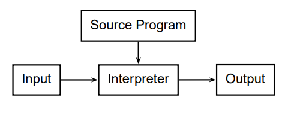
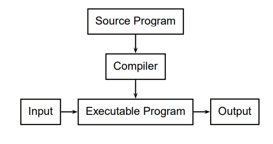
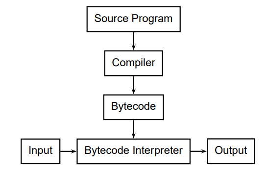
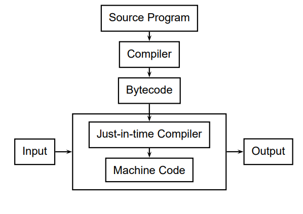
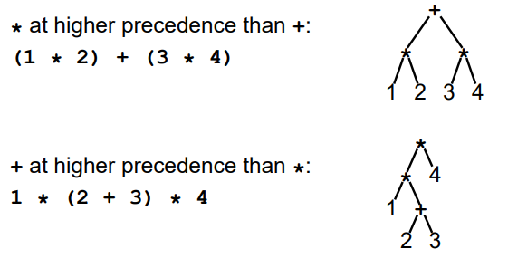
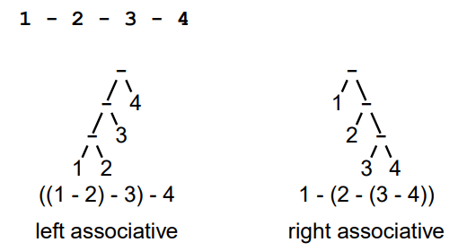
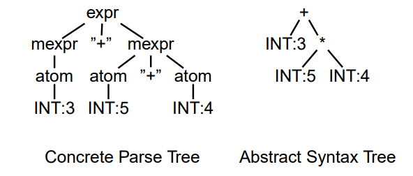

La compilació es diferencia en diverses fases

[TOC]

## Elements generals dels llenguatges 

Un llenguatge es conforma de **sintaxis** i **semàntica**:

### Sintaxis

Expressa com combinar els caràcters per formar construccions coherents amb la forma (p.e. paraules, frases, etc... ) .

Per exemple, per expressions podríem tenir la següent sintaxis:
$$
\begin{align}
expr &\rightarrow expr+expr \\
&| expr-expr  \\
&| expr*expr  \\
&| expr/expr  \\
&| digit
\end{align}
$$

### Semàntica

Dóna el significat d'un llenguatge. Es tracta de que simbolitza una certa expressió.

Podem tenir una sintaxis correcta però no una correcta semàntica o ambigua.

Es pot definir una semàntica per **denotació** (representa el comportament dels components del llenguatge) o per **operació** (definir una màquina virtual i com evolucionaria l'estat de la màquina).

### Lèxic

El lèxic correspon al conjunt de paraules d'un llenguatge.

### Gramàtica

Estudi del llenguatge.

## Processadors de llenguatge - Introducció a la compilació

Els LP tenen diferents paradigmes, segons com passen a ser executats:

| Tipus de llenguatge    |                                                              |
| ---------------------- | :----------------------------------------------------------: |
| Interpretat            |  |
| Compilat               |  |
| Interprete de Bytecode |  |
| Just-in-time Compiler  |  |

* La compilació es fa per parts, fins arribar a l'executable final.

| Fase                        | Descripció                                                   | Fases                      |
| --------------------------- | ------------------------------------------------------------ | -------------------------- |
| Preprocessadors             | En aquesta fase, s'expandeixen les macros, s'inclouen els arxius i es completa la compilació condicional. |                            |
| Anàlisis lèxic              | L'entrada al compilador es un arxiu amb una seqüencia de caràcters; la sortida es una seqüència de tokens (paraules amb sentit pel llenguatge) en forma d'arbre de sintaxis. | Crear tokens, Parse tokens |
| Anàlisis semàntic           | Es genera una taula de símbols. Es comproven els tipus i referències. |                            |
| Intermediate code generator | Cada màquina té el seu propi codi assemblador, es força útil fer una primera traducció del codi a un ASM genèric (p.e. 3-Address Code) per seguidament generar l'assemblador per cada màquina. |                            |
| Code optimizer              |                                                              |                            |
| Code generator              | Per últim, podem generar el codi màquina.                    |                            |

### Anàlisis lèxic I - Scanning

Per traduir la seqüencia de caràcters, podem utilitzar una taula amb patrons predefinits, per tal d'assignar tokens (procés de scanning). D'aquesta manera, el *parser* te menys feina.

#### Tokens i alfabets

Un *token* es una paraula amb sentit per un cert llenguatge. Definim els tokens com un alfabet.

Per un alfabet concret $\sum$ (conjunt finit de símbols), podem definir **strings** (seqüencia finita de símbols del alfabet) i **llenguatges** (set d'strings sobre $\sum$). Podem definir les següents operacions:

$L = \{{\epsilon, wo}\}, M = \{{man, men}\}$ (El caràcter $\epsilon$ representa un caràcter buit)

* Concatenació: Donats dos strings, col·locar un darrera del altra.

  $LM = \{man, men, woman, women\}$

* Unió: Donats dos $\sum$, uneix els dos $\sum$.

  $L \cup M = \{ \epsilon, wo, man, men\}$

* Clausura de Kleen (*): Cero o més concatenacions

  $M* = \{\epsilon, M, MM, MMM, ...\}$

Per treballar sobre un alfabet, s'utilitzen expressions regulars. Tenim representades les operacions anteriors amb els següents punts:

1. $\epsilon$ es una expressió regular (RE) que denota el conjunt d'espais en blanc.
2. Un caràcter $a \in \sum$ es una RE que denota el conjunt dels caràcters $a$.

3. Sobre dos conjunts de caràcters $r,s$ tenim:
   * $(r)|(s)$ és la unió.
   * $(r)(s)$ representa la concatenació.
   * $(r)^*$ representa la clausura de Kleen, amb 0 o més aparicions
   * $(r)+$ representa 1 o més aparicions
   * $(r)?$ representa 1 o cap aparició.

Aplicant les anteriors regles (construïdes amb expressions regulars)  podem construir una taula amb els tokens trobats.

* De forma intermitja, es crea un autòmat no determinista; un subset del qual servira per construir un automata determinista per poder fer l'<u>Scanning</u>.

#### Implementació de *Scanners* - ANTLR

Per treballar amb tokens, existeix un llenguatge sobre el que s'escriuen els compiladors. ANTLR genera codi per fer *Scanners, Parsers  i Tree walkers*.

##### Exercicis REGEX

1. Números de notació científica

   > Digit = '0'..'9', Sign = ('+'|'-'), Exponent = 'e'[+-]Digit+
   >
   > nCen = Sign? Digit* ('.') Digit+	

2. Sobre el alfabet $\{a,b,c\}$ forçant que després del símbol 'b' sempre apareguin almenys un simbol 'a'

   > ((a *)|(c *)|(b+a+))+

3. Sobre totes les lletres minúscules, cal que apareguin només un cop les vocals, en ordre.

   > consonants = totes les lletres minúscules menys les vocals
   >
   > consonants* a consonants* e consonants* i consonants* o consonants* u consonants*

### Anàlisis lèxic II - Parsing

Aquesta fase te com a objectiu construir un arbre sintàctic (**A**bstract **S**yntax **T**ree) per una seqüencia de tokens donada.

ANTLR construeix parsers *top-down* recursius, llegint els tokens d'esquerra a dreta. Es tracta d'un parser LL(left-to-right)(k tokens ahead).

La majoria de LP es descriuen amb una gramàtica *context-free*, donant lloc a possibles recursions i ambigüitats que s'han de resoldre. Podem tenir diferents AST si no resolem aquestes ambigüitats. ANTLR permet afegir aquestes aclaracions per construir el AST.

#### Precedència

La precedència indica com de *sticky* es un operador:

#### Associativitat

Defineix si un operador s'aplica d'esquerra a dreta (més comú) o de dreta a esquerra:

ANTLR avalua en el ordre que definim la gramàtica.

### Anàlisis semàntic I - Arbres sintàctics

Els AST que generar el procès de parser decideix si un programa forma part del llenguatge. Es habitual voler veure quin error s'ha comés per no poder generar el AST, ANTLR inclou accions si es compleix una certa regla (les accions s'executen durant el parseig).

El anàlisis lèxic anterior pot generar arbres abstractes o concrets. Es poden implementar com uns arbres n-aris amb apuntadors entre germans i als fills.

També es pot optar per arbres heterogenis, on cada token té la seva representació.

### Anàlisis semàntic II

Un cop generat el AST, cal comprovar que no hi hagi cap disbarat.