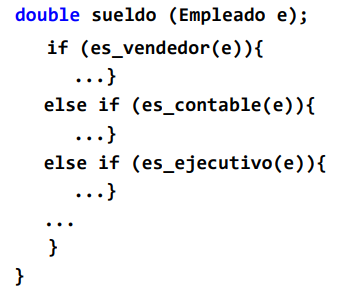
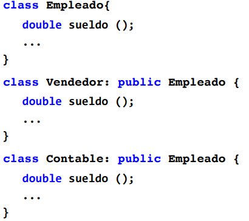

## Subtipos, herencia i POO

Hay varias definiciones correctas de subtipos:

> 1. t es subtipo de t’ $\iff$ todos los elementos de t son elementos de t’
> 2. t es subtipo de t’ $\iff$ en todo contexto en que se puede usar un objeto t’(supertipo), se puede usar un objeto t(subtipo).

La definición 1 no es muy habitual en los LP, en cambio la 2 es la definición pura para los LP OO.

La programación orientada a objeto puede ser vista como: Herencia + Modularidad (abstracción de datos) + *Late binding* (vinculación dinámica : El tipo de un objeto se “calcula” en tiempo de ejecución).

[TOC]

### Herencia y subclases

La herencia de clases(tipos/subtipos) proporciona:

* Reutilización de código.
* Estructuración del código.
* Simplificación del diseño.

La herencia además permite redefinir operaciones de la clase base.

> **Ejemplo:** Dada una clase trabajador, donde para cada tipos de trabajador necesitamos calcular su sueldo, podemos optar apoyarnos en la programación OO:

| Programación clásica                                         | Programación OO                                              |
| ------------------------------------------------------------ | ------------------------------------------------------------ |
|  |  |

> Si cambiamos el como se debe calcular el sueldo, en la opción clásica debemos rescribir mucho código, mientras en la OO solamente hay que añadir/quitar clases.

Como conclusión, **tener OO en un lenguaje tiene muchas ventajas** a la hora de programar.

### Comprobación e inferencia de tipos con subtipos

Los tipos en un LP son un mecanismo de seguridad contra a fallos importantes. Incorporar subtipos a cualquier lenguaje tiene mas problemas de los parece, es muy posible que lleve a **problemas** y **errores en la ejecución**.

Definimos las siguientes relaciones sobre los subtipos.

1. $e::t, \space t \sub t' \Rightarrow e::t'$
2. $e::t,  \space t \sub t', \space f::t'\rightarrow t'' \Rightarrow f e :: t'' $

Podemos encontrarnos con problemas con estas definiciones, con $x :: t \space , e::t' \space , t' \sub t $: 

* $x = e$ es correcto (supertipo se le asigna un  subtipo).
* Con $t \sub t’$ no es correcto (subtipo se le asigna un supertipo).

#### Covarianza y contravarianza

* Un constructor de tipo C, será covariante $\iff s \sub t \implies C(s) \sub C(t)$ .
* C será contravariante $\iff s\sub t \implies C(t) \sub C(s)$ .

* C es invariante $ \iff s\sub t \not \implies $ ninguna de las dos anteriores afirmaciones.

### Caso practico : Subclases y herencia en C++ y Java

#### Tipos de herencia

* En C++ tenemos herencia múltiple y diferentes ámbitos de visibilidad para la superclase:

````c++
class Empleado {...}
class Vendedor : public Empleado {...} 
class Vendedor : private Empleado {...}
class Vendedor : protected Empleado {...}
//Herencia múltiple
class Vendedor : public Empleado, public Comisionista{...}
````

* En Java no tenemos herencia múltiple, pero si que se puede simular con las *interfaces*

````java
class Empleado {}
class Vendedor extends Empleado {}
class Vendedor implements Empleado, Comisionista{}
````

#### Vinculación dinámica

* En Java tenemos vinculación dinámica: Teniendo una clase <u>Empleado</u>, con una operación de sueldo,  y las subclases <u>Vendedor</u> y <u>Contable</u> que redefinen esta operación. Sobre un empleado, la llamada a sueldo ejecutará la operación dependiendo del tipo.

* En C++ la vinculación es estática (de forma normal), es decir, sobre un empleado la llamada a sueldo siempre ejecuta la operación ligada a la superclase, independientemente del tipo del empleado en ese momento. 
  * Se puede obtener vinculación dinámica utilizando, declarando ``virtual``  el método de la superclase. Como contrapartida, empleado se convierte en clase abstracta y no puede tener instancias (Deberemos de usar punteros para pasar los objetos dinámicos).

En la vinculación dinámica **se prioriza ejecutar la operación de la subclase**; si no tiene se ejecuta el de la superclase.

#### Ámbitos y visibilidad en C++ y Java

* En toda las herencias, los atributos y métodos privados de la superclase no son visibles en la subclase.

* Una superclase con ``public`` o ``protected``  hará que en la subclase los métodos y atributos de la superclase sean públicos o protegidos.
* Una superclase con ``private`` hará que los atributos y métodos de la superclase sean privados. 