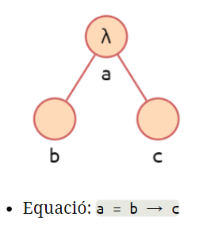
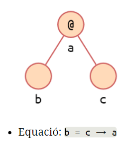

Inferència de tipus

La inferència de tipus es la detecció automàtica dels tipus de les expressions d'un llenguatge de programació. Facilita la programació.

Té sentit en llenguatges fortament tipats i típic dels llenguatges funcionals. Els seguents exemples ens mostra com funciona la inferència a C++ i haskell:

````c++
map<int, string> m;
auto x = 12;
auto it = m.find(x);
````

 ````haskell
:type 3*4
3*4 :: Num a => a
 ````

L'algorisme de Milner troba aquest tipus (el mes general de fet) dins d'un LP.

[TOC]

### Currificació

Cal recordad la currificació fa que totes les funcions tinguin nomès un paràmetre. Donada una funció com ara ``foo :: Int -> Int -> Int `` es pot interpretar com:``foo :: Int -> (Int -> Int)``.


### Algorisme de Milner

L'algorisme general:

1. Genera l'arbre de sintàxis (currificant totes les aplicacions).
2. S'etiqueta cada node. Si el tipus es conegut, s'etiqueta. Altrament s'etiqueta una nova variable de tipus.
3. Es generan les restriccions i s'unifiquen.

Nodes iguals han de tenir etiquetes iguals. Tenim les seguents components pels arbres:

* Abstracció ($\lambda$) ``a = b -> c``. 

  

  

* Aplicació (@)``b = c -> a``.

  

#### Exemple1

Tenim l'expressió ``\x -> (+) 2 x``. D'esquerra a dreta codifiquem:

* La funció amb una $\lambda$.
* Els paràmetres van a l'esquerra del arbre, en aquest cas només tenim el paràmetre x
* Les sortides van a la dreta del arbre, en aquest cas tenim:
  * Funció suma sobre 2
  * Funció (suma 2) sobre x


Del arbre obtenim les equacions, l'operadors $\rightarrow$ associa per la dreta.
$$
a = d \rightarrow b \\
c = d \rightarrow b \\
Int \rightarrow (Int \rightarrow Int) = Int \rightarrow c
$$
Resolem les variables de tipus: 

* Podem començar per la C, tenim la funció suma i un enter; per tant, C :: Int -> Int
* Ara el tipus de B té per una banda Int -> Int i un tipus D per l'altra. D ha de ser Int i B també.
* A es una funció que rep un tipus D (Int) i retorna un tipus B (int)

L'arrel del arbre es el tipus de l'expressió.

