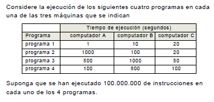

## Problemas T1 MP

[TOC]

### Ejercicio 1.1

**Pregunta 1: Calcule los MIPS de cada programa en las tres máquinas**
$$
MIPS = \frac{Ninstrc}{Tiempo}*10^{-6}\\
\text{Computador A:} \\
MIPS_A^1 = \frac{100}{1} = 100 \space 
MIPS_A^2 = \frac{100}{1000} = 0.1 \\
MIPS_A^3 = \frac{100}{500} = 0.2 \space 
MIPS_A^4 = \frac{100}{100} = 1\\
\text{Computador B:} \\
MIPS_B^1 = \frac{100}{10} = 10 \space 
MIPS_B^2 = \frac{100}{100} = 1 \\
MIPS_B^3 = \frac{100}{1000} = 0.1 \space 
MIPS_B^4 = \frac{100}{800} = 0.125\\

\text{Computador C:} \\
MIPS_C^1 = \frac{100}{20} = 5 \space 
MIPS_C^2 = \frac{100}{20} = 5 \\
MIPS_C^3 = \frac{100}{50} = 2 \space 
MIPS_C^4 = \frac{100}{100} = 1\\
$$

Considere que los 4 programas representan una carga de trabajo. Además suponga que los programas se ponderan con el mismo pero al considerar carga de trabajo.

**Pregunta 2: Calcule el tiempo media de ejecución por instrucción para cada máquina.**

> La carga de trabajo de cada programa será de 0.25 ($f_i$). 
>
> Por cada computador, su tiempo medio con la carga de trabajo es la suma ponderada y dividiendo por el número total de instrucciones obtenemos el el tiempo medio por instrucción:
>
> (Como las ponderaciones son iguales entre si podemos substituir la media ponderada por la media aritmética)
>
> **!! Sumatorio de Ti entre sumatorio de Ni, cada uno tiene 10^8 instruciones**

$$
T_m = \sum f_i * T_i \rightarrow T_m = (\sum^n T_i)/\sum_{i} n_i\\
T_{inst} = T_m / N = T_m / 10^8\\
T_m^A = (1 + 1000 + 500 + 100)/ 4= 400.25s\\
T_m^B = (10 + 100 + 1000 + 800)/ 4 = 477.5s\\
T_m^C = (20+20+50+100)/4 = 47.5s\\
T_{inst}^A = T_m^A / 10^8 = 4*10^{-6} s/i\\
T_{inst}^B = T_m^B / 10^8 = 4.78^{-6} s/i\\
T_{inst}^C = T_m^C / 10^8 = 4.75^{-7} s/i\\
$$

**Pregunta 3 : Calcule los MIPS para cada máquina, Efectúe el calculo a partir de los MIPS de cada programa**

> Los MIPS de cada programa se calculan como la media ponderada de los MIPS de cada programa, en función de la carga de trabajo; como esta es igual en cada caso calcularemos con una media aritmética.

$$
MIPS_x = \sum MIPS_i / n\\
MIPS_A = (100 + 0.1 + 0.2 + 1 )/ 4= 25.32\\
MIPS_B = (10 + 1 + 0.1 + 0.125)/ 4 = 2.81\\
MIPS_C = (5+5+2+1) / 4 = 3.25\\
$$

### Ejercicio 1.2

Disponemos de 3 versiones de un procesador: A, B y C y de un conjunto de programas de prueba que se utiliza para evaluarlos. El procesador B es una versión mejorada del procesador C y el procesador A es una versión mejorada del procesador B. En los procesadores A y B la cache es no bloqueante y los load son
bloqueantes. En el procesador C la cache es bloqueante. Todos los procesadores funcionan a la misma frecuencia.
El CPI medio medido en la versión A es 1.25. Por otro lado conocemos que el CPI medio de A es un 30% menor que el CPI medio de B.

**Pregunta 1: Calcule el CPI de B. Así mismo calcula la ganancia en rendimiento de A respecto B.**

> El CPI A es 1.25, un 30% menor que el CPI de B:!!!!!!!!!!!!!!!!!!!!!!!!!!!!!!!!!!!

$$
CPI_B = CPI_A / 0.7 = 1.78
$$

> La ganancia en rendimiento, teniendo en cuenta que las frecuencias son idénticas, sobre el mismo numero de instrucciones:

$$
G =\frac{R'}{R_0} = \frac{T_0}{T'} 
\\= \frac{N*CPI_0*T_c}{N*CPI'*T_c} = \frac{CPI_0}{CPI'}
\\G = 1.78 / 1.25 = 1.42
\\!!!!!G = 1/0.7 = 1.43
$$

El lenguaje máquina de los procesadores A y B se ha ampliado con instrucciones de prebúsqueda, las cuales no están disponibles en el procesador C. Conocemos que en ambos procesadores el número de instrucciones ejecutadas es un 3% mayor que en el procesador C. En los procesadores A y B el CPI de las instrucciones de prebúsqueda es uno.

**Pregunta 2: Calcule el CPI medio del resto de las instrucciones
(que no son de prebúsqueda) en el procesador B.**

> Instrucciones en A y B aumentan un 3% respecto  C y CPI prebúsqueda es 1
>
> El CPI medio de las instrucciones (no prebúsqueda) en B, teniendo en cuenta que estas son un 3% y el CPI de estas es 1:

$$
CPI_{prebusqueda} = 1 ; CPI_B = 1.78\\
CPI_B = 0.03 * CPI_{prebusqueda}  + 0.97 * CPI_{resto} = \\
CPI_{resto} = \frac{1.78 - 0.03}{0.97} = 1.80
$$

Sea G la ganancia en rendimiento de A respecto B y sea RR la reducción en rendimiento de B respecto de A. Ambos procesadores funcionan a la misma frecuencia.

**Pregunta 3: Exprese G y RR en función del tiempo de ejecución de A y B. Muestre una expresión que permita calcular G en función de RR y otra expresión que permite el cálculo recíproco.**

> 

El mayor IPC de A respecto de B está determinado por una mejora arquitectónica que reduce la frecuencia de fallos por instrucción (f), sin incrementar el número de instrucciones ejecutadas. Todos los otros parámetros arquitectónicos permanecen invariables. En concreto, el CPI de la unidad de proceso (acierto siempre en cache, CPIUP) es el mismo.

En las siguientes preguntas suponga que el CPI de la unidad de proceso (CPIUP) es uno y la penalización por fallo son 10 ciclos.

**Pregunta 4: Calcule los fallos por instrucción en los procesadores A y B**

> 

### Ejercicio 1.4

### Ejercicio 1.5

