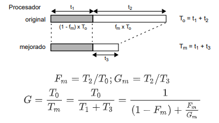

# Tema 1 Introducción

[TOC]

## Figuras de mérito

$$
T = 1/R = N*CPI*T_c\\
Ganancia = \frac{Rb}{Ra} = \frac{Ta}{Tb}\\
$$

### La ley de Amdahl

## Motivación de los multiprocesadores

Sobre el modelo de la maquina de Vonn Neumann (modelo Memoria-Unidad de proceso), este modelo puede aumentar su rendimiento, expresado como:
$$
T_{ejec} = 1/R = N*CPI*T_c  \\
T_{ejec} = N*(CPI_{up}+CPI_M)*T_c
$$
Para mejorar el rendimiento, se distinguen dos alternativas, de una manera existen opciones transparentes al programador y otras que hicieron que los programadores utilizaran nuevas técnicas de programación.

### Técnicas transparentes al programador

#### Reducir el CPI de la memoria

Con una jerarquía de memoria adecuada 8niveles de cache, registros) podemos explotar las características de los programas.

* Localidad Espacial: Los programas habitualmente acceden secuencialmente a posiciones contiguas de memoria. Un **tamaño de bloque de cache** adecuado puede explotar esta propiedad.
* Localidad Temporal: Es muy posible que se rehúsen instrucciones y datos. Se explota esta localidad mediante la **política de remplazo de la cache** y su **organización**.

#### Reducir el CPI del procesador

Con técnicas de paralelismo y segmentación podemos reducir los ciclos por instrucción haciendo aumentar el rendimiento. Estas técnicas pueden perder ciclos (por lo tanto CPI) si no se acompañan de otras para reducir la perdida de ciclos debidas a riesgos de datos o estructurales, por ejemplo con:

* Reordenación de instrucciones. Mediante compilador
* Especulación + predicción. Almacenando resultados especulados en un buffer, ya que no se “esta seguro” si se deben ejecutar esos cálculos.
* Ejecución fuera de orden. Manteniendo un buffer de instrucciones “dormidas” que se despiertan al desaparecer los riegos.
* Escritura inmediata *versus* escritura retardada.

También existen otros métodos relacionados directamente con la memoria:

* Prebúsqueda HW.
* Cache no bloqueante
* Instrucciones de prebúsqueda.

### Técnicas no transparentes al programador

En la historia, se ha llegado a un punto donde para mejorar el rendimiento también se precisa de la ayuda no transparente de los programadores, pues las técnicas transparentes ya no tenían más margen de mejora (o este era marginal). 

En temas de paralelismo y múltiples unidades HW el programador debe orquestar como estas se relacionan entre sí.

> Con el doble de recursos, se puede funcionar a la mitad de la frecuencia obteniendo el mismo rendimiento (pero con menos disipación de calor, potencia, etc...), pero se necesita más programación.

* Vectorización de instrucciones. 1 instrucción N operaciones, se reduce el número de las instrucciones y reduce el consumo de energía.
* Multihilo. Incrementa la productividad

### Introducción a los multiprocesadores

Limitados por el consumo energético, el próximo dispositivo que se uso fueron los aceleradores y coprocesadores.

* Múltiples BR y CP con multiplexación para usar el camino de datos.
* Relojes desacoplados.

