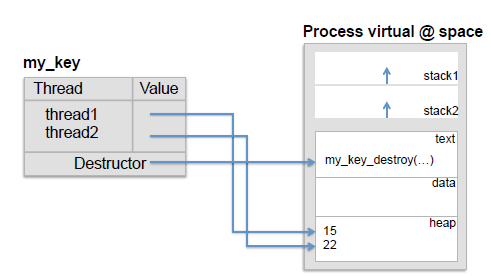

## PThreads API

[TOC]

### Create and manage Threads

````c
int pthread_create (pthread_t * thread, pthread_attr_t * attr, void * (*start_routine)(void *), void * arg );
void pthread_exit (void *retval);
int pthread_join(pthread_t thread, void **value_ptr );
//Suspend the execution of the calling thread until the thread terminates
void pthread_exit ( void *retval );
pthread_t pthread_self(void); //returns the ID of the calling thread
````

#### Example argument & exit status

````c
#include <pthread.h>
#include <stdio.h>
#include <stdlib.h>
#define numThreads 5

typedef struct {
   int	thread_id;
   char *message;
} thread_data;

char *messages[2];

void * PrintHello(void *threadArgs) {
   thread_data *my_data = (thread_data *) threadArgs;
   int tid = my_data->thread_id;
   char * msg = my_data->message;
   printf("%s thread #%d\n", msg, tid);
   pthread_exit((void *) tid);
}

int main(int argc, char *argv[]) {
	pthread_t threads[numThreads];
   	thread_data thread_data_array[numThreads];
   	messages[0] = "Hello World!, it's me";
   	messages[1] = "Bonjour le Monde!, c'est moi";
    for (int t=0; t<numThreads; t++) {
        thread_data_array[t].thread_id = t;
        thread_data_array[t].message = messages[t%2];
        pthread_create (&threads[t], NULL, &PrintHello,  (void *) (thread_data_array+t));
    }
    void *status
    for (int t=0; t<numThreads; t++){
	    pthread_join(threads[t], &status);    
        printf("Completed join for thread %ld", (long)status);
    } 
    printf("Once everything finished!\n");
}
````


### Thread-specific data



````c
pthread_key_t keyType;
int pthread_key_create(pthread_key_t *key, void (*destructor)(void*));
void *pthread_getspecific(pthread_key_t key);
int pthread_setspecific(pthread_key_t key, void *value);
int pthread_key_delete(pthread_key_t key);
````

#### Example thread specific data

````c
#include <pthread.h>
#include <stdio.h>
#include <stdlib.h>
#include <string.h>
#define numThreads 5

typedef struct {
    int thread_id;
    char message[32];
} perthread_data;

pthread_key_t my_key;

void my_key_destroy (void * arg) {
	perthread_data * mine = (perthread_data *) arg; 
	printf("Destroying key for thread %d\n", mine->thread_id);
  	free (arg); // deallocate data
}

void print_message () {
  	perthread_data * mine = pthread_getspecific (my_key);
  	printf("%s %d!\n", mine->message, mine->thread_id);
}

void * PrintHello(void * threadId) {
	int id = (int)(long) threadId;

  	perthread_data * mine = (perthread_data *) malloc(sizeof(perthread_data));
  	mine->thread_id = id;
  	if (id%2) strcpy(mine->message, "Hello World!, it's me");
  	else strcpy(mine->message, "Bonjour le Monde!, c'est moi");
  	pthread_setspecific (my_key, (void *) mine);
  	print_message ();
  	pthread_exit(NULL);
}

int main () {
  	pthread_t threads[numThreads];
  	pthread_key_create (&my_key, my_key_destroy); // per-thread attribute key
	for (int t = 0; t < numThreads; t++)
    	pthread_create(&threads[t], NULL, &PrintHello, (void *)(long) t);
  	for (int t = 0; t < numThreads; t++) pthread_join(threads[t], NULL);
	pthread_key_delete(my_key); //it will call my_key_destroy()
}

````

### Mutexes and barriers

````c
pthread_mutex_t t; 					// Declare a mutex
void pthread_mutex_init(&t, NULL); 	// Initialize a mutex dynamic
t = PTHREAD_MUTEX_INITIALIZER;		// Initialize a mutex static
void pthread_mutex_destroy(&t); 	// Destroy a mutex
void pthread_mutex_lock(&t); 		// Lock a mutex
void pthread_mutex_unlock(&t); 		// Unlock a mutex
#include <errno.h>
int pthread_mutex_trylock(&t);  	// attemps to acquire the mutex without blocking:
									// in succes: locks the lock.
									// returns EBUSY if is locked by another thread.
									// returns EDEADLK if the mutex is alredy held by the 										thread
````

````c
pthread_barrier_t t;				// Declare a barrier
void pthread_barrier_init(&t, NULL, numThreads+1); 	// Initialize a barrier
												// we can initialize a barrier +1 time
void pthread_barrier_destroy(&t); // Destroy a barrier
int pthread_barrier_wait(&t);    	// Synchronize threads at the barrier:
									//PTHREAD_BARRIER_SERIAL_THREAD : last thread
									//0 for the rest of the threads in the barrier
````


#### Example for mutexes and trylock

````c
#include <pthread.h>
#include <stdio.h>
#include <stdlib.h>
#define numThreads 5
static pthread_mutex_t mutex = PTHREAD_MUTEX_INITIALIZER;
static int counter = 0;

void * run () {
    for (int i = 0; i < 100; i++) {
        pthread_mutex_lock(&mutex);
        counter++;
        pthread_mutex_unlock(&mutex);
    }
    pthread_exit(NULL);
}
//trylock:
void * run(){
    int local = 0;
    for(int i = 0; i < 100; i++){
        if (pthread_mutex_trylock(&mutex)==EBUSY) local++;
        else counter++;
        if(local != 0)
            counter += local;
        	printf("Thread %ld accumulated %d.\n", pthread_self(), local);
        pthread_mutex_unlock(&mutex);
    }
}
int main(){
    pthread_t threads[numThreads];
    for (int t=0; t<numThreads; ++t) pthread_create (&threads[t], NULL, &run,  NULL);
    for (int t=0; t<numThreads; t++) pthread_join(threads[t], NULL);
    pthread_mutex_destroy (&mutex);
    printf("Counter = %i\n", counter);
}
````

#### Example of Barriers

````c
void * PrintHello(void * arg) {
	printf("Hello World!, it's me thread %d\n", (int)(long) arg);
   	int ret = pthread_barrier_wait(&barrier);
   	printf("Hello again!, it's still me thread %d with ret=%d\n", (int)(long) arg, ret);
    ret = pthread_barrier_wait(&barrier);
   	printf("Goodbye from thread %d with ret=%d\n", (int)(long) arg, ret);
    pthread_exit(NULL);
}
int main(){
    pthread_t threads[numThreads];
    pthread_barrier_init(&barrier, NULL, numThreads+1); // number of threads to wait
    for (int t=0; t<numThreads; ++t) pthread_create (&threads[t], NULL, &PrintHello,  (void *)(long) t);
	
    printf("Done creating threads\n");
    
    int ret = pthread_barrier_wait(&barrier);
	printf("All threads arrived to first barrier with ret=%d\n", ret);
    
    ret = pthread_barrier_wait(&barrier);
	printf("Done executing threads with ret=%d\n", ret);
    
    pthread_barrier_destroy(&barrier);
   	pthread_exit(NULL);
}
````

### gcc built-ins

`````c
//XXX: add, sub, or, and, xor, nand
type __sync_fetch_and_XXX (type *ptr, type value); //ret the value in *ptr
type __sync_XXX_and_fetch (type *ptr, type value); //ret the new value

//atomic compare & swap: if *ptr == oldval => *ptr = newval
//type: int, unsigned int, long, unsigned long, long long, unsigned long long.
bool __sync_bool_compare_and_swap(type *ptr, type oldval, type newval);
//bool version returns true if the comparisions is successful.
type __sync_val_compare_and_swap (type *ptr, type oldval, type newval);
//type version return *ptr befor the operation.
                                  
void __sync_synchronize();
//enforces an ordering constrain on memory operations before and after a memory barrier.
`````

#### Example builtins

````c
#define INC_TO 1000000
int global_int = 0;
int finished = 0;
void *thread_routine( void *arg ) {
	int id = (int)arg;
	for (long i = 0; i < INC_TO; i++)
		__sync_fetch_and_add( &global_int, 1 ); // global_int++ has data race
	if (id == 0) { finished=1; towait = 1; __sync_synchronize(); } // consistency fence
	if (id != 0) while(finished==0) __sync_synchronize (); // fence for consistency
	pthread_exit(NULL);
}
int main() {
	pthread_t threads[numThreads];
	for (int i = 0; i < numThreads; i++) 
        pthread_create(&threads[i], NULL, thread_routine, (void *) i);
	while (towait == 0) __sync_synchronize (); // memory fence for memory consistency
	for (int i = 0; i < numThreads; i++) pthread_join(threads[i], NULL);
}
````

### Pthread condition variables

### POSIX Semaphores

### CPU affinity

````c
void *thread_func(void *param) {
	cpu_set_t cpuset;
	/* bind process to processor 0 */
	CPU_ZERO(&cpuset); // clears set, so that it contains no CPUs
	CPU_SET(0, &cpuset); // Add CPU cpu to set
	pthread_setaffinity_np(pthread_self(), sizeof(cpu_set_t), &cpuset);
	/* waste some time so the work is visible with "top" (press 1) or "htop" */
	printf("result: %f\n", waste_time(5000));
	/* bind process to processor 3 */
	CPU_CLR(0, &cpuset); // Remove CPU from set
	CPU_SET(3, &cpuset);
	pthread_setaffinity_np(pthread_self(), sizeof(cpu_set_t), &cpuset);
	/* waste some more time to see the processor switch */
	printf("result: %f\n", waste_time(5000));
	pthread_exit(NULL);
}

//return in *cpuset the CPU affinity set of the thread
void pthread_getaffinity_np(thread, cpusetsize,*cpuset);

````

