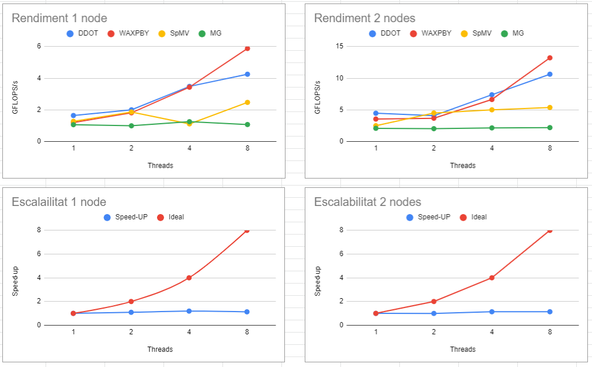

## LAB 3: Performance characteritzation of HPC clusters

En el document s'inclouen els resultats de diferents programes de prova. Els resultats es comparen amb la màquina BOADA. Cada programa de proves està dissenyat per un supòsit.

### Stream

Aquest joc de proves comprova operacions d’alt ús de memória. L'ample de banda obtingut de les diferents operacions es representa en el gràfic.

Pel que fa a l'ús de les directives numactl, tenim que aquestes controlen les polítiques de planificació i ubicació de memòria. L'opció ``--membind`` fa que nomès s'ubiqui memoria als nodes; d'altra banda que l'opció ``--cpunodebind`` fa que s'executin les comandes als nodes seleccionats. 

S'han aplicat els següents paràmetres en els diferents test proposats:

* Ubicar la memória i els threads a un NUMA node.(V1 al gràfic) ``numactl -m 0 -N 0``
* Ubicar la memória a un node i els threads a un altre node.(V2 al gràfic) ``numactl -m 0 -N 1``
* Ubicar memória i threads a dos nodes.(V3 al gràfic) ``numactl -m 0,1 -N 0,1``

En el gràfic, que compara l’ample de banda en les tres versions podem veure:

* La segona versió (memoria i thread en diferent) node es la que pitjor rendiment obté, el rendiment ve condicionat per la comunicació de dades entre els threads i la memória(que estan a diferent node).

* La primera versió no escala al augmentar el numero de threads, ja que no s’aprofita tot el paral·lelisme possible (respecte a la versió 3) al mantenir l’execució en un únic node.

* La tercera versió es la que dóna el millor rendiment, molt similar al de la segona versió amb pocs threads pero ràpidament escala el seu rendiment amb els threads.

* Els resultats entre la primera i la tercera versió ens dona els resultats de casi el doble de rendiment(~1,84 i 1,96 vegades), fet esperat, ja que amb dos nodes tenim el doble de capacitat de memòria.

  Per sota de 4 threads, no es cumpleix, segurament el sobrecost de la descomposició de tasques fa baixar el rendiment.

Respecte aquest segon gràfic, podem veure que les operacions que requereixen càlcul (add/triad) tenen un millor ample de banda que la operació de copia, aixó es dóna pel temps de latència de l’operacio, aquest temps emmascara la latencia de memoria (que en aquest cas esta a un altre node). Es a dir, mentres es fa l’operació s’aprofita aquest temps per transmetre a l’altre node els resultats. Aquesta reflexió és interesant pero tot i aixó el rendiment d’aquesta versió es molt menor a les demés.

Boada utilitza les memories DDR4-2400 i DDR4-2133 que tenen sobre el paper un ample de banda de pic de 19.200 i 17.066 MB/s. En el millor dels casos (operació de copia) trobem que el rendiment màxim ronda els 46.000 MB/s.

### Linpack

Aquest *benchmark* està destinat a mesurar el rendiment en operacions de coma flotant. S'han mesurat el programa sobre 1 i 2 nodes amb diferents configuracions i nombre de processos. Als gràfics es veuen en verd les millors configuracions per cada configuració i l'*speed-up* respecte la pitjor configuració(també s'adjunta el full de cálcul).

* Per 1 node, s'han trobat els següents resultats:

* Per 2 nodes, s'han trobat els següents resultats:

Podem comprovar que les configuracions que millor funcionen són aquells on la graella de processos està "equilibrada", ja que així la càrrega de treball es distribueix millor i obtenim més rendiment. 

També podem veure que la mida òptima està entre 64 i 128, podem fer les següents hipòtesis:

* En el cas d'un procés i 1 node, obtenim més rendiment si fem menys divisions.
* Per sota de 8 processos, la mida òptima és 128, degut possiblement a què cada procés pot reservar aquest espai de memòria sense tenir conflictes per l'espai.
*  Amb 8 processos la mida baixa a 64, seguint amb el raonament anterior, es possible que els diferents processos en reservar el mida de 128 tinguin conflictes i es perdi rendiment per culpa de la distribució de la memòria.

Agafant els millors resultats obtenim els següents gràfics per un i dos nodes on podem veure l'escalabilitat i el rendiment:

Cada node Boada té 2 [Intel Xeon E5-2609 v4 @ 1,70GHz](https://ark.intel.com/content/www/es/es/ark/products/92990/intel-xeon-processor-e5-2609-v4-20m-cache-1-70-ghz.html), amb 8 unitats de càlcul a 1,70 GHz i instruccions multimedia(Intel AVX2 capaç de fer operacions de 256 bits i FMA). Per tant calculem el pic de GFLOPS/s de cada node com:

$$
\text{GFLOPS de pic= 8 unitats * (256/64) * 2 flops * 1,70 Gcicles_per_segons} \\ = 1.088*10^{11} =\text{108.8 GFLOPS}
$$

Mirant els resultats, podem veure que el nostre rendiment en GLOPS/s es de 42,32 (per un node) i 78,09 (per dos nodes). S'ha aconseguit un 38,9% i 35,88% del pic respectivament. Aquest resultats estan afectats pels temps/latències de memoria i comunicació entre nodes.  Es pot concluir que l'intensitat aritmètica per cada *byte* es bastant petita.

### HPCG

Aquest últim programa esta orientat a mesurar el rendiment sobre aplicacions irregulars. Esta format per 4 *kernels* que fan operacions diferents

Prenent les mesures de rendiment, obtenim les següents gràfiques. L'escalabilitat està calculada sobre el 

Podem veure que l'escalabilitat total; com era d'esperar, queda lluny de l'ideal i el rendiment es bastant irregular. 

El càlcul de  GFLOPS/s total, es fa ponderant el temps d'exeucció de cada *kernel*. Aproximadament tenim la següent ponderació per cada *kernel*:

* DDOT(0,008%): Producte de punts de dos vectors. 
* WAXPBY(0,009%): Actualització d’un vector amb la suma de dos vectors.
* SpMV(0,09%): Multiplicació de matrius esparses
* MG(0,89%): Simètric Gauss-Seidel

Veient això, si haugéssim de millorar el rendiment, hauríem de millor aquella secció de codi mes utilitzada (llei d’Amdahl).

També podem observar que l’escalada de cada kernel, exceptuan WAXPBY i el DDOT, tenen un rendiment força irregula. També podem veure, en general que queda lluny de l’escalat ideal.

Comparant els resultats d’aquest *benchmark* amb el Linpack(agafant el temps d’execucció), obtenim:

* Rendiment Linpack 2 nodes i 8 Threads: 42,25 GFLOPS / 8.08 s  = 5,22 GFLOPS/s 
* Rendiment HPCG 2 nodes i 8 Threads : 2,33 GFLOPS/s

Podem veure com el rendiment del Linpack es superior, era d’esperar ja que el Linpack es un *benchmark* on sempre es fa la mateixa operació, en contra del HPCG. 

