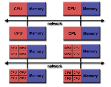

## MPI - Missatge Passing Interface

Not a ISO/IEEE standard. Just a interface, with multiple implementations.

[TOC]


### Enviroment

Here, the system have a distributed memory system with multiple nodes and a interconnection network. Each CPU don't share the address space.



````c
MPI_Init(&argc, &argv);	//Call before any MPI function, only once.
MPI_Finalize();			//Last MPI call.
````

#### MPI communicator

A group of processes working/communicating together use a communicator to send/recive messages. The default MPI communicator is MPI_COMM_WORLD.

There's a option for dynamically organize processes in diferents communicators.

#### Identification API calls

````c
//number of the MPI processes in the communicator comm.
MPI_Comm_size(comm, &size);
//returns the rank (integer between 0 and size-1) in the communicator comm.
MPI_Comm_rank(comm, &rank);
//terminates all MPI processes associated to the communicator comm.
MPI_Abort(comm, errorcode);
//returns the processor name and lenght of the name.
MPI_Get_processor_name(&name, &resultlenght);
````

#### Compiling / Running a program

<ToDo>

### Point-to-point communication

The simplest point-to-point communication routines are <u>blocking</u>. This operation involve two, and only two MPI tasks.

`````c
//Send a message with count consecutive elements of datatype from buf.
MPI_Send(&buf, count, datatype, dest, tag, comm);
//Recives a message with count elements of datatype from buf.
//status.MPI_TAG and status.MPI_SOURCE have the actual tag and status.
//MPI_ANY_SOURCE can be used to receive a msg from any source
//MPI_ANY_TAG can be ued to recive a msg with any tag
MPI_Recv(&buf, count, datatype, source, tag, comm, status);
`````

The different MPI datatype are: MPI_CHAR, MPI_SHORT, MPI_INT, MPI_LONG, MPI_LONG_LONG, MPI_FLOAT, MPI_DOUBLE.

### Examples

#### Hello world

````c
#include "mpi.h"
#include <stdio.h>
#include <stdlib.h>

int main (int argc, char *argv[]) {
	int numtasks, taskid, len;
    char hostname[MPI_MAX_PROCESSOR_NAME];
    int rc = MPI_Init(&argc, &argv);
    if (rc != MPI_SUCCESS) {
	    printf ("Error starting MPI program\n");
	    MPI_Abort(MPI_COMM_WORLD, rc);
    }
    MPI_Comm_size(MPI_COMM_WORLD, &numtasks);
    MPI_Comm_rank(MPI_COMM_WORLD,&taskid);
    MPI_Get_processor_name(hostname, &len);
    printf ("Hello #world! Task %d/%d\n on %s", taskid, numtasks, hostname);
    MPI_Finalize();
}
````

#### Pi computation

````c
#include <mpi.h>
#define NUMSTEPS 100000000

void main (int argc, char *argv[]) {
	int i, rank, procs, num_steps = NUMSTEPS;
	double x, pi, step, sum = 0.0 ;
	MPI_Init(&argc, &argv) ;
	MPI_Comm_Rank(MPI_COMM_WORLD, &rank);
	MPI_Comm_Size(MPI_COMM_WORLD, &procs);
    
	step = 1.0/(double) num_steps ;
	for (i = rank; i < num_steps; i += procs){
		x = (i + 0.5) * step;
		sum += 4.0 / (1.0 + x*x);
	}
	pi = sum * step;
	if (rank == 0){
		for (i = 1; i < procs; i++) {
			MPI_Recv(&x, 1, MPI_DOUBLE, i, 0, MPI_COMM_WORLD, MPI_STATUS_IGNORE);
			pi += x;
		}
        printf("\nResult: %f\n");
    }
	else MPI_Send(&pi, 1, MPI_DOUBLE, 0, 0, MPI_COMM_WORLD);
	MPI_Finalize() ;
}
````

