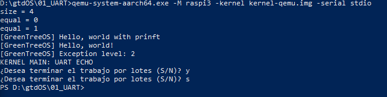

# Project - Building a Real Time OS

[TOC]

## 1. Project Motivation and Objectives

The aim of this project is to build a Real Time Kernel to run in a Rasperry Pi 3 (in my case, Raspberry Pi 3 model B rev1.2).

The kernel will be able to schedule tasks (like freeRTOS), work with serial line, GPIO's ports and to receive instructions through the Ethernet RJ45 connection. In *Sistemes Operatius 2* we built a similar operating system in C (with a few syscalls to allocate data, create threads), based in Linux kernel, for this reason I consider it would be affordable to implement this Real Time Kernel.

I also want to create a tool to measure, in function of the assembly code the expected time of execution of a program, internaly in the OS. For testing, I can use and Arduino Uno to use as an oscyloscope to watch over the times.

I am motivated and eager to work with the ARM architecture inside the raspberry Pi, because in the future I want to build a raspberry cluster at home with 3 or 4 raspberry.

## 2. Implementation steps

#### 2.1. Set up enviroment

A cross compiler is necesary for compile all the code and generate a .img file. I used one based in the gcc. [Here](https://github.com/bztsrc/raspi3-tutorial/tree/master/00_crosscompiler) is a document I follow to install a cross compiler.

Also, a debugger (gdb-multiarch) and a virtual machine (qemu) have been configured. This is so usful, because test something in the Raspberry Pi requires copy the image in the microSD and expect some message out from the UART.

The latest qemu version can emule a the behavior of a real Raspberry Pi but with some differences with the real Raspberry pi:

1. Some peripherals don't exists (like the GPIO pins)
2. The starting address for the boot section is the 0x80000 while the real hardware uses the 0x80000.
3. The time is not quite realistic For this reason, there is conditional compilation in some regions of code and a specific linker for the Qemu. A script is in all the working folders for running the Qemu with the specific flags and emulate the Raspberry Pi. For run the kernel image the correct flags where:

```shell
qemu-system-aarch64 -M raspi3 -kernel kernel-qemu.img -serial stdio
```

For debug the qemu, is necessary to compile with the -g flag and run the qemu with some flags. The qemu should use the `-s -S` flags to stop in the first instruction, and the gdb need the following sentences:

```
target remote localhost:1234
file build/kernel-qemu.elf
```

Here, the .elf file (that contains the debugging symbols) is loaded and the debugger connects via localhost to the qemu. A script for a qemu debugging session (runDBG.sh) and a script for set the gdb debugger (gdbscript) with the qemu are written.

#### 2.2. Hello world

In order to make happen a tipical "Hello World" through the UART is needed to boot the machine. The Raspberry Pi boots from the kernel8.img file, at address 0x0. 

It is necessary to start with asm instructions and jump to the C after setting parameters. The boot.S and the linker.ld files do this job and at the end, the main inside the kernel.c file starts run.

Inside this main, now we can setup the correct registers (looking at the [ARM-peripheral manual](---)) and define a simple UART interface to write/read bytes. This interface is inside the uart.c file.



For setting-up the UART and other modules, the GPIO pins need to set certain MODE values so the gpio.h file contains all the necesary definitions to change a GPIO pin MODE and read/write digital values.

Finally, a printf, string and bool definitions were included for get a better environment development.

#### 2.3. Interrupt managment

The next step is configure interruptions, so is necessary to read about the clocks in this machine and the registers to setup the clocks appropriately.

In the other hand, this CPU have different types of interrupt (such as fast Interrupts, interrupts requests) and some control register to enable/disable the interrupts (of each type), the same process is need. 

In this OS I setup the classic interrupt vector(in the correct memory address) where the CPU jumps after a enabled interrupt occurs. From this interrupt vector the system jumps to the interrupt service rutine, where this routine know (reading CPU state) who(peripheric, clock, SIGFAULT) calls for a interrupt and accordingly to this, now the system can execute the correctly service routine.

So, the files involved here are the interrupt.S, interrupt.c for setting up the interrupts and the timer.c to define the concrete interrupt clock routine and the reset/initialization routines.

Finally, now the system is notified when the timer overflow and the GPIO pin 17 blink according to the clock ticks.

#### 2.4. Scheduling

In this stage I design a Round Robin scheduling system to design CPU time for the differents tasks.

This task distribution assign a certain time to each task (named Quantum); after that time the schedule algorithm searches another task to assign a new quantum. Also, a task manager is needed; for the moment only exists a task_creation interface.

For design this Round Robin, we need a data structure that saves a certain state of a task, some logical control for the scheduling process and the capability for change the machine state. Also, is important to save some statics for a task, like the total ticks, total time elapsed, total transitions from ready to run, to be able to perform some perform analytic and adjust the Quantum.

##### The task struct

A task is defined by the PC register, the SP and the safety-registers (a convention designs x19 to x30 safety registers). Our task struct needs to save this registers in memory with some control and identification information, useful for the scheduling logic.

##### The scheduling logic

The scheduling logic is called every time a timer interrupt occurs. In this code, we need to <u>update the scheduling data</u> (in our case the Quantum but we can add other variables). After that, we need to control if the current task has run out all the quantum, in that case, we need to <u>search a new task</u> to run and change the execution context. The task that they are not running will wait in a ready queue.

Also, for this Real Time OS, a task can control the preemption (in the future will be implemented). This is a very important feature, because for some uses is important to don't allow it.

[Here](https://github.com/MisterBigThor/gtdOS/wiki/Scheduling-implementation) are more details about the scheduling.

##### Jumping to a new state - Task switch

For change the context, an assembler entry is needed, because we need to restore the values of all the safety registers and the PC. This entry will be called by the scheduler if a task switch is required.

For a detailed implementation, about all the design concepts from above you can read the [page](https://github.com/MisterBigThor/gtdOS/wiki/Scheduling-implementation) about.

At the end of this implementations, now the OS can run task in a round robin scheduler.This round robin is almost a cyclic scheduler, because all the task that leave the CPU goes to the ready queue at the last spot.

## 3. File reference

The directory contains several folders from 01 to 04, which contains the evolution of the OS. Here are the main project file with a quick description:

- boot.S : Is the first code to be runned, here be need to prepare some parameters and setups.
- linker.ld : This file contains instructions for the compiler and define some memory regions.
- kernel.c : here it is the main method, called by the boot.S.
- uart.c : methods for use the UART communication.
- mini_uart.c : methods for use the mini-UART communication.
- gpio.c : definition of the GPIO pins interface.
- interrupt.S : Assembler to set the interrupt vector and the enable/disable irq.
- interrupt.c : Interrupt handler definition.
- task.h : task definition.
- taskscheduling.c : Roun Robin logic.

## 4. Goin further

#### 4.1. Append more scheduler types

After all the implementation steps, now the OS can manage tasks and preemption. The next step is build other classic real time schedulers, like deadline monotonic or a cyclic scheduler.

A possible implementation is to have some interface like:

`````c
#define RATEMONOTONIC 	1
#define CYCLIC			2
...
void setSchedulerPolicy(int schedulerType);
`````

This call change the next task policy and eventually a the preemption permision. Also, it would be interesting to add a priority field.

In addition, in real time it would be interesting to add a method to suggest the system a task switch, but this is use can create conflicts.

#### 4.2. Some I/O managment

Another necessary developing step is the I/O managment. In a classic OS this is a blocking (moving the task out of the CPU and scheduling other) call but in real time is mandatory to examine it.

Let's study the case with a cyclic scheduler. Here any task T needs to do some stuff before the T+1 task grabs the CPU, so in all the cases the I/O can't block the task and change the context. 

In any other real time scheduling this I/O is mandatory for keep the deadlines.

In the other hand, in this Raspberry Pi hardware is complex (caches, MMU, TLB, ... , add indeterminacy ) to determine the time for the I/O, the variability it will be enormous and the task cost would be much higher than the average time for I/O (because the worst case).


## 5. Conclusions

I need to start this conclusions looking the project motivation. I was very ambitious and the principal problems I found where:

* The Ethernet card and USB reference where impossible to found.
* For recive task throught the RJ45 connection needs a lot of definition work and a detailed read of the ARM architecture reference (lengthy) book.
* Defining a perfect definition of the time a instruction takes to executed is like impossible, this is a out-of order CPU and there is another (lengthy) manual about the microarchitecture.

This problems teach me that the "perfects" instructions sets and processors show in the differents subjects are only models and abstractions, the real implementations are complex but match this models and abstractions.

After all the time working with this hardware I think other boards may used  for real time, here is a pros/cons list:

| PROS                | CONS                                                      |
| ------------------- | --------------------------------------------------------- |
| Is a cheap hardware | The currnet linux OS didn't support RT                    |
| Flexible uses       | Don't have a real-time clock (with sufficient resolution) |
| Multicore support   | rPi ARM family isn't designed for real time.              |
|                     | Peripherals device bus shared                             |

Looking at this table, we see that Raspberry PI isn't the best real-time solution but for a Hard real time porpuse but for a soft and even a firm real time it can be used.

Despite all, this days of reading the CPU reference and writting code has been interesting and entertaining. 


## 6. Bibliography and reference

Some code is from the following repositories:

- In [Matyukevich repository](https://github.com/s-matyukevich/raspberry-pi-os) there is a design for a Raspberry pi general purpose OS.
- The [bztsrc repository](https://github.com/bztsrc/raspi3-tutorial) contains some OS concepts.

Other reference are from the ARM, like the ARM v7 ISA, the ARM architecure reference and the System Registers Reference.

In the other hand, some implementations and design features are from [ZeOS](https://github.com/MisterBigThor/so2FIB),a OS designed and developed for a subject int UPC-Facultat d'informática de Barcelona.

Also, this project is in my [repository](https://github.com/MisterBigThor/gtdOS) there is a [wiki](https://github.com/MisterBigThor/gtdOS/wiki) with more details.