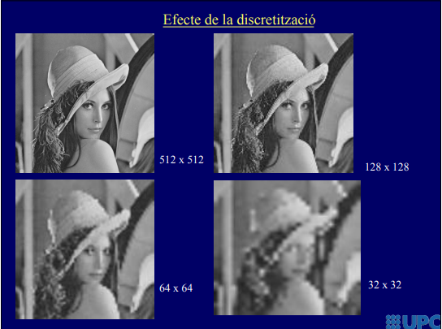
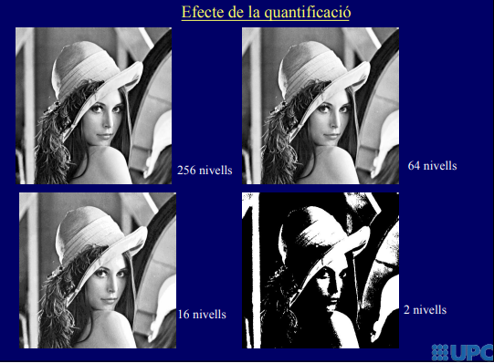
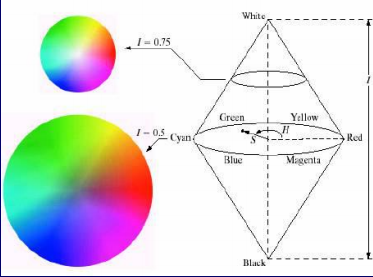

## Tema 1 -  La imatge digital i les seves propietats

[TOC]

Una imatge es pot modelitzar com una funcio de 2 o 3 variables (fila, columna, temps). Una imatge real es 3d.

### Digitalització de la imatge

Una imatge digital queda 'limitada' per una **discretització** i una **quantificació**. Una imagte digital esta representada per una matriu de **píxels**. 

#### Discretització

Aquest pixels tenen un rang de K intervals (normalment 256) sobre el rang continu dels colors. S'anomenan nivells a cada tó diferenciat, depenent del nombre total, observem efectes com:

#### Quantificació

 També dona lloc a perdua d'informació entre els píxels, donant lloc a:

#### Altres efectes

Poden apareixe fenomens derivats d'aquestes limitacions de la digitalització de la imatge. El teorema de Shannon (l'interval de mostreig ha de ser menor que la meitat de la mida del detall més petit => doble de la seva frequencia) dona lloc a l'aliasing, un fénomen que apareix si no s'acompleix aquest teorema i dona lloc a imatges amb patros extranys.

#### Imatge amb colors

Les imatges es quantifiquen en un vector de tres components (amb cada color primari). Existeixen altres transformacións amb més de significat, com el HSI:

### Propietats de la imatge

* Distància: Entre dos pixels, podem definir diferents distàncies segons el nostre interés (euclídea, manhattan, taulell d'escacs)

* Veïnatge: Segons l'interes, podem decidir que un píxel es veí dels seu 4 adjacents o dels 8 (diagonals incloses). 
* Entendrem per regió un conjunt de píxels adjacents i una vora com el conjunt de píxels d'una regió que tenen algun veí fora de la regió