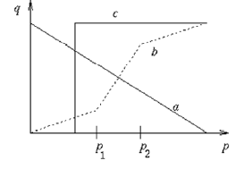

# Procesat Imatge

Es tracta d'operacions al nivell més baix d'abstracció, suprimint les distorsions(suavitzar) i/o realçar les característiques més importants per a processats posteriors.

[TOC]

## Operacions de pixel

### Transformacions a nivell de gris

Existeixen diverses transformacions per un cert valor de gris 'q': (a->Inversa, b->Realçat entre p1 i p2, c ->Binaritzat)

Els histogrames de gris es poden interpretar com funcions de densitat de probabilitat; tipicament **s'equalitza (dist. de gris uniforme)**:

### Transformacions geomètriques

Permeten eliminar les distorsions geomètriques produïdes en la captura de la imatge. **Es mapeja el píxel p(x,y) en una nova posició (x',y').**

* Rotació $x' = x \cos \alpha + y \sin \alpha \space y' = - y \sin\alpha + y \cos\alpha$

* Canvi d'escala $x' = ax, y' = by$

Aquestes transformacions faran que les noves coordenades no encaixin en la matriu imatge discreta!

### Operacions aritmètiques

Es poden operar imatges (suma, resta, producte, màxim, mínim) per obtenir una nova imatge. Si els valors es surten de rang es poden usar varies tècniques (valor absolut, rectificat positiu, escalat lineal).

#### Producte de convolució

Es calcula el nou valor d'un píxel a partir dels valors dels píxels veïns.  

* Cada veí te un coeficient de contribució (filter kernel).
  $$
  g[i,j] = f[i,j] (conv) h[i,j] = \sum_{k=1}^n \sum_{l=1}^m h[k,l] · f[i-k,j-l]
  $$

* Existeixen dos grups de preprocessat: suavitzat i realçat.

* Les vores de la imatge no tenen valor vàlids, per tant, s'han de tractar.

## Processat local

### Suavitzat de la imatge - Filtre mitjana

S'implementa com una convolució. Tenint una imatge f(x,y), per obtenir l'imatge g(x,y) seguirem:
$$
g[i,j] = \frac 1 {m·n} \sum_{k=1}^n \sum_{l=1}^m f[k,l]
$$
Es a dir, es tracta d'un producte de convolució amb "pes" 1 i dividit per l'invers del tamany de la fotografia.

### Suavitzat de la imatge - Filtre gaussià

El més popular, se segueix un model de finestra gaussiana (la influencia dels veïns disminueix amb la distancia del centre):
$$
h [i,j] = e^{\frac{-(i^2+j^2)}{2\delta^2}}
$$
Filtre lineal i separable + suavitzat isotròpic.

### Suavitzat de la imatge - Filtre mediana

Ordenem els píxels d'un entorn per nivell de gris i seleccionem el píxel central. 

* Molt bo per eliminar soroll.

* Pèrdua de discontinuïtats brusques, no es un filtre lineal.

## Detecció de contorns

Un **contorn** es un canvi local i significatiu en la intensitat de la imatge.

Complicat en nivell de gris :arrow_right: postprocés d’unió. Complicat pel soroll de les imatges i degut a que el canvi d’intensitat s’esten a més d’un pixel.

* Edge detection : Localitzar píxels del contorn.
* Edge enhancement : realçar píxles del contor.
* Edge tracing : recol·lectar els píxels del contorn en una llista.

## Múltiples escales