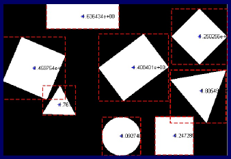
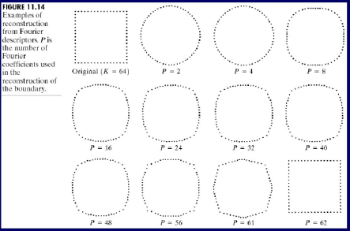
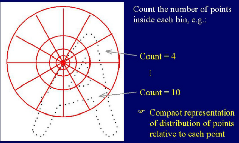

# Tema 5 - Descripció de regions

Un sistema de visió per computació clàssica tenim el següent pipeline: 

1. Processat (soroll, realçar contorns)

2. Segmentació (dividir l'escena en regions)

3. **Extraccions de descriptors (aquest tema)**

   * A l'entrada tenim una imatge segmentada/etiquetada

   * A la sortida tindrem un vector de característiques, per cada forma (àrea, excentricitat)

4. Reconeixement, via models (següent tema)

5. Models identificats

### Introducció

Les regions s'identifiquen amb etiquetes úniques, en l'exemple tenim les regions amb el centre de masses i una característica

Però , a la vida real no tenim imatges tant sintètiques, tenim problemes deguts a translació, rotació, resolució, escala, il·luminació, projecció 2D i oclusis. **Les característiques/descripcions han de ser robustes/invariants a aquest problemes**.

[TOC]

### Descriptors basats en contorns

El contorn té molta informació (p.e. silueta d'un elefant), tenim els següents descriptors:

#### Codis de cadena/Freeman

Descripció de segments unitaris entre l'origen i el final. Podem tenir veïnatge 4 o 8.

* No es robust a la rotació, es pot simplificar amb la primera derivada del codi de cadena (codi incremental només diu si gira a dreta o esquerra).

#### Propietats geomètriques

* Perímetre: Passos horitzontals i verticals del codi de cadena.

* Curvatura: ràtio de perímetre versus #canvis de direcció. 

* Signatura: seqüencia de les distàncies dels píxels del contorn al centre de masses.). La descripció es un vector de 360 posicions.

  Pot ser robust al zoom i rotació fàcilment, però te limitacions si l'objecte presenta concavitats (poden quedar ombres degut a les concavitats).

  

* "Slope density function": signatura recorrent el contorn amb i guardant la pendent. Soluciona els problemes de la signatura; però el vector de sortida no el podem saber a priori.

#### Descriptors de Fourier

En general tenim que "Tota funció periòdica es pot expressar com una suma de sinus/cosinus de diferents freqüències ponderada". Podem aplicar la inversa de la transformada de Fourier per tornar al valor original.

Aplicat, tenim que podem comparar components de les formes:

Podem obtenir les coordenades de cada píxel, convertint dues components a un únic nombre complex i calcular la transformada de Fourier per obtenir el descriptor de Fourier.

A l'exemple, calculem els descriptors de Fourier per l'original i utilitzant la inversa de la transformada amb "P" diferents veiem la reconstrucció.

#### Aproximacions poligonals

Podem veure un contorn com punts rellevants amb una distància mínima. A la imatge iterem fins que complim amb l'error.

#### Shape context

Per cada píxel construeix una matriu d'acumuladors, on per cada casella es sumen els píxels que hi han. L'àrea augmenta amb la distància al píxel, per suportar possibles deformacions.

Si trobem forces semblances en diferents descriptors de diferents imatges podem veure que son semblants. La seva millor robustesa es contra oclusions.

En l'exemple una matriu de 12*4 per cada píxel.

### Descriptors basats en regions

#### Descriptors geomètrics

* Àrea, Projeccions, Excentricitat, elongació, 

+ Rectangularitat : ràtio àrea de la regió entre el rectangle que l'envolta.

* Compacitat: ràtio àrea/ perímetre^2. Es invariant al zoom.

* Convex hull: Mínima forma convexa que engloba l'objecte.
* Esquelets: Minimitzem la informació; son poc robustos.

#### Moments

Generalitzen les combinacions de coordenades d'un objecte. Cada píxel suma a la fórmula : $M_{jk}(S) = \sum_{(x,y)\in S} x^j*y^k$

Hi han certs valors de moments que donen resultats significatius.

No podem utilitzar coordenades absolutes, d'aquesta manera tindrem moments molt diferents; caldrà utilitzar altres coordenades i treballar amb moments centrals (el centre de coordenades serà el centre de masses).

De la mateixa manera, es pot normalitzar per la desviació estàndard per calcular el moment normalitzat invariant al zoom.

#### Descripció per parts

Si tenim objectes complexos, mes enllà de formes geomètriques es complicat aplicar els conceptes fins ara vistos.

La solució es dividir l'objecte en parts i representar-ho, però com es trobar cada part ?

* Amb una segmentació "normal" podem no tenir una segmentació coherent a una divisió per parts.
* Es poden utilitzar amb nivells de colors, màxims, mínims, (altres estadístics). Fent això tindrem certes mancances en els invariants.

### Conclusions

* **Caldrà una bona segmentació.**

* Sensibles a les oclusions.
* Cal fer els descriptors invariants, segons cada cas.