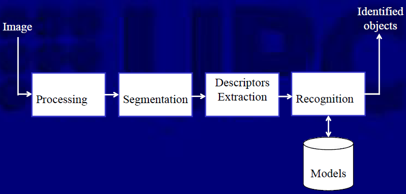
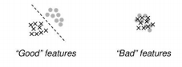

# Reconeixement

Existeixen diverses estratègies alhora de classificar una imatge en alguna classe. 

[TOC]

## Matching - Template Matching

Consisteix en localitzar objectes (*templates*, imatges de mostra) subimatges en imatges. Es busca la millor coincidència basat en algun criteri de correctesa.

> L'algoritme consisteix en "col·locar" a tots els llocs possibles l'objecte i comparar els valors del pixel d'aquella regió on estaria l'objecte amb el *template*.
>
> Si hi ha un bon *matching*, mesurat amb diferents estadístics; direm que l'objecte es present a la imatge.

* **Limitacions** 
  * Si l'objecte apareix escalat, rotat o eclipsat el *matching* no serà bo.(Es pot tenir transformacions diferents però no es eficient)
  * Sensible a les oclusions, tracta informació global.
  * Il·luminació, perspectiva, etc...

## Classificadors

Els classificadors particionen l'espai de característiques entre regions. Es necesiten prous característiques per poder discernir entre objectes.

* Les característiques (*features*) son qualsevol aspecte distintiu. Un vector de *features* representen tots els valors que pot prendre una característica. L’objectiu es tenir **bones** característiques.

  

* Un patró (*pattern*) es una composició de característiques típiques d’un objecte/individu.

Existeixen algunes característiques per disenyar els models classificadors:

* <u>Cost versus Classification Rate</u>: Podem moure la barrera de classificació en funció dels falsos positius / falsos negatius (p.e. potser interesa tenir mes falsos negatius que positius).

* <u>Overfitting</u>: Un mal entrenament d’un classificador pot portar a que tots els pronostics estiguin esbiaixats. Un entrenament que promet un ~99% d’efectivitat a la pràctica pot ser contraproduent.

#### Classificadors lineals

## Evaluació de classificadors

Per evaluar un classificador, cal utilitzar dades que no hagin sigut emprades en l’entrenament. Tenim diferents mesures estadistiques:

* Taxa d’error empiric:
* Empirical reject rate:
* Falsos positius:
* Falsos negatius:

### Cross-validation