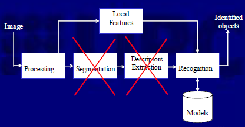
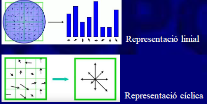
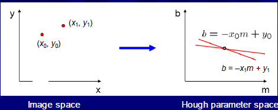

# Característiques local vs globals

Les característiques globals són sensibles al soroll i oclusions, fent que segmentar una image sigui complicat. L'alternativa són les característiques locals.

Podem substituir al *pipe-line* clàsic, per dificultats alhora de segmentar. Per tant, tampoc te gaire sentit aplicar l'etapa de generar descriptors.

* Una mala segmentació dona lloc a males descripcions (per oculusions, ombres, etc).

[TOC]

## Característiques locals - I

Necessitem "bones" característiques per les característiques locals:

* Han de ser significativament diferents i **discriminatives**.
* S'han de poder localitzar en imatges diferents (**repetitivitat**), encara que hi hagin transformacions (invariància geomètrica i photometrica). 
* Poques dades, molta informació. **Eficiència computacional**

N'hi han moltes aplicacions com ara alineament d’imatges, navegacions de robots, reconeixement de gestos, etc...

Existeixen diferents característiques locals, amb diferents principis entre elles.

### Histogrames de color

Distribució dels nivells de gris d'una imatge. No sabem on es troba cada valor del gris (es una caracterísitca de *bag of words/features*).

El color es una bona característica local ja que es invariant a transformacions geomètriques i robust a les oclusions. 

* En color, tenim un histrograma per cada tripleta (RGB) de la imatge.

* Els colors han de ser normalitzats per intensitat, així podem computar l’histograma amb dues de les tres components RGB.

#### Algoritme per reconeixe amb histogrames

1. Construir un set d’histogrames per cada objecte conegut $H = {H_i}$.
2. Construir un histograma per l’imatge a classificar $h_t$.
3. Compara $h_t$ amb cada histograma d’$H$.
4. Sel·lecionar l’objecte que mes semblant sigui (estrategia de *nearest-neighbour*).

#### Comparació d’histogrames

Per comparar histogrames de color, tenim diverses estratègies; la millor depen de l'aplicació.

* Component a component: Podem tenir moltes comparacions erroneas, per culpa de la discretització.
* Distància euclidia, Chi-square, EMD(+ robust).

### Histogrames d'orientacions

Podem descriure localment els objectes usant les direccions dels gradients. Fent el càlcul amb finestres.

Molt robust a canvis d'iluminació, les rotacions es traduiran en un desplaçament del histograma

> Existeix una representació cíclica del vector del vector, per veure gràficament.

Els HOG's (Histograms of Oriented Gradients) van ser utilitzats per identificar persones (Dalal-Triggs 2005)

1. Descriure cada mostra amb un *template* HOG.
2. Entrenar una SVM com a classificador, amb milers de mostres positives i millons de negatives.

### Transformada de Hough

Originalment, funciona per detectar rectes; molt robust a soroll, imperfeccions i oclusions.

El funcionament està basat en el pla de la imatge i el pla de Hough, **cada recta a la imatge es transforma en un punt en l'espai de Hough**.

* L'espai de Hough es representa amb una matriu discreta(2D), per cada píxel incrementem els contadors corresponents a les possibles rectes que poden complir l'equació $y_0 = m x_0 +b$

  

Per aquesta taula tenim les rectes que passen per un píxel, al final doncs veurem pics a la matriu on podrem correspondre píxels amb posicions del espai Hough.

#### Implementació de la transformada de Hough

1. Crear una matriu de Hough $(m,b)$ i dimensionar-la. Cada posició es un acumulador (inicialment a 0).
2. Per a cada píxel de la imatge de contorns $(x,y)$ incrementar les posicions de la matriu $(m,b)$ que satisfan l’equacio de la recta (totes les possibles).
3. Selecionar de la matriu aquelles rectes significatives.

Alhora d'implementar-ho, tenim el problema d'afitar m i b :arrow_right: utilitzem la forma polar $\rho= x cos(\phi ) + y sin(\phi)$. L’espai de Hough tindra punts amb coordenades $(\rho, \phi)$

* Cal treballar amb píxels rellevants (gradient important)
* Cal considerar els pics molt propers com una única recta.
* Caselles massa grans porten a que rectes de diferents acumulin al mateix lloc.
* Caselles massa petites porten a fraccionar rectes (degut al soroll de la imatge).

#### Segona implementació de la transformada

Com necesitem la direcció del contorn i aixó es exactament la direcció del vector gradient, podem fixar $\phi$ en la taula de Hough i incrementar un únic acumulador.

....

#### Hough per $\forall$ forma geomètrica

Cualsevol corba que es pugi expresar de forma paramètrica pot crear un espai de Hough, peró la complexitat (i la dimensió de la matriu) augmenta amb els paràmetres de la corba.

> **Exemple. Buscar cercles** Podem utilitzar l’expressió $(x_i-a)^2+(y_i-b)^2= r^2$ per tal d’emplenar una taula de Hough.

## Característiques Locals - II

### Haar Features

Utilitzat per trobar objectes en temps real, de forma robusta.

#### Classificador Adaboost

