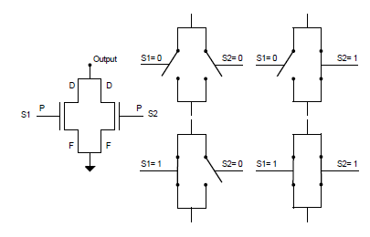

[TOC]

## Tecnologia MOS 

Tecnologia de transistors (interruptors); son les sigles de _Metal Over Silicon_.

Un transistor consta de Porta, drenador i font. Depenent del tipus de MOS, el transistor deixa passar corrent entre el drenador i la font si hi ha corrent a la porta o no.

Sovint, els transistors pMOS i nMOS s'utilitzen complementats. Existeix una correlació entre combinar en serie/paral·lel diferents transistors i operacions lògiques.

### Composició de portes lògiques

* nMOS en serie: 0 si S1 i S2

  

* pMOS en serie: 1 si no S1 i no S2

  

* nMOS en paral·lel: 0 Si S1 o S2

  

* pMOS en paral·lel: 1 si no S1 o no S2

  

  

## CMOS complementari

Aquest model consta de dos xarxes de p i n MOS complementaries; anomenades de _pull-up_ i _pull-down_ respectivament.

> Es important que si la xarxa _pull-up_ està activa, la _pull-down_ no estigui també activada i viceversa (crowbar).
>
> També es important que les dues no estiguin desactivades alhora (sortida indeterminada)

De forma mnemotècnica, per implementar en cmos estàtic les operacions and i or:

* .
  * _pull-up_ pMOS en paral·lel
  * _pull-down_ nMOS en sèrie

* +
  * _pull-up_ pMOS en sèrie
  * _pull-down_ nMOS en paral·lel

## Tipus i tecnologia de transistors

Existeixen diversos tipus de transistors, segons la tecnologia:

* Tipus MOS (controalts per tensió): nMOS i pMOS.
* Tipus bipolars (ontrolats per corrent): NPN i PNP.

Els transistors realment estan integrats en circuits elèctrics, en una visió real dels esquemes apareixen **capacitancies** i **resistivitat** pels mateixos materials del transistor. Aquest factors fan que aparegui el retard en les portes lógiques.

### Transistors pMOS

Hi haurà una intensitat Drenador-Font si la tensió Porta-Font es menor que la tensió d’alimentació menys un llindar ($V_{DD} - V_{tall} > V_{pf}$).

### Transistors nMOS

En aquest tipus, si la tensió porta-font es superior a la tensió de tall, hi haura intensitat Drenador-Font ($V_{pf} > V_t > 0$). 

### Implementació tecnològica

Els transistors estan creats sobre P o N substrat, segons el tipus de transitor, al aplicar diferencia de potencial a la porta (P) fem que el canal entre Drenador i font s’obri o es tanqui.:

Els transistors tenen diverses zones de treball, funció de la tensió que apliquem a la porta:

* Zona de tall : No circula intensitat drenador-font.
* Zona lineal : L’intensitat es proporcional a la diferencia de potencial.
* Zona saturació : El transistor pot arribar a trencar ekl canal entre el drenador i la font.