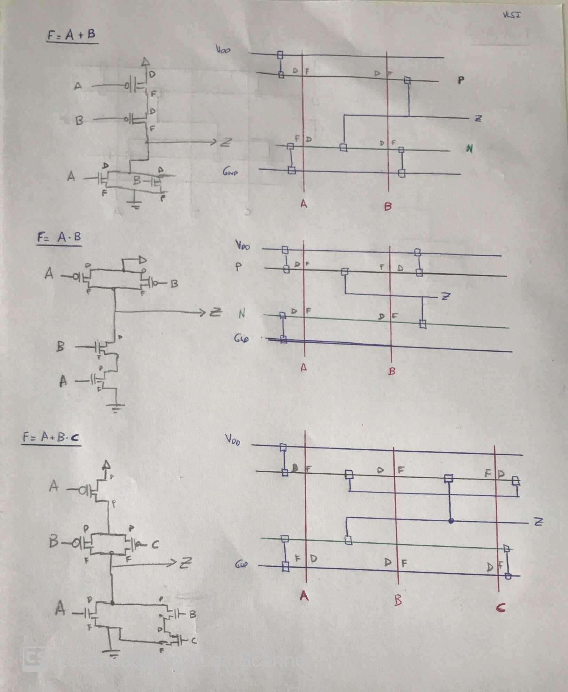

## Procès de fabricació & Regles de disseny

[TOC]

## Procès de fabricació

...

## Regles de disseny

Un transistor està fet bàsicament dels següents materials:

* **Polisilici** a la porta
* Àrea activa al drenador i la font.
* Una base de tipus P o N (depenent del tipus de transistor).
* **Metall** per connectar els diferents transistors.

Existeixen certes restriccions en funció de la tecnologia:

* Regles escalables ($\lambda$):  Proporcionals a la tecnologia
* Dimensions absolutes: Independents de la tecnologia

### Colors de referència

* Pous : Groc
* Àrees actives : Verd (N) / Marró (P)
* Polisilici : Vermell
* Metall Blau / Vermell
* Contacte : Negre

### Disseny basats en cel·les estandar

Si totes les cel·les segueixen un mateix patró aquestes poden ser **reutilitzades** en diversos dissenys. Per contra, perdem la capacitat de tenir un disseny adaptatiu a l’entorn.

Alguns exemples de funcions amb lògica CMOS:

