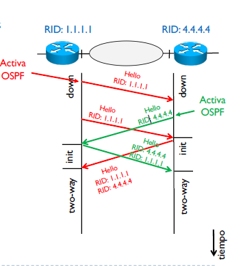
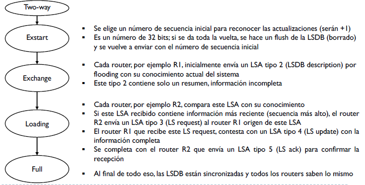

## ENCAMINAMIENTO INTRA-DOMINIO IGP

Internet está formada por diferentes Sistemas Autónomos interconectados entre si. Dentro de cada domino hay varias versiones de encaminamiento interior (IGP) dentro de este(RIP, OSPF) y los dominios(o AS) entre ellos se habla con protocolos exteriores (EGP).

Los routers (dispositivos de nivel 3-4) son los encargados de implementar y usar los algoritmos de encaminamiento.

### Arquitectura del router

Se divide en dos partes, Routing y Forwarding: 

La tabla de routing suelen tener los campos de Adquisición, Destino, Mascara, Gateway, Interfaz y Metrica.

La tabla de forwarding, esta optimizada para encontrar rápidamente el destinatario del reenvio. Se guarda la @MAC de destino y la interfaz de salida.

## Open Shortest Path First (OSPF)

* <u>RIP</u> funciona sobre un vector-distancia, donde cada 30 segundos se envía a los vecinos parte de su tabla de routing. El numero de saltos es la única métrica posible.

  Tarda mucho en converger, consume recursos y se pueden crear bucles, por el otro lado, es muy fácil de controlar.

* <u>OSPF</u> funciona sobre el estado del enlace, link-state. Cada router envía un **L**ink **S**tate **A**dvertisement sobre los cambio. Se pueden definir varias métricas e áreas diferentes.

  Se consigue una convergencia rápida, no se crean bucles, pero por el otro lado es mas complejo de configurar y necesita mas memoria y potencia de procesado.

OSPF se construye, en una área, sobre una link-state database (LSDB) en cada router, alimentando con mensajes LSA entre adyacencias. Un sistema LSA también precisa de un Router ID (RID), representado como un @IPv4 como una identificación única en un red.

Una área OSPF es una colección de redes y routers que pertenecen a una misma área-ID (si solo existe una área es 0).

Cada router debe tener un RID único en el sistema, este se puede definir:

* Manualmente (CISCO con un comando dando el valor de los 4 decimales por un punto).
* Automáticamente se adquiere la @IP mas alta entre las @IP asignadas (virtuales/loopbacks) o 
* Si no hay loopbacks, la @IP mas alta de las activas del router.

Esta bien configurar una loopback virtual, ya que siempre que el router este activo la interfaz también, en cambio una interfaz real puede caer más fácilmente.

El coste/métrica en OSPF es la inversa del ancho de banda, con un valor escalado inicial de 10^8. Como menor el coste es 1, se puede modificar el valor inicial.

### Funcionamiento del protocolo

Al activar un OSPF se genera un mensaje LSA con los link-state que conoce ese router en el momento. También hay mensajes LSA(con la nueva información solo) si cae alguna interfaz o hay algún cambio. 

Los envíos de LSA se hacen mediante 'flooding'. Este flooding se basa en enviar los mensajes con # secuencia(versión del LSA) y edad (indica el momento de la información) por todas las interfaces del router y los demás deben renviarlo por todas las interfaces del router. Al llegar al router se actualiza la información comparando los # secuencia. 

Si los mensajes LSA modifican la LSDB se debe ejecutar el algoritmo de Dijkstra para guardar el menor coste en la DB; se generara un árbol con raíz el propio router y los destinos como hojas y esta información se crea la DB.

Los mensajes de OSPF se encapsulan directamente sobre IP, sin TCP. La cabecera es:

Version # siempre es 2. El campo type indica el tipo de mensaje LSA. Se añade un control de errores ya que no se utiliza ninguna entidad de transporte, con un checksum. El campo de Authentication se utiliza si existen redes privadas; se indica en AuType (0:no hay, 1:contraseña, 2:encriptación).

DR & BDR

#### Protocolo de mensajes 'Hello' : Identificación de adyaciencias

En los mensajes HELLO se quiere <u>descubrir vecinos y selecionar DR y BDR</u>. Ademas de verificar la conexión entre vecinos. 

Al activar OSPF, por broadcast o multicast se envia el HELLO con su RID. La respuesta vendrá con el RID del vecino y en este momento estaremos en two-way.

#### Elección Designated Router Backup DR

Según la topología de la red, soportada por OSPF:

* Punto a punto: dos routers solo
* Redes de acceso múltiple y broadcast: conectividad completa entre todos.
* Redes de acceso múltiple no broadcast
* Redes punto a multipunto

Se generar un problema con los mensajes 'flooding', ya que hay una full mesh.

Para evitar esto, se designa el DR (RID más alto de la red) y el BDR (segundo RID alto). Si el DR cae, el BDR se convierte en DR y se elije un nuevo BDR.

* Si un LSA llega a un DR, este se lo reenvía a todos los demás (BDR incluido).
* Si un LSA llega a OTHER, se lo envía al DR y al BDR.
* Si un LSA llega al BDR, se lo envía al DR.

#### Sincronización de LSDB

Sobre las adyacencias ya creadas, en el estado 'two-way', tenemos los siguientes estados:

### OSPF Jerárquico

