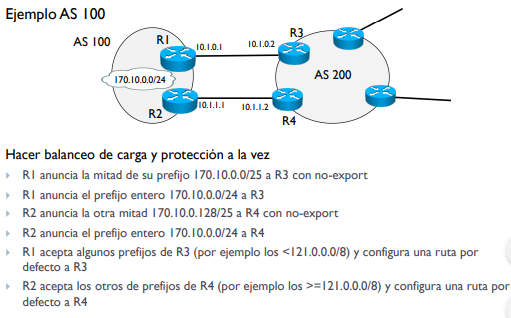

# Encaminamiento Inter-dominio EGP

Internet está formado por diferentes Sistemas Autónomos interconectados, para encaminar estos diferentes sistemas, entre ellos, se utilizan protocolos Exterior Gateway Protocol. En concreto veremos BGP; él usado en Internet, que está basado en vector-distancia.

### Border Gateway Protocol

* Cada camino se construye como composición de próximo salto, el conocimiento de cada router depende de su router informante.
* El encaminamiento puede estar basado en políticas sobre atributos.
* Permite no compartir información confidencial de cada AS.
* Entre dos routers frontera de un AS(BGP peers), se establece una sesión TCP donde comparte la información de encaminamiento de cada *prefijo* con sus atributos.

### External/Internal BGP

La información que un AS recibe debe ser retransmitida por todos sus routers frontera, sin variar el contenido de este mensaje de encaminamiento. Todos los BGP peers de un AS deben tener una sesión BGP entre ellos, dando lugar a una full mesh.

Los mensajes de iBGP son tratados como paquetes IP y retransmitidos normalmente .Los mensaje de iBGP y de eBGP son identicos.

Se debe usar una **interfaz virtual para los iBGP** y una **interfaz real para eBGP**.

Si es iBGP con una interfaz real cae la sesión BGP, en cambio si se usa una interfaz virtual el protocolo de encaminamiento interno encontrara una nueva ruta y no caera esta sesión TCP. En el caso de eBGP debemos ver cuando se pierde una interfaz real entre AS.

### Sesión BGP

Se utiliza TCP (port 179), iniciando la conexión con el three-way handshaking para establecer la conexión TCP. Una vez establecido el TCP y abierto el canal BGP se mandan los prefijos que que cada AS conoce, y quiere compartir. Las rutas BGP no tienen un tiempo de vida. Los updates BGP pueden enviar updates quitando rutas (withdraw).

Los estados por los que pasa la sesión BGP son:

idle :arrow_right: connect :arrow_right:TCP Established :arrow_right: BGP open :arrow_right:Envio de updates

Si hay time-out en el estado connect, se pasa a estado active.

### Base de datos BGP

Un router BGP mantiene 3 BD con diferente información.

* Adj-RIB_In: Todos los prefijos y atributos recibidos por sus peers.

* Loc_RIB: Contiene la información de encaminamiento local, selecionando a través de su politica de encaminamiento. Con esta información se genera la tabla de encaminamiento.

* Adj-RIB_Out: Todos los prefijos y atributos que este router anuncia a sus peers. Puede ser diferente según el vecino.

### Mensajes BGP

Existe una cabecera común de 19 bytes y según el type se añaden los campos necesarios.

Marker: Seguridad, Lenght: Longitud BGP(cabecera + payload) y Type: (Open, Update, Notification, Keepalive).

* Open

  En los mensajes open se negocian los parámetros y se identifican los AS. Añade a la cabecera común la <u>versión</u> (v4), el numero de <u>AS</u>, el <u>BGPid</u> (RID del router), el <u>Hold Timer</u>, y las <u>opciones</u>.

  El Hold timer, entre 0 y 60 es el tiempo entre UPDATE o KEEPALIVE. Se esperan 3 HoldTimer antes de cerrar las sesión TCP. Se usa el menor de los dos propuestos. 0 no se usa esto. El campo de opciones añade otras capacidades.

* KeepAlive

  Se usa para verificar la conectividad entre dos peers. Se envia la cabecera común de 19 bytes.

* Notification

  Sobre un error en la sesión BGP, se envia este mensaje y se cierra la sesión TCP. Se añade un numero de error, un subcodigo y se añade en el campo data el mensaje que ha provocado el error.

* Update

  Se comparte información de encaminamiento entre peers, con los siguientes campos:

  Withdraw routes: Notifica que un prefijo ya no es valido

  Path Attribute: Atributos comunes de los NLRI del update (si no hay atributos comunes se debe separar el mensaje de update). Hay varios atributos estandar usados (ORIGEN, AS_PATH, NEXT HOP, ...).

  El Network Layer Reachability Information (NLRI) contiene la lista de prefijos anunciados por este peer, limitado por el tamaño maximo del mensaje BGP 4096 bytes.

  Se añaden 2 bytes para la longitud del estos campos. La longuitud del NLRI es el restante.

### Atributos BGP

  Los atributos que se añaden a los mensajes de update son diversos, algunos son obligatorios:

  * AS-PATH: Secuencia de números de AS por donde ha pasado un prefijo. Se usa para evitar bucles en las notificaciones de prefijos y para determinar el camino más corto (menor número de AS)

  * Next-hop: Indica la @IP del router que hace de GW entre AS. Es el GW a nivel de AS.

    

  * Next-hop third-party: Caso que haya un enlace directo sin sesión eBGP, sin next-hop los datagramas pasarían por un tercer AS.

  * Next-hop backdoor: Desacoplo del router BGP del router que procesa paquetes.

  * ORIGIN: Determina como se ha aprendido un prefijo. Se añade al final del AS-PATH. Puede ser un '?' si esta información está incompleta, una 'i' si se ha aprendido por IGP o una 'e' si se ha aprendido por EGP (protocolo ya no utilizado de encaminamiento inter-AS).

Otros atributos son opcionales:

* Aggregator: Si un router sumariza prefijos se utiliza este atributo para indicar el RID del router y el AS donde se ha hecho.
* Local preference: Se utiliza para manipular la selección del mejor camino, se escoge la ruta con valor mas alto. Por defecto el valor es 100.
* Multi Exit Discriminator/MED/Metric: Se elige la ruta con <u>metric</u> más bajo. Los AS pueden recomendar al vecino cual usar, pero este puede elegir. Por defecto el valor es 0.

### Algoritmo de Selección BGP

Hay varios casos donde existen varias rutas para llegar a un destino y se establece un orden para los diferentes atributos BGP:

1. Ruta con mayor local preference.

2. Ruta con menor AS-Path.

3. IGP > EGP > incompleto. (atributo bgp ORIGIN)

4. Ruta con menor metric.

5. Ruta aprendida por eBGP antes que iBGP.

6. 2 o + rutas iBGP, la de menor coste IGP.

7. Ruta aprendida antes (más antigua).

8. Ruta hacia el router con menor RID.

9. Ruta hacia la interfaz de un mismo router con menor @IP.

### Políticas sobre encaminamiento-Scripts CISCO

Entre los AS puede existir una relacion peer to peer, o bien una relacion de costumer-provider.

Las politicas se aplican usando varias herramientas de filtrado, aplicadas a los BGP updates.

Los scripts de cisco se basan en 'route-map', a través de una lista de acceso.

Se aplican las acciones correspondientes acciones, que actualizaran los BGP updates dependiendo si se aplican 'in' o 'out'.

Los route-map tiene un else final donde no dejan passar nada que no se cumpla antes, se debe añadir un 'route-map permit' para dejar passar.

### Escenarios más Comunes

* Stub

  AS cliente, conectado a otro AS que le proporciona transito. En este caso se puede utilizar un numero de AS privado, sin pasar por IANA.

  Hay traducción en el caso de que el AS quiera ir a Internet, donde solo caben los números AS públicos).

  La tabla del BR del AS Stub, tendrá una ruta por defecto al router del AS proveedor.

* Stub multi-homed

  AS con 2 o más conexiones a un único AS, por seguridad, a un mismo AS (proveedor). Es posible que existan varios BR en cada frontera del AS.

  No debe proporcionar transito entre los routers del otro AS.

  Existen varias configuraciones posibles:

  * <u>1 conexión eBGP, otras preparadas</u>, entonces el router anuncia sus redes internas solamente a su BGP peer. Solo configura una ruta por defecto a este router. Si falla, se abre la otra sesión.

  * <u>Una conexión preferida, otras de backup abiertas siempre</u>. 

    Anunciamos los prefijo y aplicamos MET en los router no preferido.

    Los prefijos que entran, aplicamos local-preference < 100 a los prefijos del router no preferido.

  * Hacer <u>balanceo de carga</u> usando los 2 o más routers. Dividiendo el anuncio de la mitad de los prefijos del Stub; en el otro sentido haciendo lo mismo pero general a todas las direcciones posibles.

    

* Multi-homed

  AS cliente, que no proporciona tránsito. Tiene 2 o más conexiones con diferentes AS proveedores.

  Las configuraciones posibles son las mismas que en Stub multi-homed, pero el router no debe dar transito entre los AS proveedores de forma explicita.

* Transito

  AS que tiene 2 o más conexiones con otros AS y proporciona transito entre ellos, según el contrato con los vecinos.

### Route leaks

Si distribuimos accidentalmente o malintencionadamente prefijos, podemos provocar fallos en todo internet.	

### BGP mejoras

#### Comunidades

Atributo opcional de BGP, crea una capa de abstracción. Si hay un cambio de prefijos en un AS cliente, con comunidades no es necesario que el proveedor cambie. Las comunidades se identifican con #AS : #COMUNIDAD .

* Comunidades no-export 65535:65281 no puede anunciar el prefijo por sesión eBGP (iBGP si). Este prefijo solo se quedare dentro del AS pero este no lo retransmitirá.

* Comunidades no-advertise, no anuncia el prefijo ni por eBGP ni iBGP.
* Comunidades no-export-subconfed, no anunci a ningun otro router fuera del sub-AS.

Las comunidades en los casos de stub multi-homed se configuran:

Los routers utilizan la entrada del encaminamiento con @IP de mayor mascara. El AS200 será el que hará el balanceo de carga porque es el único que tiene las @IP con mascara /25 y hacia fuera anunciara la @IP con /24. 

Por seguridad se anuncia entero el prefijo con mascara /24 por si uno de los dos enlaces cae.

#### Escalabilidad iBGP

Se necesita una conexión TCP por cada sesión de iBGP, con una malla completa entre todos los routers BGP dentro del AS. Para solucionar el problema de la malla completa se puede optar por:

* <u>Router reflection</u>

  Se divide el AS en clusters y en cada cluster se elige 1 o más <u>R</u>outer <u>R</u>eflector. Se necesitara un cluster-list (idem a AS_PATH) y originator-id (idem ORIGIN).

  

* <u>Confederación de sub-AS</u> 

  

  Se utilizan AS privados, dentro de estos si que tiene una malla completa. Los sub-AS deben tener una sesión eiBGP, tantas como sean necesarias. 
  
  Desde fuera del AS este cambio no se ve ni se necesitan atributos adicionales.
  
  ### Route Flap Damping
  
  Un route flap se produce anuncia y elimina uno o más prefijos o cambia el valor de los atributos constantemente (bgp Update -> consumo CPU, cortes servicio). Esto esta provocado por errores hardware/software, cables en mal estado, políticas contrapuestas.
  
  Los route flaps hacen que la convergencia sea más lenta entre routers BGP. Para solucionar este problema hay que ver cuando hay "demasiados" cambios y aplicamos penalidades:
  
  Creamos parámetros y reglas para controlar los flaps. [TODO REGLAS!]
  
  
  
  Se vio que este prefijo daba mas problemas que soluciones y los routers modernos ya podian soportar todos los route flaps. Se recomendó no usar esta solución en 2006. Actualmente(2013 a hoy) si se recomienda usarlo con valores de umbral más alto (6000).
  
  
  
  
